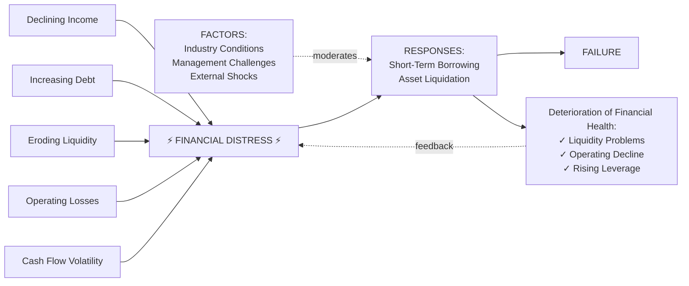

# Figure 3 — Process of Financial Distress Evolution

> Bari's headline visual argument — a process model of how distress unfolds, moderated by external factors, with a feedback loop into deteriorating financial health. **Reproduced as Mermaid** for navigability and citability. The key conceptual contribution: distress is not a single event but an **iterative loop** in which responses (borrowing, asset sales) intended to escape distress can deepen it (rising leverage, eroded asset base) — exactly the path Altman-style point-in-time bankruptcy models obscure.

## Provenance

| Field | Value |
|---|---|
| Source | [[2026-02-04-bari-2026-us-small-business-distress-framework]] |
| Source's reference | Figure 3 |
| Caption (verbatim) | *"Process of Financial Distress Evolution."* |
| Location | p. 86 |
| Last confirmed | 2026-05-25 |

## Diagram (Mermaid reproduction)

## Reading the diagram

Five **causes** on the left converge into the central distress state:

1. Declining Income
2. Increasing Debt
3. Eroding Liquidity
4. Operating Losses
5. Cash Flow Volatility

The central **distress state** (FINANCIAL DISTRESS, rendered with lightning-bolt iconography in the original) triggers two managerial **responses**:

- Short-Term Borrowing
- Asset Liquidation

The transition from distress to responses is **moderated** by three external FACTORS shown as a top-right input:

- Industry Conditions
- Management Challenges
- External Shocks

The responses lead to one of two outcomes:

- **FAILURE** (the terminal exit) — the path Altman/Z-score models implicitly assume is the only one.
- **Deterioration of Financial Health** (Liquidity Problems, Operating Decline, Rising Leverage) — which **feeds back** into the original distress state, creating an iterative loop.

## Why this matters (the feedback loop as conceptual contribution)

Traditional bankruptcy-prediction models treat distress as a point-in-time event with a binary outcome. Bari's diagram reframes it as a **process** that can:

- **Spiral.** Borrowing → higher leverage → deeper distress → more borrowing.
- **Stabilise.** Asset liquidation → lower obligations → improved liquidity → exit from distress without failure.
- **Cycle.** Repeated distress-response-recovery loops over multiple periods, with the firm eventually either failing or normalising.

The implication for distress prediction: a model that only takes a snapshot of financial ratios at time *t* misses the **trajectory information** (how many cycles, with what depth and duration). Bari's empirical regression in [[bari-2026-hierarchical-regression-results]] tests whether trajectory-encoding variables (cash-flow dynamics, credit behaviour history, relationship variables) add predictive power beyond financial-ratio snapshots — and finds they do, adding +0.15 R² over financial-only baseline.

## Cross-references

- The empirical regression validating the diagram's channels: [[bari-2026-hierarchical-regression-results]].
- The 7-construct framework underlying the regression: [[bari-2026-indicator-family-framework]].
- Concepts: [[financial-distress]], [[sme-default-prediction]].
