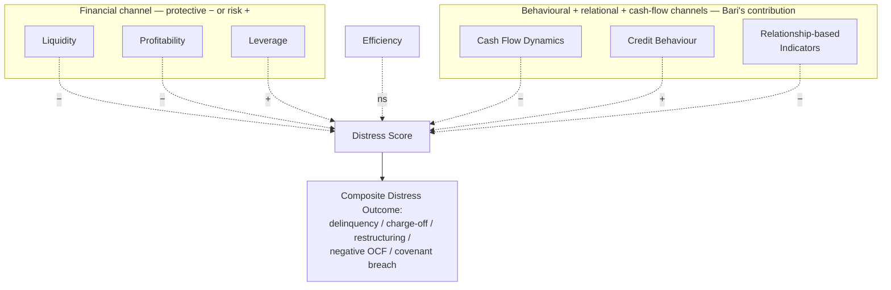

# Seven indicator-family framework for small-business distress

> Bari's conceptual scaffold: seven families of predictors organised into two channels — the **financial channel** (liquidity, profitability, leverage; the classical Altman-style inputs) and Bari's **contribution channels** (cash-flow dynamics, efficiency, credit behaviour, relationship-based indicators). The framework defines what the [[bari-2026-hierarchical-regression-results|hierarchical regression]] tests — and is the conceptual answer to "what should a multi-channel SME distress model look like?".

## Provenance

| Field | Value |
|---|---|
| Source | [[2026-02-04-bari-2026-us-small-business-distress-framework]] |
| Source's reference | Conceptual framework (§Methods) + Figure 12 |
| Location | Body §Methods + p. 100 |
| Last confirmed | 2026-05-25 |

## Diagram (Mermaid reproduction)

## The seven families

| # | Family | Channel | Indicator examples | Effect on distress |
|---|---|---|---|:---:|
| 1 | **Liquidity** | Financial | Current ratio, quick ratio, cash ratio | Protective (−) |
| 2 | **Profitability** | Financial | ROA, ROE, net margin | Protective (−) |
| 3 | **Leverage** | Financial | Debt/equity, debt/assets, interest coverage | Risk-increasing (+) |
| 4 | **Cash Flow Dynamics** | Bari's contribution | OCF volatility, OCF trajectory, OCF/sales | Protective (−) |
| 5 | **Efficiency** | (Standalone) | Asset turnover, inventory days, working-capital efficiency | **Not significant** |
| 6 | **Credit Behaviour** | Bari's contribution | Past delinquency, payment-delay history, utilisation patterns | Risk-increasing (+) — **largest single effect** |
| 7 | **Relationship-based Indicators** | Bari's contribution | Relationship duration, product scope, soft-information exchanges, monitoring intensity | Protective (−) |

## What the framework argues

The framework's central claim — empirically tested by the [[bari-2026-hierarchical-regression-results|hierarchical regression]] — is that **distress prediction needs all three Bari-contribution channels** beyond the classical financial-ratio channels:

- **Cash-flow dynamics** capture trajectory information that point-in-time ratios miss.
- **Credit behaviour** captures borrower-history signals that snapshot leverage misses.
- **Relationship-based indicators** capture soft-information channels (lender-borrower relationship quality, monitoring intensity) that hard-data ratios cannot proxy.

The regression's +0.15 R² lift over financial-only confirms this empirically. The framework's most striking finding is the rank order: **credit behaviour > leverage > cash-flow dynamics > liquidity > relationship > profitability > efficiency** (by |β|). Behavioural variables out-weigh the classical financial ratios — small businesses' distress is *behavioural* before it is *financial*.

## Why efficiency fails

The efficiency family is the framework's only non-significant channel. Two explanations from the source:

1. **Measurement noise.** Cronbach's α = 0.77 — the lowest of any construct, suggesting the operationalisation is noisy.
2. **Indirect mediation.** Efficiency may operate *through* the other constructs (efficient firms are more profitable, more liquid, less leveraged) rather than as an independent channel.

Future re-ingests of small-business-distress literature should note that "efficiency" as a standalone framework component may need re-operationalisation. The paper does not propose a fix.

## How this aligns with adjacent papers

| Paper | Bari channel overlap |
|---|---|
| [[2022-11-28-altman-2023-omega-score-sme-default]] | Set 2 (payment) ≈ Bari's Credit Behaviour; Set 3 (employee) and Set 4 (management) ≈ Bari's Relationship-based |
| [[2024-06-22-hajek-2024-distress-prediction-annual-reports]] | BERTopic risk topics ≈ Bari's Relationship + Credit Behaviour (the textual proxy for soft-information channels) |
| [[2024-01-01-powell-2024-asean-accounting-early-warning-distress]] | Classical financial channel only — Powell's MDA is a clean *financial-channel baseline* Bari's framework extends |
| [[2020-01-01-habib-2020-distress-determinants-consequences-review]] | Maps to Habib's firm-fundamental + corporate-governance determinant cells (per [[habib-2020-determinants-consequences-taxonomy]]) |

## Cross-references

- The empirical regression validating the framework: [[bari-2026-hierarchical-regression-results]].
- The process diagram the framework operationalises: [[bari-2026-financial-distress-process-diagram]] (Figure 3).
- Sample composition: [[bari-2026-demographic-distribution]].
- Concepts: [[financial-distress]], [[sme-default-prediction]], [[behavioural-distress-prediction]].
