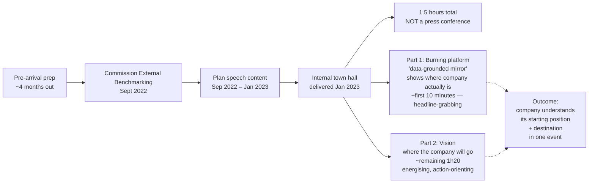

# The 'burning platform' speech protocol

> The named event that launched the Rolls-Royce transformation. Reproduced here as a reproducible protocol rather than as a one-off rhetorical moment — Erginbilgiç's interview presents the speech as **data + vision delivered together as one event**, supported by months of pre-arrival preparation. The wiki should treat this as a CEO-onboarding template, with the usual caveat that one CEO's protocol on one transformation is hypothesis, not generalisable evidence.

## Provenance

| Field | Value |
|---|---|
| Source | [[2026-05-24-erginbilgic-2026-rolls-royce-turnaround-playbook]] |
| Source's reference | Body Chapter 2 (2:01–8:33) |
| Location | Transcript [1:30]–[8:23] |
| Last confirmed | 2026-05-26 |

## The protocol

## Step 1 — Pre-arrival preparation (September 2022 onward)

Erginbilgiç planned the speech starting **September 2022**, ~4 months before formally taking the CEO role (January 2023). The preparation included:

- **Commissioned External Benchmarking** — the speech's data backbone. Erginbilgiç explicitly says: *"You cannot say the things you just said without data because it will just learn like you are criticizing them effectively. With data, I demonstrated where the company is."*
- Defined the speech's two halves: the burning-platform critique (data-grounded) and the vision (where the company will go).

**Why this matters.** Most CEO-onboarding speeches are based on Day-1 impressions ("I've been here a week and let me tell you what I see"). Erginbilgiç's structure inverts that — by the time he gave the speech, he had four months of benchmarking data to ground every claim.

## Step 2 — Internal town hall delivery (January 2023, ~1.5 hours)

The speech itself:

- **Format: internal town hall** — not a press conference. *"This was supposed to be internal town hall, right? So it wasn't a press conference, and therefore yes, there was that risk it may leak."*
- **Duration: 1.5 hours** — much longer than the press coverage suggested. *"That speech itself actually was 1.5 hour speech, but obviously headlines took from the first ten minutes."*
- **Audience: employees** — the people whose buy-in was needed for the transformation to succeed.

**The leak risk was acknowledged but accepted.** Erginbilgiç notes some shareholders were worried the speech would be "destabilising for staff" but his view was that the upside (internal alignment) exceeded the downside (press leak / shareholder concern).

## Step 3 — Two-part content structure

### Part 1 — Burning platform (~first 10 minutes; headline-grabbing)

> *"With data, I demonstrated where the company is."*

The data-grounded portion of the speech. Demonstrated:

- Balance sheet "in terrible shape."
- "Every investment we make, we destroy value."
- Cost of capital "significantly higher than returns of the company."
- "Direction is not clear; strategy doesn't exist; performance management doesn't exist."

**Critical**: this section is positioned by Erginbilgiç as **"putting the mirror up,"** not as criticism. The data justifies the diagnosis. Without data, the same statements would have been heard as the new CEO criticising employees.

### Part 2 — Vision (~remaining 1h20 minutes; less newsworthy but more important)

> *"In the same speech then you continue and you talk about your vision and where you take the company."*

The energising portion of the speech — where the company will go. Erginbilgiç insists this section is *load-bearing*: *"Remember, you are not only talking about burning platform, you are talking about vision and how we are going to get there. That vision needs to be energising."*

The headline-press attention on Part 1 obscured Part 2 entirely. Internal audience got both.

## Step 4 — Avoid the "tough love" framing

A counter-intuitive aspect of the protocol: Erginbilgiç explicitly rejects the "tough love" interpretation when Lacqua proposes it.

> *Lacqua: "First of all, was there a decision to give the company and the employees tough love?"*
> *Erginbilgiç: "Neither of them actually. Interesting because I don't think that way. First of all, they need to understand what the company is. Secondly, they need to understand this is going to be different... It was about **tell it how it is**."*

The "tough love" framing privileges the speaker's authority ("I am being tough on you for your own good"). The "tell it how it is" framing privileges the data ("here is what the numbers say"). Erginbilgiç sees these as fundamentally different stances — the second avoids putting employees in a recipient position.

## Step 5 — Authenticity as a non-negotiable

> *"You need to be very authentic. So that actually when they look at you, they say 'okay, I believe it.'"*

The protocol depends on the speaker being authentic — performative versions of the same speech (delivered by a CEO who doesn't actually believe the data or the vision) would not produce the same effect. This is the protocol's primary failure mode: a CEO who copies the structure without the underlying authenticity will produce theatre, not transformation.

## What this artifact is NOT

- **Not portable without context.** The protocol assumes the speaker has the standing (new CEO, recently appointed), the data (months of external benchmarking), and the time (1.5h internal town hall). Without all three, mimicry will fail.
- **Not differentiated from existing literature.** "Burning platform" as a change-management concept dates to John P. Kotter's *Leading Change* (1996) and earlier (the metaphor originated in the 1988 Piper Alpha disaster). Erginbilgiç's protocol is *one operationalisation* of the broader concept; comparison with Kotter's eight-step model or McKinsey's influence model is future synthesis work.
- **Not a one-shot event.** The Rolls-Royce transformation also required the [[erginbilgic-2026-four-pillar-turnaround-playbook|four pillars]] — the speech is the *launch*; the pillars are the *execution*.

## Cross-references

- The follow-on execution framework: [[erginbilgic-2026-four-pillar-turnaround-playbook]].
- The umbrella concept this artifact feeds: [[corporate-turnaround]].
- The source interview: [[2026-05-24-erginbilgic-2026-rolls-royce-turnaround-playbook]].
- The detection literature that motivates needing a "burning platform" in the first place: [[financial-distress]].
