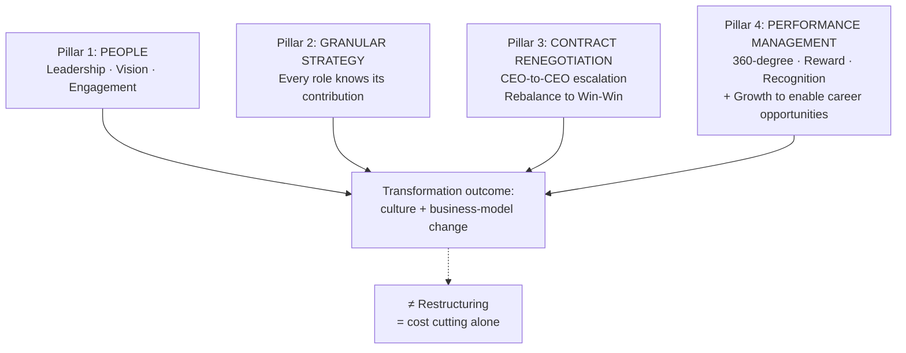

# The four-pillar turnaround playbook

> Erginbilgiç's named framework for the Rolls-Royce transformation, articulated in the interview as four jointly-necessary pillars. The framework is presented as portable ("what British companies can learn") but the wiki should treat that portability claim as hypothesis, not evidence. Distinguishes **transformation** (culture + business-model change) from **restructuring** (cost cutting) — the four pillars are what makes the difference.

## Provenance

| Field | Value |
|---|---|
| Source | [[2026-05-24-erginbilgic-2026-rolls-royce-turnaround-playbook]] |
| Source's reference | Body Chapter 4 (11:03–15:53) |
| Location | Transcript [11:03]–[15:44] |
| Last confirmed | 2026-05-26 |

## The four pillars

## Pillar 1 — People (Leadership, Vision, Engagement)

> *"This sort of first pillar is all about people. It is the leadership vision, engagement."*

**Why first.** Erginbilgiç observed on arrival that Rolls-Royce had "good people who have not been led well; direction is not clear; strategy doesn't exist; performance management doesn't exist." The pillar addresses the leadership-vacuum failure mode.

**Operational content** (from elsewhere in the interview):

- Be **authentic**, not performative ("be very authentic so when they look at you they say 'I believe it'").
- Couple **burning platform** (data-grounded critique) with **vision** (energising future) in the same communication event. See [[erginbilgic-2026-burning-platform-speech-protocol]].
- Tell-it-how-it-is style: "you won't dance around the subject; you cannot miss what I say."
- Performance pressure should be **for-a-purpose** ("pace and intensity is for a purpose; you choose where it matters") and **modulated** ("you almost move to a new normal").

## Pillar 2 — Granular strategy

> *"Everybody knows in the company their role in delivering strategy. If you don't have granular strategy, only ten people know it and then ten people are surprisingly surprised that strategy is not delivered."*

**Why granular.** A strategy that only the top ten know is not actually a strategy — it's an executive secret. Erginbilgiç's claim is that granular role-level strategy is what converts a strategy document into delivered outcomes.

**Operational content:**

- **Don't develop strategy in dark rooms with consultants** ("I personally attended 25–30 workshops").
- 500+ employees participated across the workshop series.
- Workshop ground rules: **"no hierarchy in the room"** + **"this is going to be chaotic"** ("many strategic conversations don't open up; it closes; it becomes plan conversations; you need to open it up so that all the out-of-blue ideas come into the room, even if you don't do them, they are in the room").
- The output of granularity is **"this is your role, if you deliver"** — every employee can locate themselves in the strategy.

## Pillar 3 — Contract renegotiation

> *"I needed to negotiate because company was bleeding."*

**Why contracts.** Many of Rolls-Royce's structural problems were embedded in long-running customer contracts where pricing or terms had been set under prior management's assumptions. Erginbilgiç identifies these as a major value-destroying mechanism.

**Operational content:**

- **CEO-to-CEO escalation.** "Numbers are so big that CEO-to-CEO conversation required."
- **First meeting is for setup, not closure.** "First off and of course they complain — new CEO. They complain about all the operational problems we cause. Then I am thinking 'wow, how am I going to open up that we are not happy with commercials.' But it gave me a good opportunity to say 'I understand all your concerns, but a weak Rolls-Royce can only do that; a strong Rolls-Royce can be a lot better partners.'"
- **Reframe to Win-Win.** "All you want to achieve [from the first meeting] is for them to agree to bring the teams together to rebalance the contract and find Win-Win solutions. That's all. If you are planning to achieve more than that, you are going to be disappointed."
- **Cultural multiplier effect.** "I didn't appreciate the cultural impact — everybody thought that was absolute impossible thing to do. Then people said 'I'm going to do impossible things as well.'"

## Pillar 4 — Performance management

> *"That is almost 360 performance management in my mind. And 360 performance management, always. If you want to close the circle, it finishes with reward and recognition and then grow the company because that creates all sorts of career opportunities."*

**Why fourth (not first).** Performance management depends on people, strategy, and contracts being right — without those, performance management measures the wrong thing. With them, it converts the transformation into a self-reinforcing system.

**Operational content:**

- **360-degree review structure** — multiple perspectives, not just top-down.
- **Reward and recognition closes the loop** — without this, performance management is just measurement without consequence.
- **Growth as enabler.** "Shrinking companies have less opportunities to grow. The company that actually feeds itself" — growth provides the career-opportunity slack that lets performance management reward top performers without zero-sum competition.
- **Goal: keep highly-marketable people who *want* to stay.** "You want people in your organization who are highly marketable, but they want to stay with you. That's the secret sauce."

## Why the pillars are presented as joint, not sequential

Reading the interview transcript carefully, Erginbilgiç does not give a temporal ordering ("pillar 1 in month 1, pillar 2 in month 6"). He gives them as **co-occurring concerns** that all need to be addressed within the same transformation window (he stated "in the first 2 or 3 years, we need to make good progress" but did not phase the pillars within that window).

This is consistent with the **transformation-vs-restructuring** framing: restructurings often sequence layoffs first → cost reduction → eventual strategic clarity. Erginbilgiç's claim is that this sequencing is what makes restructurings less effective than transformations — by the time you get to pillars 2-4, you have demoralised the people that pillar 1 depends on.

## What this artifact is NOT

- **Not a peer-reviewed framework.** This is one CEO's articulation in a 23-minute interview. The portability claim ("what British companies can learn") is a hypothesis, not evidence.
- **Not exhaustive.** Other things Erginbilgiç did (commissioning external benchmarking, attending 25-30 workshops personally, eliminating layers rather than operational roles) are operational tactics under the pillars, not separate pillars.
- **Not differentiated from contemporary turnaround literature.** Bain, BCG, and McKinsey all publish turnaround frameworks; this artifact does not compare. A future synthesis on [[corporate-turnaround]] could position the four pillars against academic and consulting literature.

## Cross-references

- The named-event the four pillars launched from: [[erginbilgic-2026-burning-platform-speech-protocol]].
- The umbrella concept this artifact feeds: [[corporate-turnaround]].
- The source interview: [[2026-05-24-erginbilgic-2026-rolls-royce-turnaround-playbook]].
- The detection literature this response framework complements: [[financial-distress]].
