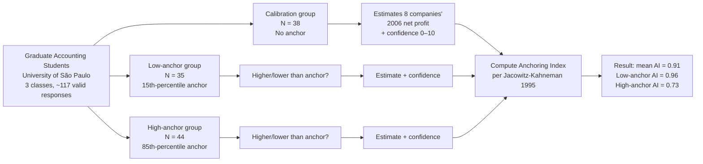

# 8-company × 3-group experimental design

> Luppe's replication of the Jacowitz-Kahneman 1995 anchoring methodology, adapted to accounting-financial-variable estimation. Three randomised groups (calibration / low-anchor / high-anchor) estimate the 2006 net profit of eight named companies; the Anchoring Index is computed per company from the group medians. **Reproduced as Mermaid** for navigability and methodological reuse — this design is portable to any accounting-estimation context (audit risk, fair value, transfer-pricing benchmark, environmental liability).

## Provenance

| Field | Value |
|---|---|
| Source | [[2012-09-01-luppe-2012-anchoring-accounting-indicators]] |
| Source's reference | §Methods (experimental-design section) |
| Location | pp. 122–124 |
| Last confirmed | 2026-05-25 |

## Diagram (Mermaid reproduction)

## Design parameters

### Sample

- **N total**: ~117 valid responses
- **Source population**: Graduate accounting students, University of São Paulo (FEA/USP)
- **Recruitment**: 3 graduate-class samples; convenience sampling
- **Demographics**: Brazilian, predominantly accounting-trained, mean age ≈ late-20s

### Three randomly-assigned conditions

| Group | N | Treatment | Question pattern |
|---|---:|---|---|
| **Calibration** | 38 | No anchor — open question | "What was Petrobras's 2006 net profit?" → numeric estimate + confidence (0–10) |
| **Low-anchor** | 35 | Anchor = 15th percentile of calibration distribution | (1) "Was Petrobras's 2006 net profit higher or lower than R$ 1 B?" (2) "What was it?" + confidence |
| **High-anchor** | 44 | Anchor = 85th percentile of calibration distribution | Same two-step structure with the high anchor (e.g. R$ 16 B for Petrobras) |

### Eight target companies

Four Brazilian + four US companies, chosen to span familiarity and magnitude:

1. **Petrobras** (BR, oil & gas, large)
2. **General Electric** (US, conglomerate, large)
3. **Grupo Pão de Açúcar** (BR, retail, mid-cap)
4. **Wal-Mart** (US, retail, very large)
5. **CVRD / Vale** (BR, mining, large)
6. **Apple Computer** (US, tech, mid-cap at the time)
7. **TAM Linhas Aéreas** (BR, airline, mid-cap)
8. **Sears** (US, retail, declining)

### Anchor derivation

Anchors are derived **from the calibration group's own distribution**: low anchor = 15th-percentile estimate from calibration group; high anchor = 85th-percentile estimate. This is the Jacowitz-Kahneman 1995 protocol — anchors are *plausible* (drawn from real estimates), not arbitrary, and span the realistic distribution the calibration group considered.

### Outcome measures

- **Numeric estimate** (raw, then transformed to a 0–100 scale via the Jacowitz-Kahneman formula)
- **Self-reported confidence** in the estimate (0–10 scale)

## Why the design is reusable

The protocol generalises to any **accounting-judgment context** where a reference number could be presented:

| Domain | Anchor candidate | Estimation target |
|---|---|---|
| Audit risk assessment | Prior-year risk score | Current-year risk score |
| Fair-value impairment | Independent appraiser estimate | Manager's impairment recognition |
| Transfer pricing | Industry-benchmark margin | Internal margin selection |
| Environmental liability | Outside-counsel estimate | Internal reserve |
| Goodwill testing | Historical cost basis | Discount-rate selection |

In each case, the design's contribution is the **calibration-group baseline** — without an unanchored reference distribution, you cannot quantify the anchoring effect. The 3-group design is the minimum-cost way to obtain that baseline.

## Cross-references

- The Anchoring Index results this design produces: [[luppe-2012-anchoring-index-results]] (Table 2).
- The statistical tests of those results: [[luppe-2012-t-test-results]] (Table 4).
- Concepts: [[anchoring-bias]], [[behavioural-finance]], [[jacowitz-kahneman-method]], [[accounting-judgment]].
