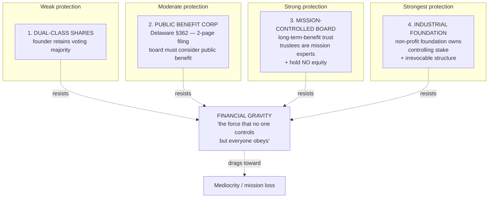

# Four mission-protection mechanisms

> Eric Ries's *Incorruptible* (2026) taxonomy of governance structures that protect a company's founding mission from "financial gravity" — the predictable pull toward shareholder-primacy-driven mediocrity. **Four mechanisms in increasing order of protection strength**, each with characteristic strengths, weaknesses, and live cases. Sourced from both the [[2026-05-26-yc-2026-defend-against-mediocrity-and-rot|Y Combinator]] and [[2026-05-26-lennys-2026-anthropic-costco-patagonia-incorruptible-companies|Lenny's Podcast]] interviews — both reproduce the taxonomy from Ries's book.

## Provenance

| Field | Value |
|---|---|
| Source (primary) | [[2026-05-26-yc-2026-defend-against-mediocrity-and-rot]] (YC, 50 min) |
| Source (secondary) | [[2026-05-26-lennys-2026-anthropic-costco-patagonia-incorruptible-companies]] (Lenny's, 99 min) |
| Author | Eric Ries — *Incorruptible* (2026) |
| Location | YC chapters 5–18; Lenny scattered |
| Last confirmed | 2026-05-26 |

## The four mechanisms

## Mechanism 1 — Dual-class shares

**What it is:** Founders retain a special class of shares with super-voting rights (e.g. 10 votes per share for Class B; 1 vote per share for Class A held by public investors). Allows the founder to maintain voting control even after dilutive equity rounds.

**Strengths:**

- Common, well-understood, no special filings beyond corporate charter amendments.
- Compatible with public-market listings (Google, Meta, Snap, many tech IPOs use it).
- Protects against hostile takeover.

**Weaknesses (per Ries):**

- **Founder can still drift.** Dual-class protects the *founder's* control but does not bind the founder to the original mission. If the founder's priorities change, or if the founder transfers shares to successors who don't share the mission, the protection evaporates.
- **Sunset clauses common.** Many dual-class structures expire after a fixed period (often 10-20 years) or on founder departure. The mission protection has an expiry.
- **Reduces equity-raise capacity at the margins.** Some institutional investors won't hold dual-class stock; index inclusion is conditional in some indices (S&P removed Snap from S&P 500 inclusion for years due to non-voting share structure).

**Live cases:** Google (Sergey & Larry retained super-voting; arguably drifted with Schmidt-era and post-founder management); Meta (Zuckerberg retains control); Snap; many tech IPOs.

**Ries's verdict:** *"[Dual-class is] better than nothing. I mean it's certainly better than investor control which really is self-defeating. Founder…"* — *but insufficient on its own.*

## Mechanism 2 — Public Benefit Corporation (PBC)

**What it is:** A Delaware General Corporation Law amendment (DGCL §362) — sometimes called "the two-page filing" — that converts a standard C-Corp into a Public Benefit Corporation. The amendment requires the board to consider, in its decisions, the public-benefit purpose written into the corporate charter, alongside shareholder interests.

**Mechanically:**

- Pre-funding (founding-stage): minimal cost, can be added or formed as PBC from the start.
- Post-funding: requires investor consent (typically a supermajority of equity holders).
- Statutory text: §362(a) — the public benefit must be "specific" and written into the charter.
- Reporting: PBC must publish (every two years in Delaware) a benefit report.
- Enforcement: limited. Shareholders can sue for failure to consider the public benefit but cannot sue to force a specific outcome.

**Strengths:**

- **Legally binding.** Unlike a mission statement on a website, the board's fiduciary duty actually expands to include the public-benefit purpose.
- **Cheap and reversible at founding.** Two pages of legal filing; conversion before investor capitalisation is trivial.
- **Compatible with venture funding.** Many VCs have learned to accept PBC structure post-2015 (the most famous early-adopter case being Kickstarter's 2015 conversion).

**Weaknesses (per Ries):**

- **Enforcement is weak.** "Must consider" is easier to satisfy than "must maximise." A diligent board can satisfy the public-benefit consideration with minimal substance.
- **Founder can still convert back.** With supermajority vote, the PBC status can be removed; the protection isn't structurally irrevocable.
- **No external accountability party.** Unlike mechanisms 3 + 4, there is no trust or foundation enforcing the mission.

**Live cases:** Patagonia (PBC since 2012, before its 2022 trust transfer); Kickstarter; Allbirds; the broader B-Corp population (B-Corp certification typically requires PBC or equivalent legal status).

**Ries's verdict** (paraphrased from YC chapter 11 *"Just Become a PBC"*): the easiest first step. *"If you get into YC, you've got a safe, you know, maybe you haven't converted equity yet. Yeah, the normal path which is like..."* — convert before capitalisation; cheap insurance.

## Mechanism 3 — Mission-controlled board (long-term-benefit trust)

**What it is:** Some or all directors of the for-profit corporation's board are appointed by, and accountable to, an external mission-aligned trust whose trustees hold **no equity** in the company. The trust's deed binds the trustees to the founding mission; the trustees in turn select directors who are obligated to that mission rather than to shareholders.

**Mechanically (the Anthropic case study):**

- Anthropic, Public Benefit Corp.
- Long-Term Benefit Trust holds a class of stock with appointment rights to the Anthropic board.
- Trustees are AI-safety experts; no equity in Anthropic.
- Whenever shareholder-return interests conflict with the AI-safety mission, the trust-appointed directors have a fiduciary obligation to the mission, not to shareholder returns.

**Strengths (per Ries):**

- **Equity-free trustees have no personal-wealth incentive to override the mission.** This is the design's load-bearing feature. Trustees who would receive equity windfalls by overriding safety constraints would have a structural conflict; equity-free trustees do not.
- **Survives founder departure.** Anthropic's trust persists independent of any individual founder's continued involvement.
- **Strong evidence in observed behaviour.** Anthropic's documented refusals to release models considered too dangerous are attributed by Ries to this structure. *"Whenever you see Anthropic do the right thing, like when they refuse to release a model because they think it's too dangerous, think about how much that's costing them."*

**Weaknesses (per Ries — implied; not flagged by Ries in interview):**

- **Trustee selection is critical and not democratically accountable.** The founders pick the initial trustees; bad trustee selection persists.
- **Concentrates power.** The trust mechanism gives a small unelected body veto over commercial decisions; this concentrates risk in trustees' competence and judgement.
- **Untested under hard commercial squeeze.** Anthropic has not yet faced a make-or-break funding round or mass-layoff scenario where the trust's authority would be challenged.

**Live cases:** Anthropic (Long-Term Benefit Trust); Mozilla Foundation → Mozilla Corporation (the foundation owns the corp and selects directors).

**Ries's verdict:** the structure he advised Dario Amodei to write into Anthropic's charter pre-commercial-launch. *"They were true believers in this safety mission. And so investors suggested they come talk to me. I told them, 'Look, if you don't get this right, here's what's going to happen.' They wrote into their charter..."*

## Mechanism 4 — Industrial foundation

**What it is:** A non-profit foundation owns a controlling stake (typically majority voting via a special share class) of the for-profit company. The foundation is governed by trustees bound to the founding mission; the foundation's existence is irrevocable.

**Mechanically (the Novo Nordisk case study):**

- Novo Nordisk Foundation, a Danish industrial foundation, owns approximately 28% of Novo Nordisk economically.
- The Foundation's special share class carries majority voting rights (well above the economic stake).
- The Foundation's charter binds its trustees to the founding scientific-research and patient-care mission.
- The Foundation cannot be liquidated, acquired, or "voted away" — it is structurally irrevocable under Danish foundation law.

**Strengths (per Ries):**

- **Structurally irrevocable.** Foundation cannot be acquired or dissolved; mission persists even through ownership changes that would defeat dual-class or PBC protections.
- **Capital-market compatible.** Foundation-controlled firms can still list publicly (Novo Nordisk is listed; Patagonia post-2022 is not, but its trust is the same structural family). Investors hold the minority economic stake and get returns; the foundation holds the control.
- **Outperformance evidence (claimed but not cited).** Ries asserts industrial foundations outperform listed peers in aggregate. Steen Thomsen (Copenhagen Business School) has multiple working papers on this; the underlying empirical evidence is in the academic governance literature.
- **Headline live case:** Novo Nordisk's market cap reached **~$600 B in the 2023-2024 Ozempic-driven surge** while remaining foundation-controlled. The structure scaled with the firm.

**Weaknesses:**

- **Jurisdictional specificity.** Industrial foundations work cleanly under Danish, German, Dutch, Swedish law. US implementation requires special-purpose structures (Patagonia's 2022 transfer used a US trust + 501(c)(4) combination; legally clever but not a clean equivalent).
- **High setup cost at scale.** Setting up an industrial foundation post-founding requires either an extraordinary founder transfer (Yvon Chouinard's gift of Patagonia in 2022) or a complex post-IPO restructuring. Compare with PBC: 2 pages at founding.
- **Reduces founder family's economic upside.** The foundation owns shares the founder family no longer does.

**Live cases:**

- **Novo Nordisk** (Danish; Foundation-controlled; ~$600 B peak valuation).
- **Patagonia** (US; 2022 transfer of Chouinard family ownership to a Patagonia Purpose Trust + Holdfast Collective 501(c)(4); proceeds beyond reinvestment go to climate action).
- **Bosch, Carlsberg, Heineken Holding** (European industrial foundations / family-trust structures cited by Ries as the same broad family).

**Ries's verdict:** the strongest structural protection available; the one to aspire to for founders who genuinely want the mission to outlive them.

## How the four compose

The mechanisms are not exclusive. Real-world mission-protected companies typically stack two or three:

- **Anthropic**: Long-Term Benefit Trust (mechanism 3) + PBC status (mechanism 2).
- **Patagonia post-2022**: PBC status + Purpose Trust + 501(c)(4) — a US-jurisdiction industrial-foundation analogue (mechanisms 2 + 4).
- **Novo Nordisk**: Industrial foundation (mechanism 4) + Danish corporate-governance norms that constrain foundation behaviour.
- **Costco**: Sol Price's "fiduciary-to-customer" cultural norm — Ries does not classify Costco under any of the four mechanisms strictly; the protection there is cultural rather than structural. *(This is the wiki page's interpretation, not Ries's explicit statement; the Costco case in the interviews is presented as cultural inheritance from Sol Price rather than as a legal-structure case.)*

## What Ries explicitly rejects as insufficient

- **Mission statements without binding governance.** A website "About" page articulating the mission is worthless if the board has no fiduciary obligation to it.
- **Founder character alone.** Ries's argument is that financial gravity will eventually exceed any individual leader's resolve; structural mechanisms are needed.
- **Dual-class shares alone.** As discussed in Mechanism 1 — better than nothing but insufficient.
- **Reliance on ESG / B-Corp certification without statutory backing.** B-Corp certification (B Lab) signals intent but is not itself binding; it should be paired with PBC or stronger structure.

## What this artifact is NOT

- **Not Ries's exhaustive taxonomy.** The book *Incorruptible* (2026) — not ingested in this wiki yet — presumably has fuller detail, additional mechanisms, and the underlying empirical evidence. This artifact reproduces the interview-level summary.
- **Not jurisdictionally neutral.** PBC is Delaware-specific; industrial foundations work best in Northern European legal systems. Founders in other jurisdictions need to translate.
- **Not a recommendation engine.** Whether a founder should adopt one of these mechanisms — and which one — depends on commercial context, founder values, investor base, and exit horizon. The interviews discuss the trade-offs but do not prescribe.

## Cross-references

**Sources:**

- [[2026-05-26-yc-2026-defend-against-mediocrity-and-rot]] (Y Combinator).
- [[2026-05-26-lennys-2026-anthropic-costco-patagonia-incorruptible-companies]] (Lenny's Podcast).

**Author:**

- [[Eric-Ries]] — the source-author entity, promoted via the two-source rule on the same batch ingest.

**Concept this artifact belongs to:**

- [[mission-protection-via-governance]] — the umbrella concept page.

**Adjacent concepts:**

- [[corporate-turnaround]] — the response-phase dual; turnaround addresses what happens when prevention failed or wasn't in place.
- [[financial-distress]] — the symptom downstream of financial-gravity-driven mission erosion.

**Citations Ries makes but the wiki has not yet ingested:**

- Milton Friedman, *The Social Responsibility of Business Is to Increase Its Profits* (NYT Magazine, 1970) — canonical shareholder-primacy doctrine.
- Steen Thomsen — industrial-foundation outperformance studies (CBS).
- Lynn Stout, *The Shareholder Value Myth* (2012).
- Hansmann & Kraakman, *The End of History for Corporate Law* (2001) — counter-perspective.
