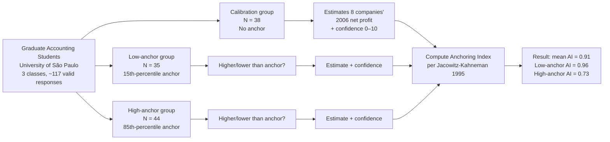

# Anchoring Heuristic and the Estimation of Accounting and Financial Indicators

> The literature is unclear about how the perceptions that are involved with accounting judgment occur. The fundamental purpose of this article is to identify the effects of anchoring in the estimation of a balance sheet indicator to represent companies' net profit. From this perspective, the dynamics of the decision-making process prompt the use of true or false reference points, suggestively called anchors. This study examines how an arbitrary number presented to someone may influence their judgment, regarding a company's net profit, and the results provide evidence of the existence of anchoring bias in the estimation of this indicator. It's believed that studies of this nature are fundamental to provide a greater understanding of how heuristics may influence individual judgment and, consequently, how such biases may be avoided.

## TL;DR

Luppe & Fávero test **Tversky-Kahneman's anchoring heuristic** in an **accounting-judgment context** — specifically, the estimation of *net annual profit* (FY 2006, pre-crisis) for eight publicly-traded companies (4 Brazilian + 4 US; 4 retailers, 3 industries, 1 service provider). Using **Jacowitz-Kahneman's 1995 calibration-group method**, 117 accounting graduate students at University of São Paulo were assigned to a calibration group (no anchor) or one of two anchored groups (low / high anchor). The **mean Anchoring Index = 0.91** — anchored-group estimate medians moved 91 % of the way toward the anchor compared with the calibration-group medians. **Low anchors produced a stronger effect (AI = 0.96) than high anchors (AI = 0.73)** — opposite to Jacowitz-Kahneman but consistent with Luppe 2006. Effect persists for high-confidence subjects (AI = 0.85 vs. overall 0.91). The paper is the wiki's behavioural-finance outlier — it sits **outside the Altman/MDA distress-prediction tradition** and instead tests a cognitive bias that affects *how humans interpret* accounting numbers.

## Citation

**APA (7th edition):**

> Luppe, M. R., & Lopes Fávero, L. P. (2012). Anchoring heuristic and the estimation of accounting and financial indicators. *International Journal of Finance and Accounting*, *1*(5), 120–130. https://doi.org/10.5923/j.ijfa.20120105.06

**BibTeX:**

```bibtex
@article{luppe_2012_anchoring,
  author  = {Luppe, Marcos Roberto and Lopes F{\'a}vero, Luiz Paulo},
  title   = {{Anchoring Heuristic and the Estimation of Accounting and Financial Indicators}},
  journal = {International Journal of Finance and Accounting},
  year    = {2012},
  volume  = {1},
  number  = {5},
  pages   = {120--130},
  doi     = {10.5923/j.ijfa.20120105.06}
}
```

## What was actually ingested

**Pass 2** — full read. Abstract, introduction, literature review (judgment-and-decision-making, anchoring heuristic, bounded rationality), method (Jacowitz-Kahneman calibration-group design, identification-of-anchoring via Anchoring Index and point-biserial correlation), results (all 7 tables), conclusions, references list reviewed.

## Context (WHY)

Sits **outside the distress-prediction tradition** that the other five papers in the 2026-05-25 batch share. Where Altman/Habib/Powell/Hajek/Bari examine *what* financial indicators predict distress, Luppe & Fávero examine *how reliably humans estimate* a single financial indicator (net profit) when presented with potentially-misleading reference points.

The intellectual move is **cognitive-bias-into-accounting**: applying Tversky-Kahneman's anchoring-heuristic literature (Tversky-Kahneman 1974 *Science*; Kahneman-Tversky 1979 prospect theory; Jacowitz-Kahneman 1995 measurement method) to accounting estimation. Predecessor literature in this stream:

- Joyce-Biddle 1981 — anchoring in probabilistic inference in auditing.
- Wright-Anderson 1989 — anchoring in probability assessment for auditing.
- Kennedy-Mitchell-Sefcik 1998 — anchoring on environmental-liability disclosures in financial statements.
- Vitting 2010 — anchoring in financial-market participants' decisions.

Luppe's contribution: **adapts Jacowitz-Kahneman's experimental method to accounting estimation tasks in a Brazilian / emerging-market context**. The paper is methodologically rigorous (formal Anchoring Index calculation, point-biserial correlation, t-tests of transformed estimates, confidence-mediated subgroup analysis) but its empirical scope is bounded — graduate-student sample, eight specific firms, single financial indicator.

**Theoretical bases:**

- **Bounded rationality** (Simon 1957) — the foundational claim that humans use heuristics because cognitive resources are limited.
- **Heuristics-and-biases program** (Tversky-Kahneman 1974) — three core heuristics: representativeness, availability, anchoring.
- **Prospect theory** (Kahneman-Tversky 1979) — reference-point-based value functions.
- **Neuroeconomics** (interdisciplinary economics + psychology + medicine).
- **Behavioural accounting** (Hogarth 1993; Maines 2007; Solomon-Shields 2007) — the bridge between cognitive psychology and accounting research.

Adjacent wiki sources: **none in the 2026-05-25 batch carry typed relationships to Luppe**. The paper is a thematic outlier — the cognitive-bias channel is orthogonal to the distress-prediction lineage. A defensible weak `mentions` relationship to [[2020-01-01-habib-2020-distress-determinants-consequences-review]] exists (Habib's review notes CEO/director personal-default history as a distress signal, citing managerial-bias-style reasoning) but the connection is too thin to merit a typed edge. The cleanest concept-bridge is via [[behavioural-finance]] / [[anchoring-heuristic]] — concept pages future ingests of behavioural-distress sources could link to.

## Methods (HOW)

### Experimental design — Jacowitz-Kahneman 1995 method

Three groups drawn from the same population:

1. **Calibration group** (N = 38 valid responses): estimates the 8 companies' net-profit values with **no anchor** mentioned. Confidence in each estimate self-rated on 0–10 scale.
2. **Low-anchor group** (N = 35 valid responses): for each company, first asked "is the net profit higher or lower than X?" where X is the **15th percentile** of the calibration group's distribution, then estimates the value.
3. **High-anchor group** (N = 44 valid responses): same but anchor is the **85th percentile** of the calibration distribution.

Anchors per company (8 questions × low / high):

| Company | Low anchor | High anchor |
|---|---|---|
| Petrobras (R$) | 25 M | 16 B |
| General Electric (US$) | 29 M | 24 B |
| Grupo Pão de Açúcar (R$) | 5 M | 1 B |
| Wal-Mart (US$) | 93 M | 100 B |
| CVRD (R$) | 25 M | 26 B |
| Apple Computer (US$) | 8 M | 10 B |
| TAM Linhas Aéreas (R$) | 3 M | 920 M |
| Sears (US$) | 2 M | 4 B |

(Calibration group medians from Table 1: Petrobras R$ 3 B, GE US$ 891 M, GPA R$ 412 M, Wal-Mart US$ 5.5 B, CVRD R$ 900 M, Apple US$ 991 M, TAM R$ 125 M, Sears US$ 185 M.)

### Anchoring Index — the central measurement instrument

```
General Anchoring Index:
  AI = (median high anchor − median low anchor) / (high anchor − low anchor)

Per-anchor AI (low anchor):
  AI_low = (median low anchor − median calibration) / (low anchor − median calibration)

Per-anchor AI (high anchor):
  AI_high = (median high anchor − median calibration) / (high anchor − median calibration)
```

**Interpretation**: AI = 0 means no anchoring effect; AI = 1 means anchored-group medians coincide exactly with the anchors; AI > 1 means anchored-group medians have moved *past* the anchor.

### Additional measurements

- **Estimate transformation** (Jacowitz-Kahneman): standardise anchored-group estimates by the calibration-group's distribution → score 50 = calibration median; scores 0 and 100 for estimates outside the calibration range. Allows pooling across questions.
- **t-tests** of transformed estimates between low-anchor and high-anchor groups (verify difference statistically significant).
- **Point-biserial correlation** (special case of Pearson, one variable dichotomous) between the anchored groups' answers ("higher than anchor" coded 1; "lower" coded 0) and the estimate values.
- **Confidence-mediated subgroup analysis**: top-25 % most-confident respondents in each anchored group → recompute AIs. Tests Wilson et al. 1996's claim that anchoring effect varies inversely with confidence.

## Results (WHAT)

### Anchoring Index per company (Table 2)

| Question | Calibration median | Low-anchor median | High-anchor median | Gen AI | Low AI | High AI |
|---|---|---|---|---:|---:|---:|
| 1. Petrobras | R$ 3 B | R$ 1 B | R$ 14.5 B | 0.85 | 0.67 | 0.88 |
| 2. General Electric | US$ 891 M | US$ 300 M | US$ 20 B | 0.82 | 0.69 | 0.83 |
| 3. Grupo Pão de Açúcar | R$ 412 M | R$ 50 M | R$ 1.4 B | **1.36** | 0.89 | **1.68** |
| 4. Wal-Mart | US$ 5.5 B | US$ 400 M | US$ 50 B | 0.50 | 0.94 | 0.47 |
| 5. CVRD | R$ 900 M | R$ 800 M | R$ 20 B | 0.74 | 0.11 | 0.76 |
| 6. Apple Computer | US$ 991 M | US$ 250 M | US$ 14 B | **1.38** | 0.75 | **1.44** |
| 7. TAM Linhas Aéreas | R$ 125 M | R$ 25 M | R$ 825 M | 0.87 | 0.82 | 0.88 |
| 8. Sears | US$ 185 M | US$ 10 M | US$ 3 B | 0.75 | 0.96 | 0.74 |
| **Mean** | | | | **0.91** | 0.73 | **0.96** |

**Mean AI = 0.91** — the central headline finding. The two AIs > 1 (Grupo Pão de Açúcar; Apple) indicate that respondents *over-shot* the high anchor — i.e., when told Apple's profit was greater than US$ 10 B (the high anchor), some respondents estimated values *above* US$ 10 B; the median estimate of US$ 14 B is 40 % beyond the anchor itself.

Petrobras worked example (cited explicitly in body): real 2006 net profit was R$ 26 B (≈ 1.7× the high anchor of R$ 16 B). Calibration-group median: R$ 3 B (off by an order of magnitude). Anchored medians: R$ 1 B (low) vs. R$ 14.5 B (high) — a 14× swing driven purely by the arbitrary reference point.

### Transformed medians and extreme values (Table 3)

Median transformed score: 11.3 (low anchor) vs. 52.8 (high anchor). The high-anchor median sits essentially on top of the calibration median (50 = calibration median); the low-anchor median is far below. Extreme-value rates: 7 % (low anchor) vs. 42 % (high anchor) — high anchors produced more out-of-range estimates because some respondents accepted the anchor's implication that the value is "very high" and moved freely above the calibration distribution.

### t-tests (Table 4)

All 8 t-test statistics are large (range 6.34 to 11.46), all p < 0.01 with N = 79. The difference between low-anchor and high-anchor groups' transformed estimates is highly statistically significant — anchoring is not a marginal effect.

### Point-biserial correlation

Mean correlation = 0.13 between "higher/lower than anchor" answer and the estimate. Modest in absolute terms but evidence that anchor values influenced estimates beyond what would arise by chance.

### Confidence-mediated effects (Table 5)

For the top-25 % most-confident respondents in each anchored group: **mean AI = 0.85**, down from 0.91 overall — a small reduction. Anchoring effect persists even among subjects with high stated confidence in their estimates. The classic Wilson et al. 1996 inverse-confidence prediction holds directionally but is *weak* — confidence does not protect against anchoring as strongly as the prior literature claimed.

### Confidence-presentation effects (Tables 6 and 7)

Mean self-reported confidence: 3.00 (calibration group, no anchor) vs. 4.00 (high-anchor group) vs. 3.91 (low-anchor group). Per-question t-tests significant at p < 0.10 across all 8 companies in both directions. **Subjects rate their estimates as more confident when they have been given an anchor** — the anchor is treated as useful information, even when arbitrary. This is a clean behavioural finding with policy implications: providing a reference point increases stated confidence without necessarily improving accuracy.

### Three robust findings (conclusion)

1. **Anchoring effects are significant on accounting-financial-variable estimation** (mean AI = 0.91; all t-tests p < 0.01).
2. **Low anchors are more influential than high anchors** in this context (AI_low = 0.96; AI_high = 0.73). Body interpretation: high anchors were too far from the calibration distribution in absolute magnitude (US$ 100 billion for Wal-Mart was "absurd"); low anchors were closer to the realistic range. This *contradicts* Jacowitz-Kahneman 1995 but corroborates Luppe 2006 (the first author's master's dissertation).
3. **Greater uncertainty → more anchoring** — confidence-mediated subgroup analysis shows the effect persists but is somewhat reduced for high-confidence respondents.

## Visual content

The paper carries **no figures** (no diagrams, no charts, no images) and **7 tables**. The methodology is presented in prose + formulae; results are presented in tabular form. Audio/visual content: none.

### Table 1 — Calibration group statistics

**Type:** descriptive-statistics table. **Location:** p. 124.

8 companies × 3 statistics (median + 15th percentile + 85th percentile + N). The 15th and 85th percentiles become the low and high anchors for the experimental groups. → reproduced selectively in §Methods above.

### Table 2 — Experiment Anchoring Indexes

**Type:** core-results table. **Location:** p. 125.

8 questions × 7 columns (calibration median, low anchor, high anchor, low-anchor median, high-anchor median, General AI, Low AI, High AI). The headline empirical artifact of the paper. → reproduced in full in §Results above.

### Table 3 — Transformed medians and extreme values

**Type:** transformed-statistics table. **Location:** p. 126. 8 companies × 4 columns. → reproduced in §Results above.

### Table 4 — t-tests of transformed estimates

**Type:** statistical-test table. **Location:** p. 126. 8 t-test statistics; N = 79; sig. < 0.01.

| Question | t |
|---|---:|
| 1. Petrobras | 6.535 |
| 2. General Electric | 7.286 |
| 3. Grupo Pão de Açúcar | 9.422 |
| 4. Wal-Mart | 6.582 |
| 5. CVRD | 6.340 |
| 6. Apple Computer | 11.463 |
| 7. TAM Linhas Aéreas | 7.028 |
| 8. Sears | 9.729 |

### Table 5 — Highest-confidence subgroup AIs

**Type:** subgroup-analysis table. **Location:** p. 127. Top-25 % most-confident respondents. **Mean AI = 0.85** (vs. 0.91 overall).

### Tables 6 and 7 — Degree-of-confidence means by group

**Type:** confidence-comparison tables with t-tests. **Location:** p. 128.

Per-company mean confidence (high anchor vs. calibration; low anchor vs. calibration). **General means: anchored 3.91–4.00, calibration 3.00**. All 16 pairwise t-tests significant at p < 0.10 (with 73–82 subjects per comparison).

The paper carries **no figures**, no flowcharts, no equations rendered as images. Per the wiki's [§Visual content extraction](../../CLAUDE.md#visual-content-extraction) rule: the paper is *not exclusively text-based* — the tables are visual artifacts in the load-bearing sense — but it carries no figures/charts/diagrams. The Visual-content section above is therefore primarily a table catalogue.

## Distinctive artifacts

### Anchoring Index formulae

```
General AI:    AI = (median_high_anchor − median_low_anchor) / (high_anchor − low_anchor)

Per-anchor:    AI_low  = (median_low_anchor  − median_calibration) / (low_anchor  − median_calibration)
               AI_high = (median_high_anchor − median_calibration) / (high_anchor − median_calibration)

Interpretation:
   AI = 0   → no anchoring effect; anchored group's median = calibration median
   AI = 1   → full anchoring; anchored group's median = the anchor itself
   AI > 1   → over-anchoring; anchored group's median is beyond the anchor
```

### Estimate-transformation formulae (Jacowitz-Kahneman)

For estimates between calibration median and maximum of calibration range:

```
Transformed_score(x) = 50 + (estimate − calibration_median) · 50 / (max_value − calibration_median)
```

For estimates between minimum of calibration range and calibration median:

```
Transformed_score(x) = 50 + (estimate − min_value) · 50 / (calibration_median − min_value)

(Equivalent to a piecewise rescaling that puts the calibration median at 50, the
calibration extremes at 0 and 100, and values outside the calibration range at
0 or 100 by clipping.)
```

### The 8-company × 3-group experimental design (Mermaid reproduction)



### Three robust findings (paraphrased from conclusion)

```
(a) Anchoring effects significant on accounting-financial-variable estimation
    Mean AI = 0.91 across 8 companies; all 8 t-tests p < 0.01

(b) Low anchors > high anchors in influence in this experiment
    AI_low = 0.96; AI_high = 0.73
    Body interpretation: high anchors were too far from realistic values to be plausible
    Note: this CONTRADICTS Jacowitz-Kahneman 1995 (high > low in their experiment)
    but is CONSISTENT with Luppe 2006

(c) Anchoring persists under high subject-stated confidence
    AI = 0.85 in the top-25% confidence subgroup, only slightly below the overall 0.91
    Suggests confidence does not strongly protect against anchoring bias
```

## Discussion / Significance (SO WHAT)

For the wiki, three contributions land:

1. **Empirical demonstration that anchoring affects accounting-judgment tasks** — the paper extends the heuristics-and-biases programme into the accounting domain in a Brazilian / emerging-market context. The AI = 0.91 magnitude is large enough to be a policy concern: any accounting-judgment context that provides a reference value (a prior-year figure, a benchmark, an external estimate) risks biasing the user's own estimate by ~90 % of the gap between that reference and an unanchored judgment.
2. **Methodological reusability** — the Jacowitz-Kahneman calibration-group design + AI calculation is portable to other accounting-estimation contexts (audit-risk estimation, environmental-liability estimation, fair-value impairment estimation, transfer-pricing benchmarks). Each is a candidate domain for replication.
3. **Confidence does not protect against anchoring** — the top-25 % most-confident respondents still showed AI = 0.85. This contradicts naive interventions ("just have confident experts make the estimate") and supports structural debiasing (forcing reference-free estimation steps; presenting multiple anchors).

**Limitations acknowledged by authors:**
- Convenience sample of graduate accounting students at University of São Paulo. Generalisability to working professionals limited.
- Simplified task (one indicator: net profit) does not capture the complexity of real-world accounting/audit decisions.
- Sample size: 117 valid responses across 3 groups; per-question N ≈ 35–44.

**Limitations not flagged:**
- **The "low anchor was more influential than high anchor" finding may be a paper-specific artefact**: the high anchors (US$ 100 B for Wal-Mart; US$ 24 B for GE) were chosen to be the 85th percentile of the calibration group's estimates, but if the calibration group itself was systematically *underestimating* (as the Petrobras worked example shows — calibration median R$ 3 B vs. real R$ 26 B), the 85th-percentile high anchors may have happened to land near reality, while the 15th-percentile low anchors landed at unrealistically-low values. The asymmetry would then be an artefact of calibration-group bias rather than a generalisable finding about anchor magnitude.
- **The 2006 net-profit task was retrospective** — respondents were estimating values from approximately 6 years before the experiment (paper published 2012, task asks about 2006). Memory effects + accumulated outside information about company performance since 2006 (e.g., the 2008 GFC) may have contaminated estimates differently for the eight companies.
- **No interaction effect explored** between anchor magnitude and respondent-domain knowledge** — the paper notes accounting graduate students "presumably have greater knowledge" but does not quantify or interact this with the anchoring effect.
- **No comparison with non-accounting comparison group** — would non-accounting students show *more* anchoring? Less? The single-population design does not let us isolate domain expertise as a modulator.

## Citations to chase

- **Tversky, Kahneman 1974** — *Judgment under Uncertainty: Heuristics and Biases*, Science 185. The founding anchoring paper.
- **Jacowitz, Kahneman 1995** — *Measures of Anchoring in Estimation Tasks*, Personality and Social Psychology Bulletin 21. The method Luppe replicates.
- **Simon 1957** — *Models of Man*. Bounded-rationality foundation.
- **Kahneman, Tversky 1979** — *Prospect Theory*, Econometrica 47. Reference-point-based decision theory.
- **Joyce, Biddle 1981** — earliest anchoring study in auditing.
- **Wilson et al. 1996** — *A New Look at Anchoring Effects*. Confidence-mediation discussion.
- **Hogarth 1993** — *Accounting for Decisions and Decisions for Accounting*. The behavioural-accounting research programme.
- **Bazerman, Moore 2008** — *Judgment in Managerial Decision Making* (textbook).

## Linked entities and concepts

**Entities** (per [§Author-entity promotion](../../CLAUDE.md#author-entity-promotion)):

- **Dangling** (single-source mention, deferred): Marcos Roberto Luppe (USP), Luiz Paulo Lopes Fávero (USP, School of Economics, Business and Accounting). Single-source-mention rule; not promoted in this batch.

**Concepts** (created or referenced in this ingest batch):

- [[anchoring-heuristic]] — the central cognitive bias studied.
- [[accounting-judgment]] — the application domain.
- [[behavioural-finance]] — the broader research programme.
- [[bounded-rationality]] — Simon 1957 foundation.
- [[heuristics-and-biases]] — Tversky-Kahneman programme.
- [[net-profit-estimation]] — the specific task tested.

Concepts that emerge from this paper are intentionally **disjoint from the financial-distress concept family** that the other five batch papers contribute to. Luppe sits in a parallel cognitive-bias-in-accounting cluster.

## Source-to-source relationships

Neighbour-scan against the 2026-05-25 batch:

The neighbour-source scan yields **no defensible typed-edge candidates** in this batch. The cleanest plausible link would be a `mentions` weak edge to [[2020-01-01-habib-2020-distress-determinants-consequences-review]] via Habib's CEO-overconfidence determinant (citing Ho et al. 2016) and CEO past-default determinant (Kallunki-Pyykko 2013) — both touch managerial-judgment biases. But Luppe is about the *cognitive bias itself*, not its consequences for distress; the link is thematically thin.

A defensible cross-corpus connection exists conceptually:

- **`mentions` (weak) → [[2020-01-01-habib-2020-distress-determinants-consequences-review]]** — *via:* "both treat managerial / individual judgment as a determinant of financial outcomes, though Luppe studies the cognitive mechanism while Habib catalogues the empirical determinants." This is noted but not committed as a typed `supports` edge in the frontmatter; the cluster bridge is too thin for that.

Luppe is best treated as a **stub-source for the future behavioural-finance corpus** — when a second behavioural-finance paper enters the wiki, the [[anchoring-heuristic]] concept page will become a hub linking both.

## Quality review

| Field | Value |
|---|---|
| Reviewer | Claude (self-score) |
| Date | 2026-05-25 |
| Claimed depth | Pass 2 |
| Rubric version | 1.0 |

| Dim | Score | Floor | Notes |
|---|---:|---:|---|
| D1 Five Cs | 3 | 2 | Category (experimental + behavioural), Context (Tversky-Kahneman lineage + Brazilian-context novelty + outlier-from-batch noted), Correctness (calibration-bias hypothesis + retrospective-task concern flagged), Contributions (3 named), Clarity (no figures — table-only paper; the asymmetry-finding caveat noted). |
| D2 IMRaD | 3 | 2 | Results section gives specific AIs per company (range 0.50–1.38), exact t-statistics per question (6.34–11.46), specific confidence-subgroup AI (0.85 vs. 0.91 overall), specific calibration / anchored confidence means (3.00 vs. 3.91–4.00). |
| D3 Distinctive artifacts | 3 | 2 | **Anchoring Index general + per-anchor formulae transcribed**; Jacowitz-Kahneman transformation formulae transcribed; Table 2 (the headline AI table) fully reproduced; Table 4 (t-tests) reproduced; experimental design rendered as Mermaid flowchart; three robust findings codified as code block. |
| D4 Critical reading | 2 | 2 | Four concrete "not flagged" items: low/high-anchor asymmetry may be calibration-group-bias artefact; retrospective 2006-task memory contamination; no domain-knowledge interaction; no non-accounting comparison group. Each traceable to specific methodological choices. |
| D5 Pass-3 markers | — | — | n/a (Pass 2 page) |

**Total: 11 / 12 = 0.92** (at ceiling)

**Resolution:** accepted; catalogue update can proceed. The paper is a thematic outlier in the 2026-05-25 batch; the wiki currently has no thematic neighbours for it. The [[anchoring-heuristic]] concept page is the canonical first home for future behavioural-finance ingests to link back to.
