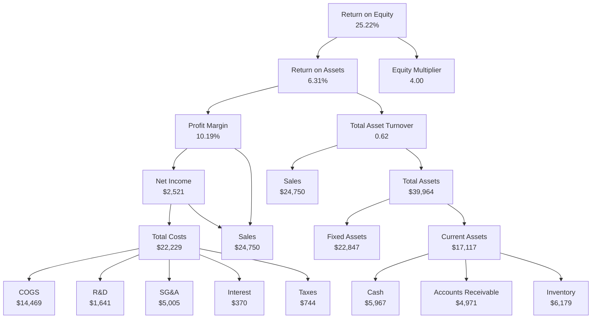

# Working with Financial Statements

> THE PRICE OF A SHARE OF COMMON STOCK in corner pharmacy CVS Health closed at about $82 on January 6, 2017. At that price, CVS had a price-earnings (PE) ratio of 18. That is, investors were willing to pay $18 for every dollar in income earned by CVS. At the same time, investors were willing to pay $55, $34, and $6 for each dollar earned by Adobe Systems, Pfizer, and Ford, respectively. At the other extreme were Blackberry and Twitter. Both had negative earnings for the previous year, yet Blackberry was priced at about $8 per share and Twitter at about $17 per share. Because they had negative earnings, their PE ratios would have been negative, so they were not reported. At the time, the typical stock in the S&P 500 index of large company stocks was trading at a PE of about 16, or about 16 times earnings, as they say on Wall Street.
>
> Price-to-earnings comparisons are examples of the use of financial ratios. As we will see in this chapter, there are a wide variety of financial ratios, all designed to summarize specific aspects of a firm's financial position. In addition to discussing how to analyze financial statements and compute financial ratios, we will have quite a bit to say about who uses this information and why.
>
> *(Opening vignette, p. 49.)*

## TL;DR

The **canonical pedagogical reference** for financial-statement analysis in undergraduate corporate-finance courses, taught for nearly four decades through successive editions. Chapter 3 codifies (1) the **closed vocabulary of ~22 financial ratios** across five categories — short-term solvency, long-term solvency, asset management, profitability, market value; (2) the **DuPont identity** decomposition of ROE into profit margin × total asset turnover × equity multiplier; (3) the **standardisation toolkit** (common-size statements, common-base year, combined common-size/base year); and (4) the **benchmarking taxonomy** for cross-firm comparison (time-trend, peer-group via SIC/NAICS, RMA industry data). The chapter is also notable for honestly catalogu­ing — in §3.5 — the structural limits of ratio analysis: no underlying theory, no canonical formulae, conglomerate dilution, cross-border GAAP heterogeneity, accounting-period mismatch, transient-event distortion.

For the wiki, this is the **definitional backbone** every financial-distress paper in the corpus implicitly assumes: Habib's measurement-models taxonomy, Altman's Z- and Omega-score families, Powell's ASEAN MDA, Hajek's structured-ratio baseline, Bari's small-business indicator families — all operationalise ratios that this chapter defines pedagogically.

## Citation

**APA (7th edition):**

> Ross, S. A., Westerfield, R. W., & Jordan, B. D. (2019). Working with financial statements. In *Fundamentals of corporate finance* (12th ed., pp. 49–90). McGraw-Hill Education.

**BibTeX:**

```bibtex
@incollection{ross_2019_fundamentals_ch3,
  author    = {Ross, Stephen A. and Westerfield, Randolph W. and Jordan, Bradford D.},
  title     = {{Working with Financial Statements}},
  booktitle = {{Fundamentals of Corporate Finance}},
  edition   = {12th},
  chapter   = {3},
  pages     = {49--90},
  publisher = {McGraw-Hill Education},
  year      = {2019},
  isbn      = {9781259918957}
}
```

Note: The PDF on disk is named `Fundamentals of Corporate Finance - Stephen M. Ross.pdf` — the filename's "Stephen M. Ross" is incorrect. The textbook's lead author is **Stephen A. Ross** (Franco Modigliani Professor of Financial Economics, MIT Sloan; deceased 2017). Stephen M. Ross is the unrelated Michigan businessman/philanthropist. The 12th edition (copyright 2019) is the final edition on which Stephen A. Ross was lead author; subsequent editions retain his name posthumously. Co-authors: Randolph W. Westerfield (Marshall School, USC) and Bradford D. Jordan (Gatton College, University of Kentucky).

## What was actually ingested

**Pass 2** — every section of the chapter read in full: §3.1 Cash Flow and Financial Statements (sources/uses + statement of cash flows + Prufrock balance sheets and income statement); §3.2 Standardized Financial Statements (common-size + common-base year + combined); §3.3 Ratio Analysis (all five categories, every numbered equation 3.1-3.25 captured); §3.4 The DuPont Identity (closer-look-at-ROE derivation + Yahoo!/Alphabet comparison + Expanded DuPont analysis for DuPont Inc); §3.5 Using Financial Statement Information (why-evaluate + benchmarking via time-trend / peer-group / SIC / NAICS / RMA + Problems with Financial Statement Analysis); §3.6 Summary and Conclusions.

The 13 tables and 1 figure were inspected in the original PDF (pdftotext mangles Tables 3.12 / 3.13 — the RMA wine-industry comparative data — and drops Figure 3.1 entirely, so the PDF was read directly for those). All 5 boxed Examples (3.1-3.5) read. End-of-chapter material catalogued by category — 12 Critical-Thinking Questions, 30 Questions & Problems split into Basic/Intermediate/Master-level, one Excel Master It! XBRL problem, one Minicase (Ratio Analysis at S&S Air, Inc.) — but **the end-of-chapter problems were not solved**, only catalogued for completeness.

## Context — the chapter's place in the textbook and the wiki

The chapter sits in **Part 2: Financial Statements and Long-Term Financial Planning** (Chapters 3-4 of the 12th edition). It depends on Chapter 2 (the accounting identity, the balance sheet, the income statement, the basic cash-flow identity) and prepares for Chapter 4 (long-term financial planning via the percent-of-sales method, internal/sustainable growth rates). Capital-structure ratios resurface in Part 6 (Capital Structure and Dividend Policy); the market-value ratios reappear in Part 5 (Risk and Return) and Part 7 (Short-Term Financial Planning).

For **wiki** purposes, this chapter is the *definitional backbone* the wiki's distress-prediction literature implicitly assumes:

- The ratios Altman 1968 combined into the Z-score (working capital/total assets, retained earnings/total assets, EBIT/total assets, market value of equity/book value of total debt, sales/total assets) are all members of the closed vocabulary §3.3 codifies — albeit Ross uses the more common modern variants.
- The "financial fundamentals" determinants in [[2020-01-01-habib-2020-distress-determinants-consequences-review|Habib 2020]] §3.1 (firm size, profitability, leverage, liquidity) map directly to the chapter's five ratio categories.
- The structured-ratio inputs to [[2024-06-22-hajek-2024-distress-prediction-annual-reports|Hajek 2024]]'s baseline (against which the FinBERT NLP gain is measured) are exactly this ratio set.
- The seven financial-indicator families in [[2026-02-04-bari-2026-us-small-business-distress-framework|Bari 2026]] are operationalisations of the chapter's liquidity / leverage / profitability buckets, adapted for small-business data.

## Chapter walkthrough

### §3.1 Cash Flow and Financial Statements: A Closer Look (pp. 50–54)

Extends Chapter 2's cash-flow identity (`Cash flow from assets = Cash flow to creditors + Cash flow to owners`) by tracing the cash events that produced the total. Introduces **sources of cash** (activities generating cash) and **uses of cash** (activities spending cash) with the mechanical rule:

> *An increase in a left-side (asset) account or a decrease in a right-side (liability or equity) account is a use of cash. Likewise, a decrease in an asset account or an increase in a liability (or equity) account is a source of cash.* (p. 53)

The **Prufrock Corporation** running example is introduced — a fictional firm with 2017 and 2018 balance sheets (Table 3.1), 2018 income statement (Table 3.2), and derived 2018 statement of cash flows in two presentations (Table 3.3 — three-category GAAP format; Table 3.4 — older sources-and-uses format).

### §3.2 Standardized Financial Statements (pp. 54–57)

Three normalisation techniques for cross-firm and cross-time comparison:

1. **Common-size statements** — every balance-sheet item as % of total assets; every income-statement item as % of sales. Prufrock common-size BS (Table 3.5) and IS (Table 3.6).
2. **Common-base year statements** — each item expressed relative to its base-year value; pure trend index.
3. **Combined common-size + base-year analysis** — applies the index to the common-size series so growth-in-the-ratio is separated from growth-in-the-underlying-firm. Prufrock illustration in Table 3.7.

### §3.3 Ratio Analysis (pp. 57–69)

The chapter's centerpiece. Five categories, twenty-two ratios:

**I. Short-term solvency / liquidity** (Eq 3.1–3.5):

1. Current ratio = Current assets / Current liabilities
2. Quick (acid-test) ratio = (Current assets − Inventory) / Current liabilities
3. Cash ratio = Cash / Current liabilities
4. NWC to total assets = Net working capital / Total assets
5. Interval measure = Current assets / Average daily operating costs

**II. Long-term solvency / financial leverage** (Eq 3.6–3.11):

6. Total debt ratio = (Total assets − Total equity) / Total assets
7. Debt-equity ratio = Total debt / Total equity
8. Equity multiplier = Total assets / Total equity = 1 + Debt-equity ratio
9. Long-term debt ratio = LT debt / (LT debt + Total equity)
10. Times interest earned (TIE) = EBIT / Interest
11. Cash coverage = (EBIT + Depreciation) / Interest

The chapter notes "EBITDA" (earnings before interest, taxes, depreciation, amortisation) and "EBITDAR" (adding rentals) as common variations on the cash-coverage numerator.

**III. Asset management / turnover** (Eq 3.12–3.18):

12. Inventory turnover = Cost of goods sold / Inventory
13. Days' sales in inventory = 365 / Inventory turnover
14. Receivables turnover = Sales / Accounts receivable
15. Days' sales in receivables (ACP) = 365 / Receivables turnover
16. NWC turnover = Sales / NWC
17. Fixed asset turnover = Sales / Net fixed assets
18. Total asset turnover = Sales / Total assets

**IV. Profitability** (Eq 3.19–3.21):

19. Profit margin = Net income / Sales
20. Return on assets (ROA) = Net income / Total assets
21. Return on equity (ROE) = Net income / Total equity

**V. Market value** (Eq 3.22–3.25 plus Tobin's Q):

22. Price-earnings (PE) ratio = Price per share / EPS
23. PEG ratio = PE / Earnings growth rate (%)
24. Price-sales ratio = Price per share / Sales per share
25. Market-to-book ratio = Market value per share / Book value per share
26. Tobin's Q = Market value of assets / Replacement cost of assets
27. Enterprise value (EV) = Total market value of stock + Book value of liabilities − Cash
28. Enterprise value-EBITDA = EV / EBITDA

The full list is reproduced as Table 3.8 (`Common Financial Ratios`).

### §3.4 The DuPont Identity (pp. 69–72)

Decomposes ROE into three driver components — the **DuPont identity** (Eq 3.26):

> **ROE = Profit margin × Total asset turnover × Equity multiplier**

Or equivalently: `ROE = (Net income / Sales) × (Sales / Assets) × (Assets / Total equity) = (Operating efficiency) × (Asset use efficiency) × (Financial leverage)`.

The General Motors illustration (1989–1993 ROE rose from 12.1% to 44.1%, driven entirely by equity-multiplier expansion from 4.95 to 33.62 after a pension-accounting writedown of book equity) shows why DuPont-decomposed scrutiny is non-optional for interpreting ROE comparisons. The Yahoo!/Alphabet 2013-2015 comparison (Table 3.9) shows how the same identity isolates profit-margin collapse (Yahoo! 2015 PM = −87.5%) as the dominant ROE driver.

The **Expanded DuPont chart** (Figure 3.1) further partitions each leg into balance-sheet and income-statement leaves, illustrated with DuPont Inc's 2016 financials (Table 3.10): ROE 25.22% = ROA 6.31% × Equity multiplier 4.00; ROA = Profit margin 10.19% × Total asset turnover 0.62.

### §3.5 Using Financial Statement Information (pp. 73–80)

**Why evaluate financial statements?** Internal uses (performance evaluation, planning) and external uses (creditors, suppliers, credit rating, competitors, acquisition targets).

**Choosing a benchmark.** Three approaches:

1. **Time-trend analysis** — compare a firm's ratios against its own history.
2. **Peer-group analysis** — compare against firms in the same business. The chapter introduces **SIC (Standard Industrial Classification)** four-digit codes — selected two-digit codes catalogued in Table 3.11 — and the successor **NAICS (North American Industry Classification System)** (1997).
3. **Aspirant-group analysis** — compare against firms the focal firm aspires to resemble, not necessarily its current peers.

**RMA (Risk Management Association, formerly Robert Morris Associates)** publishes annual industry-aggregated common-size statements and ratios; the chapter illustrates with NAICS 312130 (Manufacturing — Wineries) in Tables 3.12 (financial-statement data, by sales bucket and historical period) and 3.13 (selected ratios).

**Problems with financial statement analysis** — the chapter's intellectual highlight:

> *In one way or another, the basic problem with financial statement analysis is that there is no underlying theory to help us identify which quantities to look at and to use in establishing benchmarks. As we discuss in other chapters, there are many cases in which financial theory and economic logic provide guidance in making judgments about value and risk. Little such help exists with financial statements. This is why we can't say which ratios matter the most and what may be considered a high or low value.* (p. 78)

Specific problems listed:

- **Conglomerates** — multi-segment firms don't fit neat industry buckets (GE, 3M cited).
- **Globalisation** — non-US peers don't conform to GAAP; cross-border comparison is structurally lossy.
- **Within-industry heterogeneity** — even SIC-coded peers may operate dissimilarly (e.g., regulated utilities organised as cooperatives vs. for-profit).
- **Accounting heterogeneity** — different firms use different inventory accounting (FIFO/LIFO/average), different depreciation schedules.
- **Fiscal-year mismatch** — different firms' fiscal years end at different points.
- **Seasonality** — retailers with Christmas peaks have within-year balance-sheet fluctuations.
- **Transient events** — one-time asset sales, restructurings distort year-over-year comparison.

### §3.6 Summary and Conclusions (pp. 80)

Four-point recap: sources and uses of cash; standardised financial statements; ratio analysis (including the DuPont identity); using financial statements (benchmarks and problems).

### End-of-chapter material (pp. 81–90)

- **Chapter Review and Self-Test Problems** (3.1–3.4) — Philippe Corporation worked example covering sources/uses, common-size income statement, all 12 leading ratios, and DuPont identity. Answers fully worked out.
- **Concepts Review and Critical Thinking Questions** (12 questions) — qualitative questions including the "buy/sell inventory at cost vs. at a profit" current-ratio trick (Q1), the industry-specific-ratios prompts (book-to-bill for semiconductors Q8; same-store sales for McDonald's/Sears Q9), and the broader §3.5 cautions translated into discussion prompts.
- **Questions and Problems** (30 numerical problems) — Basic (1–17), Intermediate (18–30); recurrent companies are SDJ, DTO, Twist, King, Queen, Makers, Roten Rooters, Jack, Thrice, Heritage, Hudgins, SME, Just Dew It, Y3K, Maurer, Pop Evil, Highly Suspect, Prince Albert Canning PLC (UK £ illustration), Smolira Golf.
- **Excel Master It! Problem** — XBRL (eXtensible Business Reporting Language) submitted to SEC since 2009; downloadable structured financials via the SEC's InteractiveData links.
- **Minicase: Ratio Analysis at S&S Air, Inc.** — Chris Guthrie, light-aircraft manufacturer, computes 14 ratios against light-airplane industry quartiles; discusses whether Boeing is an appropriate aspirant.

## Key vocabulary and definitions

A condensed glossary of the chapter's load-bearing terms — sourced verbatim or near-verbatim from the chapter's margin definitions:

| Term | Definition (Ross §3) |
| --- | --- |
| **Sources of cash** | A firm's activities that generate cash. |
| **Uses (applications) of cash** | A firm's activities in which cash is spent. |
| **Statement of cash flows** | A firm's financial statement that summarises its sources and uses of cash over a specified period. |
| **Common-size statement** | A standardised financial statement presenting all items in percentage terms — BS items as % of assets; IS items as % of sales. |
| **Common-base year statement** | A standardised financial statement presenting all items relative to a certain base-year amount. |
| **Financial ratios** | Relationships determined from a firm's financial information and used for comparison purposes. |
| **Sources of liquidity** | Current ratio, quick ratio, cash ratio, NWC-to-total-assets, interval measure. |
| **Financial leverage ratios** | Total debt ratio, debt-equity, equity multiplier, long-term debt ratio, TIE, cash coverage. |
| **Asset utilisation ratios** | Inventory turnover, days' sales in inventory, receivables turnover, days' sales in receivables, NWC turnover, fixed-asset turnover, total asset turnover. |
| **Profitability ratios** | Profit margin, ROA, ROE. |
| **Market-value ratios** | PE, PEG, price-sales, market-to-book, Tobin's Q, enterprise value-EBITDA. |
| **DuPont identity** | Popular expression breaking ROE into three parts: operating efficiency (profit margin), asset-use efficiency (total asset turnover), financial leverage (equity multiplier). |
| **SIC code** | Standard Industrial Classification code — a U.S. government code used to classify a firm by its type of business operations. Four-digit; first two digits give the broad industry. |
| **NAICS** | North American Industry Classification System (introduced 1997, intended to replace SIC). |
| **RMA** | Risk Management Association (formerly Robert Morris Associates) — publisher of industry-aggregated comparative common-size statements and ratios. |
| **EBIT** | Earnings before interest and taxes. |
| **EBITDA** | Earnings before interest, taxes, depreciation, and amortisation (pronounced "ebbit-dah"). |
| **EBITDAR** | EBITDA plus rentals — frequently used for industries with large lease obligations (airlines, retailers). |
| **Average collection period (ACP)** | Days' sales in receivables = 365 / Receivables turnover. |
| **Burn rate** | The average daily operating cost in a startup context; numerator of the interval measure when applied to pre-revenue firms. |
| **Aspirant group** | A peer-comparison group composed of firms the focal firm aspires to resemble, not necessarily its current peers. |

## Visual content

The chapter's visual register is dense: 13 tables, 1 figure, 26 numbered equations rendered as set-piece mathematical expressions, and 5 boxed worked Examples. Per [CLAUDE.md §Visual content extraction](../../CLAUDE.md#visual-content-extraction), each is catalogued below; the load-bearing reproductions live in `## Distinctive artifacts` further down.

### Table 3.1 — Prufrock Corporation 2017 and 2018 Balance Sheets

**Type:** financial-statement table
**Caption (verbatim):** *PRUFROCK CORPORATION / 2017 and 2018 Balance Sheets / ($ in millions)*
**Location:** p. 51

Three-column balance sheet (2017 / 2018 / Change) split horizontally into Assets and Liabilities & Owners' Equity. Assets: cash, accounts receivable, inventory, total current assets, net plant & equipment, total assets. Liabilities: accounts payable, notes payable, total current liabilities, long-term debt, common stock + paid-in surplus, retained earnings, total equity. Total assets rose $3,373M → $3,636M (+$263M). The Change column is the visual cue that drives the sources/uses analysis on p. 51. → reproduced in [§ Distinctive artifacts](#distinctive-artifacts).

### Table 3.2 — Prufrock 2018 Income Statement

**Type:** financial-statement table
**Location:** p. 52

Single-column income statement: Sales $2,311M → COGS $1,344M → Depreciation $276M → EBIT $691M → Interest $141M → Taxable income $550M → Taxes (21%) $116M → Net income $435M, split into Dividends $145M and Addition to retained earnings $290M. The 21% tax rate is the post-TCJA federal corporate rate, dating the example to ≥2018. → reproduced in [§ Distinctive artifacts](#distinctive-artifacts).

### Table 3.3 — Prufrock 2018 Statement of Cash Flows

**Type:** financial-statement table
**Location:** p. 53

GAAP three-category format: Operating activity ($691M), Investment activity (−$425M), Financing activity (−$204M); net increase in cash $62M; cash $84M → $146M. The depreciation add-back ($276M) and the increase-in-accounts-payable add-back ($32M) are the canonical non-cash + working-capital adjustments. → reproduced in [§ Distinctive artifacts](#distinctive-artifacts).

### Table 3.4 — Prufrock 2018 Sources and Uses of Cash

**Type:** financial-statement table
**Location:** p. 53

Older alternative format: sources of cash ($793M) less uses of cash ($731M) = net addition $62M. Used in the chapter to clarify the conceptual classification before the GAAP statement is presented. Same Prufrock numbers as Table 3.3, restructured.

### Table 3.5 — Prufrock 2017 and 2018 Common-Size Balance Sheets

**Type:** common-size financial-statement table
**Location:** p. 55

All cells expressed as % of total assets. Notable headline movements: cash 2.5% → 4.0% (+1.5 pts); inventory 11.7% → 11.6% (~flat); long-term debt 15.7% → 12.6% (−3.2 pts); retained earnings 53.3% → 57.5% (+4.1 pts). Total equity 68.2% → 72.6% (+4.4 pts) — Prufrock deleveraged.

### Table 3.6 — Prufrock 2018 Common-Size Income Statement

**Type:** common-size financial-statement table
**Location:** p. 56

All cells expressed as % of sales. COGS 58.2%, depreciation 11.9%, EBIT 29.9%, interest 6.1%, taxable income 23.8%, taxes 5.0%, net income 18.8% — split into dividends 6.3% and retained earnings 12.5%. The 18.8% net-margin is the basis of Prufrock's downstream profit-margin ratio in §3.3.

### Table 3.7 — Prufrock Summary of Standardized Balance Sheets (Asset Side Only)

**Type:** four-column combined-analysis table
**Caption (verbatim):** *PRUFROCK CORPORATION / Summary of Standardized Balance Sheets (Asset Side Only)*
**Location:** p. 57

Four side-by-side views of the same asset rows: nominal dollars (2017 / 2018), common-size %, common-base year (2018 indexed to 2017 = 1.00), and combined common-size + base-year. The point of the visual: cash grew 74% by the base-year index (1.74) but only 61% in combined terms (1.61) because total assets grew 8% (1.08) — the visual demonstrates the value of separating ratio-growth from underlying-firm-growth.

### Table 3.8 — Common Financial Ratios

**Type:** five-panel ratio catalogue
**Caption (verbatim):** *Common Financial Ratios*
**Location:** p. 68

The chapter's central artifact: a single page laying out all five ratio families and their formulae — Short-term solvency (I), Long-term solvency (II), Asset management (III), Profitability (IV), Market value (V). Each formula appears as a small equation block. This is the canonical "cheat sheet" for the entire ratio vocabulary, and is the most reproduction-worthy visual in the chapter. → reproduced in [§ Distinctive artifacts](#distinctive-artifacts).

### Table 3.9 — Yahoo! and Alphabet DuPont Comparison (2013–2015)

**Type:** four-column comparison table
**Location:** p. 71

Six rows (Yahoo! 2015, 2014, 2013; Alphabet 2015, 2014, 2013) × four columns (ROE, profit margin, total asset turnover, equity multiplier). The visual argument: Yahoo!'s 2015 ROE of −15.0% decomposes into a catastrophic profit-margin collapse to −87.5% with total asset turnover (0.110) and equity multiplier (1.56) only modestly changed from Alphabet's profile — i.e. the DuPont identity isolates the dominant driver. → reproduced in [§ Distinctive artifacts](#distinctive-artifacts).

### Table 3.10 — DuPont Inc 2016 Financial Statements

**Type:** stitched income-statement + balance-sheet pair
**Caption (verbatim):** *FINANCIAL STATEMENTS FOR DUPONT / 12 months ending December 31, 2016 / (All numbers are in millions)*
**Location:** p. 71

Two side-by-side mini-statements feeding the Extended DuPont Chart (Figure 3.1). Income statement: Sales $24,750; COGS $14,469; Gross profit $10,281; SG&A $5,005; R&D $1,641; EBIT $3,635; Interest $370; EBT $3,265; Taxes $744; Net income $2,521. Balance sheet: Current assets $17,117 (Cash $5,967; AR $4,971; Inventory $6,179); Fixed assets $22,847; Total assets $39,964; Current liabilities $8,897; LT debt $21,069; Total equity $9,998.

### Figure 3.1 — Extended DuPont Chart for DuPont

**Type:** hierarchical decomposition diagram (boxes-and-arrows)
**Caption (verbatim):** *Extended DuPont Chart for DuPont*
**Location:** p. 72

A pyramidal decomposition with ROE 25.22% at the apex, branching into ROA 6.31% and Equity multiplier 4.00. ROA further decomposes into Profit margin 10.19% × Total asset turnover 0.62. Profit margin further decomposes into Net income $2,521 / Sales $24,750, and Net income = Sales − Total costs $22,229 (where Total costs breaks into COGS $14,469, SG&A $5,005, R&D $1,641, Interest $370, Taxes $744). Total asset turnover decomposes into Sales / Total assets $39,964, where Total assets = Fixed assets $22,847 + Current assets $17,117 (Cash $5,967, AR $4,971, Inventory $6,179). The diagram's visual argument: every operational lever in the firm — cost control, inventory management, leverage policy — has a discoverable place on the decomposition tree. → reproduced in [§ Distinctive artifacts](#distinctive-artifacts) as a Mermaid diagram.

### Table 3.11 — Selected Two-Digit SIC Codes

**Type:** two-column reference table
**Caption (verbatim):** *Selected Two-Digit SIC Codes*
**Location:** p. 74

Eight broad industry buckets with sample two-digit codes: Agriculture/Forestry/Fishing (01-09), Mining (10-13), Construction (15-17), Manufacturing (28-37), Transportation/Communication/Utilities (40-49), Retail Trade (54-58), Finance/Insurance/Real Estate (60-65), Services (78-82). A pedagogical reference table, not load-bearing for any single argument.

### Table 3.12 — Selected Financial Statement Information (RMA Wineries NAICS 312130)

**Type:** dense multi-column industry-comparison table
**Location:** p. 76

A six-column comparison of common-size balance sheet and income statement items across firm-size buckets (0-1MM, 1-3MM, 3-5MM, 5-10MM, 10-25MM, 25MM+ sales), plus three historical-aggregate columns (2014, 2015, 2016 totals). 219, 276, 258 firms by year. The visual shows how the same industry (NAICS 312130 — Manufacturing/Wineries) looks structurally different at different scales: inventory as % of assets is 44.4% / 47.4% / 47.3% on the historical aggregate but jumps to 52.0% / 50.1% / 49.4% / 42.6% / 47.0% / 44.9% by sales bucket — small wineries hold proportionally more inventory than 5-10MM-sales mid-tier ones. Pdftotext mangles the column alignment; readers should consult the PDF directly. ©2017 RMA — datasheet, not chapter-native content.

### Table 3.13 — Selected Ratios (RMA Wineries NAICS 312130, two-page table)

**Type:** dense multi-page industry-ratio-quartile table
**Location:** pp. 77–78

The companion to Table 3.12: same industry buckets and historical periods, now showing 17 ratios each as a quartile triple (upper / median / lower). Ratios: current, quick, sales/receivables, cost-of-sales/inventory, cost-of-sales/payables, sales/working-capital, EBIT/interest, net-profit-plus-depreciation-amortisation-and-current-maturities-of-LTD/LTD, fixed/worth, debt/worth, % profit-before-taxes/tangible-net-worth, % profit-before-taxes/total-assets, sales/net-fixed-assets, sales/total-assets, % depreciation-depletion-amortisation/sales, % officers'-comp/sales, plus aggregate net sales and total assets ($M). The Worked-Example 3.5 ("More Ratios") draws on this table to compute a 521-day inventory days'-sales-in-inventory for wineries (typical for fine wines). ©2017 RMA — datasheet, not chapter-native content.

### Numbered Equations 3.1–3.26

The chapter's most distinctive visual register is its **26 set-piece numbered equations**, rendered as small inline-math blocks with the equation number in a coloured roundel to the right margin. These are not "figures" in the traditional sense but they are the chapter's load-bearing definitional moves. They are catalogued in full in [§ Distinctive artifacts](#distinctive-artifacts) — every equation reproduced with its number.

### Worked Examples (boxed, 5 in total)

**Example 3.1 — Current Events (p. 59).** Walks through three counter-intuitive transactions and their effects on the current ratio: pay off short-term creditors (ratio rises if currently >1, falls if <1); buy inventory with cash (no change); sell inventory at a profit (ratio rises because gross margin creates net asset addition).

**Example 3.2 — Payables Turnover (p. 63).** Computes Prufrock's accounts-payable turnover as $1,344 / $344 = 3.91 times, giving 365 / 3.91 = 94 days to pay suppliers.

**Example 3.3 — More Turnover (p. 64).** If total asset turnover is 0.40 times/year, the firm takes 1 / 0.40 = 2.5 years to turn its total assets over completely.

**Example 3.4 — ROE and ROA (p. 65).** Recalculates Prufrock's ROA and ROE using *average* assets and *average* equity instead of ending values: ROA 12.40% (vs. 11.95% with ending), ROE 17.60% (vs. 16.46%).

**Example 3.5 — More Ratios (p. 75).** Reads ratios out of Table 3.13: median inventory turnover for wineries 0.7 times → 365/0.7 = 521 days' sales in inventory (typical for fine wines); median TIE 3.7 times.

### Concept-Question boxes (5)

Each section closes with a Concept Questions box (5 boxes: §3.1a-b, §3.2a-b, §3.3a-d, §3.4a-b, §3.5a-d). These are revision prompts, not load-bearing diagrams; their presence is pedagogically conventional but doesn't carry semantic weight beyond reinforcement.

### Marginal definitions and side-notes

Throughout the chapter, key terms are defined in coloured side-notes in the left margin (the textbook's standard pedagogical apparatus). The full set is consolidated in [§ Key vocabulary and definitions](#key-vocabulary-and-definitions) above. Two recurring side-icons are also present: "Excel Master It!" badges (10 instances) flagging Excel companion exercises, and small "globe" icons (3 instances) flagging URLs (finance.yahoo.com, www.reuters.com, www.chalfin.com, www.marketwatch.com, www.morningstar.com, www.naics.com).

## Distinctive artifacts

### Artifact 1 — Table 3.8 reproduced: the closed ratio vocabulary

The chapter's *single most reproducible* artifact: the unified ratio catalogue that anchors the rest of the wiki's financial-distress literature. Reproduced verbatim:

**I. Short-term solvency / liquidity ratios**

| # | Ratio | Definition |
|---|---|---|
| 3.1 | Current ratio | Current assets / Current liabilities |
| 3.2 | Quick ratio | (Current assets − Inventory) / Current liabilities |
| 3.3 | Cash ratio | Cash / Current liabilities |
| 3.4 | NWC to total assets | Net working capital / Total assets |
| 3.5 | Interval measure | Current assets / Average daily operating costs |

**II. Long-term solvency / financial leverage ratios**

| # | Ratio | Definition |
|---|---|---|
| 3.6 | Total debt ratio | (Total assets − Total equity) / Total assets |
| 3.7 | Debt-equity ratio | Total debt / Total equity |
| 3.8 | Equity multiplier | Total assets / Total equity = 1 + Debt-equity |
| 3.9 | Long-term debt ratio | LT debt / (LT debt + Total equity) |
| 3.10 | Times interest earned (TIE) | EBIT / Interest |
| 3.11 | Cash coverage | (EBIT + Depreciation) / Interest |

**III. Asset management / turnover ratios**

| # | Ratio | Definition |
|---|---|---|
| 3.12 | Inventory turnover | Cost of goods sold / Inventory |
| 3.13 | Days' sales in inventory | 365 / Inventory turnover |
| 3.14 | Receivables turnover | Sales / Accounts receivable |
| 3.15 | Days' sales in receivables (ACP) | 365 / Receivables turnover |
| 3.16 | NWC turnover | Sales / NWC |
| 3.17 | Fixed asset turnover | Sales / Net fixed assets |
| 3.18 | Total asset turnover | Sales / Total assets |

**IV. Profitability ratios**

| # | Ratio | Definition |
|---|---|---|
| 3.19 | Profit margin | Net income / Sales |
| 3.20 | Return on assets (ROA) | Net income / Total assets |
| 3.21 | Return on equity (ROE) | Net income / Total equity |
| — | ROE (DuPont form) | (Net income / Sales) × (Sales / Assets) × (Assets / Equity) |

**V. Market value ratios**

| # | Ratio | Definition |
|---|---|---|
| 3.22 | Price-earnings (PE) ratio | Price per share / Earnings per share |
| — | PEG ratio | PE / Earnings growth rate (%) |
| — | Price-sales ratio | Price per share / Sales per share |
| 3.23 | Market-to-book ratio | Market value per share / Book value per share |
| — | Tobin's Q | Market value of assets / Replacement cost of assets |
| 3.24 | Enterprise value (EV) | Total market value of stock + Book value of liabilities − Cash |
| 3.25 | Enterprise value-EBITDA (multiple) | EV / EBITDA |

### Artifact 2 — The DuPont identity (Equation 3.26)

```
ROE = (Net income / Sales) × (Sales / Assets) × (Assets / Total equity)
    = Profit margin × Total asset turnover × Equity multiplier
    = Operating efficiency × Asset use efficiency × Financial leverage
```

Equivalent algebraic forms used in the chapter:

```
ROE = ROA × Equity multiplier
    = ROA × (1 + Debt-equity ratio)
```

Numerical illustration (Prufrock 2018):

```
ROE = 0.1880 × 0.64 × 1.38 = 0.1646 = 16.46%
```

Yahoo! / Alphabet 2015 contrast (per Table 3.9):

```
Yahoo!   −15.0% = −87.5%  × 0.110 × 1.56
Alphabet  13.6% =  21.8%  × 0.509 × 1.23
```

### Artifact 3 — The Extended DuPont Chart (Figure 3.1)

Reproduced as Mermaid (decomposition tree, DuPont Inc 2016 financials):



The decomposition's pedagogical power: every leaf is an actionable lever. Cost control attaches to the COGS / SG&A / R&D nodes; inventory management to the Inv node; capital structure to the Equity multiplier node; pricing to the Sales nodes. Performance diagnosis with the DuPont tree localises the *where* of an ROE problem (operations vs. asset utilisation vs. leverage), not just the *whether*.

### Artifact 4 — Prufrock Corporation 2017/2018 balance sheet (Table 3.1)

The running example's anchor. Reproduced in compact form because it is the lookup-source for almost every numerical illustration in the chapter:

| Asset side | 2017 | 2018 | Change |
|---|---:|---:|---:|
| Cash | $84 | $146 | +$62 |
| Accounts receivable | 165 | 188 | +23 |
| Inventory | 393 | 422 | +29 |
| Total current assets | $642 | $756 | +$114 |
| Net plant & equipment | 2,731 | 2,880 | +149 |
| **Total assets** | **$3,373** | **$3,636** | **+$263** |

| Liabilities + equity | 2017 | 2018 | Change |
|---|---:|---:|---:|
| Accounts payable | $312 | $344 | +$32 |
| Notes payable | 231 | 196 | −35 |
| Total current liabilities | $543 | $540 | −$3 |
| Long-term debt | 531 | 457 | −74 |
| Common stock + paid-in surplus | 500 | 550 | +50 |
| Retained earnings | 1,799 | 2,089 | +290 |
| Total equity | 2,299 | 2,639 | +340 |
| **Total liabilities + equity** | **$3,373** | **$3,636** | **+$263** |

($ millions throughout.)

### Artifact 5 — Prufrock 2018 Income Statement (Table 3.2)

| Income statement | $M |
|---|---:|
| Sales | 2,311 |
| Cost of goods sold | 1,344 |
| Depreciation | 276 |
| **Earnings before interest and taxes** | **691** |
| Interest paid | 141 |
| Taxable income | 550 |
| Taxes (21%) | 116 |
| **Net income** | **435** |
| Dividends | 145 |
| Addition to retained earnings | 290 |

### Artifact 6 — Prufrock 2018 Statement of Cash Flows (Table 3.3)

GAAP three-category presentation, the wiki-canonical worked example:

| Category | Item | $M |
|---|---|---:|
| Opening | Cash, beginning of year | 84 |
| Operating | Net income | 435 |
|  | + Depreciation | 276 |
|  | + Increase in accounts payable | 32 |
|  | − Increase in accounts receivable | −23 |
|  | − Increase in inventory | −29 |
|  | **Net cash from operating activity** | **691** |
| Investing | Fixed asset acquisitions | −425 |
|  | **Net cash from investment activity** | **−425** |
| Financing | Decrease in notes payable | −35 |
|  | Decrease in long-term debt | −74 |
|  | Dividends paid | −145 |
|  | Increase in common stock | 50 |
|  | **Net cash from financing activity** | **−204** |
| Closing | Net increase in cash | 62 |
|  | Cash, end of year | 146 |

### Artifact 7 — Yahoo! vs Alphabet DuPont decomposition (Table 3.9)

| Firm | Year | ROE | = | Profit margin | × | Total asset turnover | × | Equity multiplier |
|---|---|---:|---|---:|---|---:|---|---:|
| Yahoo! | 2015 | −15.0% | = | −87.5% | × | 0.110 | × | 1.56 |
| Yahoo! | 2014 | 0.4% | = | 3.1% | × | 0.075 | × | 1.59 |
| Yahoo! | 2013 | 10.4% | = | 29.2% | × | 0.279 | × | 1.29 |
| Alphabet | 2015 | 13.6% | = | 21.8% | × | 0.509 | × | 1.23 |
| Alphabet | 2014 | 13.6% | = | 21.4% | × | 0.511 | × | 1.24 |
| Alphabet | 2013 | 14.8% | = | 21.6% | × | 0.539 | × | 1.27 |

The chapter's pedagogical argument from this table: Yahoo!'s 2015 ROE collapse is overwhelmingly a profit-margin event (−87.5% vs. Alphabet's +21.8%); leverage and turnover are second-order. The DuPont decomposition *names* the diagnosis the headline ROE can't.

### Artifact 8 — The chapter's catalogue of "Problems with Financial Statement Analysis" (§3.5)

The intellectual conscience of the chapter, distilled:

1. **No underlying theory.** Unlike capital-structure or option theory, financial-statement analysis lacks a normative model — there is no way to derive a "correct" set of ratios or thresholds; the entire enterprise is comparative.
2. **Conglomerate dilution.** Multi-segment firms (GE, 3M cited) cannot be benchmarked against a single industry peer group.
3. **Cross-border GAAP heterogeneity.** Major peers may be globally distributed; non-US firms use IFRS or local equivalents, distorting cross-border comparison.
4. **Within-industry heterogeneity.** Same SIC code ≠ same business (e.g., regulated electric utilities can be hydroelectric / nuclear / coal — all SIC 4911; cooperative vs. for-profit organisation; regulatory environment varies).
5. **Accounting-method heterogeneity.** Inventory (FIFO / LIFO / weighted-average), depreciation schedules, asset capitalisation thresholds — all firm-level choices that distort cross-firm ratio comparison.
6. **Fiscal-year mismatch.** Different firms close their books at different points in the year, making direct same-period comparison unsafe for seasonal businesses.
7. **Seasonality.** Retailers with Q4-concentrated sales (Christmas) show within-year balance-sheet swings that mid-year snapshots misrepresent.
8. **Transient events.** One-time asset sales, restructurings, accounting-policy changes — all distort year-over-year comparison.

This list is the chapter's most honest moment. The wiki's distress-prediction literature inherits every one of these problems; Habib 2020 cites several as "limitations of partial models" and proposes holistic models as the response.

## Significance for the wiki

This chapter is **not** a research source in the sense the other wiki sources are. It is a **definitional and procedural backbone** — a closed vocabulary and a normalised toolkit that the wiki's research sources implicitly assume.

**Why it matters now:**

1. **Anchors the ratio vocabulary used across all six distress-prediction papers.** Concept pages such as [[financial-distress]] and [[altman-z-score]] previously cited individual papers for ratio definitions. With Ross Ch. 3 in the wiki, those concept pages can point to a single canonical definitional reference instead of repeating per-paper definitions.

2. **Operationalises the DuPont identity** — a concept implicit in every "profit-margin × leverage × turnover" decomposition the distress papers run, but not previously codified on its own wiki page. A new concept page [[dupont-identity]] is created in this ingest.

3. **Codifies the standardisation toolkit** — common-size, common-base year, combined — used (typically without explicit naming) when distress-prediction papers normalise inputs across firms of different scales. New concept page [[common-size-statements]].

4. **Catalogues the structural limits of ratio analysis** (§3.5). Every honest distress-prediction paper acknowledges these limits; Ross is the wiki's canonical reference for *why* they exist as a class.

5. **Foundation for downstream pedagogy.** The wiki's research orientation (financial-distress + Dutch real-estate) is unusual for a corporate-finance reference, but the chapter's role as a *definitional ledger* makes it a natural anchor: any future ingest that uses a ratio with a Ross §3.3 definition can cite this page once instead of re-defining inline.

**What it doesn't add:**

- Empirical evidence about anything. It is a pedagogical reference, not a study.
- A digital-transformation lens — the chapter pre-dates and is orthogonal to the Warner & Wäger framework; `dynamic_capabilities:` tagging is therefore omitted, per CLAUDE.md guidance that tagging be omitted rather than forced where the lens does not apply.
- Newer ratio innovations — the chapter is comprehensive on classical ratios, but does not cover machine-learning-derived risk scores, behavioural-finance ratios, or ESG metrics. These would have to be ingested from other sources.

## Caveats and limitations

The chapter is honest about its own boundaries (the §3.5 catalogue above), but some additional caveats are relevant for the wiki:

- **Edition specificity.** The 21% federal corporate tax rate dates the numerical examples to the post-TCJA (2018+) regime. Prior editions (≤11th) use the older 34%/35% rate. Users transcribing Prufrock's numbers should be aware.
- **US-centric.** SIC and NAICS are US-government classification systems. The chapter mentions that non-US firms don't use GAAP but does not provide IFRS equivalents.
- **Static ratio analysis.** The chapter does not explore *temporal dynamics* (lead-lag relationships among ratios, structural breaks in time series). This is what the distress-prediction literature adds on top.
- **No formal cross-validation framework.** The chapter does not discuss train/test splits, out-of-sample testing, or model-validation discipline — these are out of scope for an introductory chapter and are addressed in the wiki's distress-prediction sources instead.
- **Pedagogical fiction.** Prufrock Corporation is a teaching device, not a real firm. Numbers should not be cited as empirical data points.

## Citations to chase

The chapter does not carry a formal reference list — it is a textbook, not a research article — but it points readers toward several external resources that are candidate raw-folder additions:

- **www.reuters.com Financials** — used in the "Work the Web" box (Home Depot ratios example) and as a recurring side-margin link. A current Reuters Financials snapshot for any wiki-relevant firm would be a candidate `articles/` ingest.
- **finance.yahoo.com, finance.google.com (defunct), money.msn.com (defunct)** — the chapter's original "where to find ratios" guidance; finance.yahoo.com remains the live one.
- **www.naics.com** — official NAICS code lookup.
- **www.chalfin.com** — chapter cites for technology-firm ratio benchmarks; not personally verified.
- **www.marketwatch.com, www.morningstar.com** — alternative ratio sources cited in §3.5.
- **www.sec.gov** — XBRL-tagged structured financials, referenced in the Excel Master It! Problem.
- **RMA Annual Statement Studies** — publisher of Tables 3.12 / 3.13. A future ingest of a specific industry's RMA datasheet would substantially extend the wiki's benchmarking layer.

## Linked entities and concepts

**Entities** (per [§Author-entity promotion](../../CLAUDE.md#author-entity-promotion)):

- **Dangling** (single-source mention, deferred): **Stephen A. Ross** (Franco Modigliani Professor of Financial Economics, MIT Sloan; deceased 2017), **Randolph W. Westerfield** (Marshall School of Business, USC; Dean Emeritus), **Bradford D. Jordan** (Gatton College of Business and Economics, University of Kentucky). All three appear *only* on this source page as of 2026-05-25 — second-source rule not yet met. Promotion candidates if any of Ross's many other works (e.g. *Corporate Finance* (Ross/Westerfield/Jaffe/Jordan), Ross's arbitrage pricing theory papers) enter the wiki later.

**Concepts** (created or updated in this ingest):

- [[financial-ratio-analysis]] — *new*. Umbrella concept for the chapter's closed ratio vocabulary, sourced principally to Ross §3.3.
- [[dupont-identity]] — *new*. The ROE = Profit margin × Total asset turnover × Equity multiplier decomposition (Eq 3.26), sourced principally to Ross §3.4.
- [[common-size-statements]] — *new*. The two-axis standardisation toolkit (common-size + common-base-year), sourced principally to Ross §3.2.
- [[financial-distress]] — *updated*. Now cites Ross §3.3 as the canonical definitional source for the ratios used to operationalise distress.
- [[altman-z-score]] — *updated*. The Z-score formula's component ratios (WC/TA, RE/TA, EBIT/TA, ME/BVD, Sales/TA) are all members of the Ross §3.3 vocabulary; the page now links to Ross's individual definitions.

## Source-to-source relationships

Neighbour-scan against the current wiki corpus (six academic distress papers + five Rabobank sectoral reports). **Six neighbour candidates surfaced** — all six academic-distress papers are direct downstream users of the chapter's ratio vocabulary; the Rabobank reports are sectoral and don't have a defensible typed edge to this pedagogical reference. Per CLAUDE.md ≥3-candidate surfacing rule, the full list is shown:

- **`supports` ↔ [[2020-01-01-habib-2020-distress-determinants-consequences-review|Habib 2020]]** — Habib's Section 2 *measurement of distress* taxonomy (Z, O, Zmijewski, BSM-Prob, DTD) and Section 3 *firm-fundamental determinants* (firm size, profitability, leverage, liquidity, growth) are all built on ratios this chapter codifies. Habib's closing recommendation for *holistic* models is partly a critique of operating only on the ratio vocabulary Ross teaches, suggesting the relationship is supports-with-implicit-critique rather than pure agreement.

- **`supports` ↔ [[2022-11-28-altman-2023-omega-score-sme-default|Altman 2023]]** — The Z-score and its Omega-Score successor are MDA-linear combinations of the chapter's profitability + liquidity + leverage ratios. The Omega-Score's *innovation* over Z is the addition of non-financial variables; the *foundation* it adds them to is the Ross §3.3 ratio set.

- **`supports` ↔ [[2024-01-01-powell-2024-asean-accounting-early-warning-distress|Powell 2024]]** — Powell's ASEAN MDA on 720 firms uses the canonical accounting ratio mix (current, quick, debt-equity, ROA, profit margin, asset turnover). Each country-period discriminant function selects a subset of the Ross vocabulary; Powell's contribution is the geographic-cross-section, not the ratio definitions.

- **`supports` ↔ [[2024-06-22-hajek-2024-distress-prediction-annual-reports|Hajek & Munk 2024]]** — Hajek's structured-financial baseline (against which the FinBERT sentiment + 26-topic BERTopic NLP additions are measured) is exactly the Ross §3.3 ratio set. The NLP gain is measured *over* the ratio baseline this chapter defines.

- **`supports` ↔ [[2026-02-04-bari-2026-us-small-business-distress-framework|Bari 2026]]** — Bari's seven financial-indicator families for US small businesses (liquidity, leverage, profitability, efficiency, growth, behavioural, relational) operationalise the chapter's first four ratio categories for the small-business context (where market-value ratios don't apply to private firms).

- **`supports` ↔ [[2012-09-01-luppe-2012-anchoring-accounting-indicators|Luppe & Fávero 2012]]** — Luppe's anchoring experiment measures forecast bias on *net profit* (the numerator of Ross's profit-margin, ROA, and ROE definitions). The chapter is the canonical definitional reference for the accounting indicators the anchoring is measured against; Luppe shows a behavioural-bias finding *about* the use of those indicators.

No `contradicts` or `supersedes` edges identified. The chapter is a definitional ledger, not a competing empirical claim; later sources extend or critique its scope but don't retire its content.

