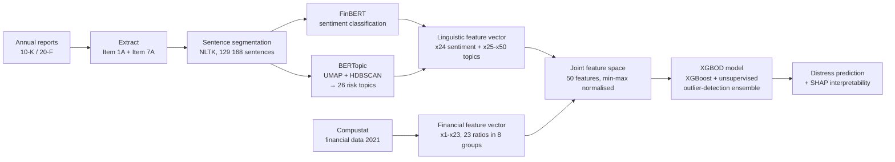

# Corporate financial distress prediction using the risk-related information content of annual reports

> This study presents a financial distress prediction model focusing on the linguistic analysis of risk-related sections of corporate annual reports. Here, we introduce a novel methodology that leverages BERT-based contextualized embedding models for nuanced extraction of financial sentiment and topic coherence. This stands in contrast to existing research, which predominantly relies on dictionary-based or non-contextual word embeddings and addresses their limitations in context sensitivity. Furthermore, we apply an innovative financial distress prediction model that combines the robust XGBoost algorithm with unsupervised outlier detection techniques. This hybrid model is specifically designed to tackle the issue of class imbalance, a persistent challenge in financial distress prediction. The efficacy of the proposed model is empirically validated using a comprehensive dataset of 2545 companies listed on major global stock exchanges. Our findings indicate that the introduced model not only significantly outperforms most existing state-of-the-art financial distress prediction models in terms of predictive accuracy, but also significantly outperforms the Loughran & McDonald dictionary-based approach and the Word2Vec model, underlining its potential as a superior analytical tool for financial distress prediction.

## TL;DR

Hajek & Munk add an **NLP modality** to financial-distress prediction: **FinBERT sentiment** + **BERTopic 26-topic taxonomy** extracted from the Risk Factors (Item 1A) and Market Risk (Item 7A) sections of **10-K / 20-F filings**. Linguistic features feed an **XGBOD** model (XGBoost + unsupervised outlier-detection ensemble, a semi-supervised learning extension by Zhao & Hryniewicki 2018) that specifically targets class imbalance — only 98 distressed firms in 2,545 total. The combined model reaches **AUC 0.9864 and sensitivity 0.8616** — outperforming dictionary-based (Loughran-McDonald) and Word2Vec linguistic baselines, supervised SMOTE-balanced XGBoost variants, and the financial-features-only baseline. Headline content discovery: **credit-risk and liquidity-risk topic frequencies** are the most predictive linguistic features (per SHAP analysis).

## Citation

**APA (7th edition):**

> Hajek, P., & Munk, M. (2024). Corporate financial distress prediction using the risk-related information content of annual reports. *Information Processing and Management*, *61*(5), 103820. https://doi.org/10.1016/j.ipm.2024.103820

**BibTeX:**

```bibtex
@article{hajek_2024_finbert_distress,
  author  = {Hajek, Petr and Munk, Michal},
  title   = {{Corporate Financial Distress Prediction Using the Risk-Related Information Content of Annual Reports}},
  journal = {Information Processing and Management},
  year    = {2024},
  volume  = {61},
  number  = {5},
  pages   = {103820},
  doi     = {10.1016/j.ipm.2024.103820}
}
```

## What was actually ingested

**Pass 2** — abstract, introduction, full literature review (dictionary-based → bag-of-words → Word2Vec → BERT progression), §3 research objectives + contributions, §4 framework (financial features, BERT-based linguistic features via FinBERT + BERTopic, XGBOD/SSL architecture), §5 data, §6 results (linguistic analysis, classification performance, statistical tests, ablations, SHAP, robustness over 2-year horizon), §7 conclusion. Tables 1–7 read row-by-row, including the **Table 4 BERTopic 26-topic taxonomy** in full. Figures 1–10 referenced in body (no direct PDF rendering opened in this read, but Fig. 1 risk-factor extracts, Fig. 2 framework architecture, Fig. 5 topic similarity matrix, Fig. 6 topic frequencies, Fig. 9 SHAP plot all described from body prose).

## Context (WHY)

Sits at the **NLP-meets-distress-prediction frontier** that [[2020-01-01-habib-2020-distress-determinants-consequences-review]] flagged as under-developed (Habib §3.1.6 MD&A subsection covered MD&A narratives but mostly with dictionary-based methods). The intellectual move is **modality-stacking**: structured financial ratios (the classical Beaver-Altman channel) + textual sentiment (Loughran-McDonald dictionary channel) + **contextualised embeddings** (BERT-based, Hajek's contribution).

The literature progression (Hajek §2):

1. **Bag-of-words era** (Cecchini et al. 2010): MD&A bag-of-words → SVM, accuracy 80 % using text alone; +17 % over Altman baseline.
2. **Dictionary-based era** (Hajek et al. 2014; Loughran-McDonald 2011; Chen et al. 2023; Nguyen-Huynh 2022): finance-specific lexicons → SVM/LR. Better than general-purpose dictionaries; lacks context.
3. **Word2Vec era** (Mai et al. 2019; Matin et al. 2019; Huang-Yao 2023): non-contextualised embeddings + CNN/XGBoost. Improvement over dictionary; still lacks contextualised sentence-level representation.
4. **BERT era** (Li et al. 2021; Jiang et al. 2022; Hajek-Munk 2023): contextualised embeddings → DNN/RF. The intellectual ceiling of modality 2 (text).
5. **This paper**: FinBERT (sentiment) + BERTopic (topics) on Risk Factors specifically + XGBoost-SSL for class imbalance. The integration is the contribution.

Adjacent wiki sources: [[2020-01-01-habib-2020-distress-determinants-consequences-review]] (cited explicitly in opening sentence as foundational framework); [[2022-11-28-altman-2023-omega-score-sme-default]] (parallel example of multi-channel modeling — Omega Score adds management+employee variables to structured channels, Hajek adds linguistic features); [[2024-01-01-powell-2024-asean-accounting-early-warning-distress]] (parallel structured-only model on different geography).

**Theoretical bases**: Transformer architecture (Vaswani 2017 attention; Devlin 2018 BERT); financial sentiment dictionary tradition (Loughran-McDonald 2011); risk-factor-disclosure regulation (Campbell et al. 2014 found 11 % of 10-K content is risk factors); semi-supervised learning (Zhao-Hryniewicki 2018 XGBOD); SHAP for interpretability (Lundberg-Lee 2017).

## Methods (HOW)

### Data

**N = 2,545 firms** listed on major global stock exchanges. **Distress = S&P credit rating CCC to D** in 2022 (98 firms, 3.9 %); **non-distress = AAA to B** (2,447 firms, 96.1 %). The 26.55 % one-year default rate at CCC-or-lower vs. 0.00–3.18 % at AAA-to-B justifies the binary cut.

Financial data: Compustat 2021 (year-prior to outcome). Linguistic data: SEC EDGAR 10-K (US) / 20-F (foreign) 2021 filings, **Item 1A (Risk Factors) + Item 7A (Market Risk)** sections only, segmented to 129,168 sentences.

**Stratified 10-fold CV** for evaluation. **Severe class imbalance** (98 : 2,447 ≈ 4 %) is the central methodological challenge.

### Financial features (Table 2)

23 ratios in 8 categories: company size (TA, revenues); corporate reputation (institutional shares); profitability (NI, NPM, OpM, ROE, ROA); activity (TA/rev, TA/AP, ΔWC); growth (3yr rev growth); liquidity (cash ratio, CF ratio); leverage (BD/TA, MD/TA, ICR); valuation (beta, payout, dividend yield, P/B, P/S, P/E).

### Linguistic features

**Sentiment (x24)**: FinBERT (Araci 2019) pre-trained on TRC2-financial corpus (29M words from Reuters), fine-tuned on ~5,000 sentences from Financial PhraseBank. Classifies each risk-related sentence as positive/neutral/negative. Per-company aggregate sentiment = (pos − neg) / total.

**Topics (x25–x50)**: **BERTopic** (Grootendorst 2022) — BERT embeddings + UMAP dimensionality reduction + HDBSCAN clustering → coherent topics. Initial 298 topics; filtered to topics with ≥1000 occurrences → **26 risk topics retained**. UMAP gave topic coherence 0.712 vs. PCA 0.471. Each topic represented as the proportion of a company's risk-section sentences classified into that topic.

### Predictive model — XGBOD (semi-supervised)

XGBoost objective with L2 regularisation:

```
obj^(t) = Σᵢ (yᵢ − (ŷᵢ^(t−1) + fₜ(xᵢ)))² + Σₜ Ω(fₜ)
```

XGBOD (Zhao-Hryniewicki 2018) augments the original feature space with **Transformed Outlier Scores (TOS)** from an ensemble of unsupervised outlier-detection methods (proximity-based + linear-model + ensembling). TOS feature selection uses a discounted-accuracy criterion:

```
Ψ(TOSᵢ) = AUCᵢ / Σⱼ |ρ(TOSᵢ, TOSⱼ)|
```

— rewards AUC, penalises mutual correlation between outlier scores. Final feature space = financial (23) + linguistic (27) + selected TOS scores. XGBoost classifier trained on the enhanced space.

Hyperparameters (grid-search + 5-fold CV on training fold): 30 unsupervised estimators; max tree depth 15; learning rate 0.1. Implementation via PyOD library.

### Performance metrics + statistical tests

Accuracy, F1, AUC, Sensitivity. Pairwise classifier comparison: **McNemar test**. Multi-model comparison: **Friedman + Shafer post-hoc** (Garcia-Herrera 2008) at α = 0.05.

## Results (WHAT)

### Linguistic-analysis findings

Distressed firms' average risk-related sentiment x24 = **−0.459** vs. non-distressed **−0.397**. Distressed firms are *more* negative on average — but the magnitude (~0.06) is small enough that sentiment alone is a weak signal. Topic distribution: IP, R&D, and Security risks dominate the risk-section content across all firms; **credit risk is most discriminating between distressed and non-distressed firms**.

### Headline classification performance (Table 6, full reproduction)

| Model | Accuracy | F1 | **AUC** | **Sensitivity** |
|---|---:|---:|---:|---:|
| CS-SVM (Zieba et al. 2016) | 0.8039 ± 0.0844 | 0.8848 | 0.7510 | 0.7474 |
| RUS + MLP (Zhou 2013) | 0.8777 | 0.9327 | 0.9085 | 0.8563 |
| ROS + MLP (Zhou 2013) | 0.8883 | 0.9377 | 0.9055 | 0.7969 |
| SMOTE + MLP (Zhou 2013) | 0.9591 | 0.9619 | 0.9325 | 0.6300 |
| SMOTE + XGBoost (Le 2022) | 0.9739 | 0.9733 | 0.9725 | 0.6026 |
| SMOTE + AdaBoost (Faris et al. 2020) | 0.9627 | 0.9636 | 0.9630 | 0.5821 |
| SMOTE + RF (Veganzones-Séverin 2018) | 0.9702 | 0.9684 | 0.9642 | 0.5089 |
| XGBoost baseline (Park et al. 2021) | 0.9727 | 0.9708 | 0.9739 | 0.5100 |
| RUS + XGBoost | 0.9194 | 0.9564 | 0.9657 | 0.8979 |
| ROS + XGBoost | 0.9614 | 0.9656 | 0.9762 | 0.7453 |
| **XGBOD (this study)** | **0.9749** | **0.9717** | **0.9864** | **0.8616** |

Three observations:

1. **AUC and sensitivity together** — most prior methods achieve high AUC but at the cost of low sensitivity (< 0.62 for SMOTE-based variants). The naive "high accuracy" of SMOTE+RF (0.9702) is misleading — sensitivity is only 0.51, meaning the classifier misses half the distressed firms.
2. **Random under-sampling (RUS) variants** achieve high sensitivity (0.86–0.90) but at cost of accuracy.
3. **XGBOD reaches both** — AUC 0.9864 and sensitivity 0.8616 — the design of integrating unsupervised outlier scores acts as a smart re-sampling alternative that doesn't lose information.

### Statistical significance (Table 7 — Friedman + Shafer)

Friedman test p ≤ 4.21e−10 (significant heterogeneity); XGBOD ranked best (mean rank 2.4 vs. CS-SVM 11.0). Shafer post-hoc: XGBOD significantly outperforms all benchmarks except XGBoost, SMOTE+XGBoost, and ROS+XGBoost (all of which are XGBoost-derived). The result: **the gain comes from the XGBoost backbone + the unsupervised-outlier-score augmentation**, not from any single component alone.

### Linguistic-feature value-add

Compared to dictionary-based (Loughran-McDonald) and Word2Vec linguistic-feature baselines, the **FinBERT + BERTopic** combination *significantly* (McNemar p < 0.05) improves predictive accuracy. The Financial baseline, Financial+L&M, and Financial+Word2Vec models showed **no significant differences** among themselves — meaning prior linguistic methods provided no detectable lift over financials. **Only contextualised BERT-based features broke that ceiling.**

### SHAP interpretability

Financial features dominate global importance (size, profitability, liquidity, leverage, beta). Among linguistic features, **credit-risk-topic frequency and liquidity-risk-topic frequency** carry the strongest signal — distressed firms talk about credit/liquidity issues more frequently in their Risk Factors sections.

### Robustness — 2-year forecast horizon

Two-year-ahead prediction (training on 2021 features → outcomes in 2023 instead of 2022): accuracy −1.48 %, AUC −1.56 % vs. 1-year-ahead. The linguistic signal degrades gracefully — risk-factor disclosures encode signal beyond next-year horizon.

## Visual content

The paper carries **10 figures + 7 in-body tables + 1 appendix figure + 1 appendix table**. Figures are catalogued below from body references; the PDF was not opened during this read for direct frame capture.

### Table 1 — Summary of related linguistic-distress-prediction studies

**Type:** literature-summary table. **Location:** p. 4.

Columns: Study, Data source, Methods for textual features, Prediction method, Performance. Rows: Cecchini et al. 2010 (bag-of-words/SVM, Acc 0.839), Hajek et al. 2014 (L&M/SVM, Acc 0.838 AUC 0.891), Matin et al. 2019 (word2vec/CNN+LSTM, AUC 0.844), Mai et al. 2019 (word2vec/CNN, Acc 0.712), Tang 2020 (sentiment/RNN, AUC 0.936), Wang 2020 (HowNet+L&M/RanSub, AUC 0.961), Li 2021 (BERT/DNN, Acc 0.901, F1 0.896), Huang-Yao 2023 (word2vec/XGBoost, AUC 0.912), Zhao 2022 (sentiment/CatBoost, AUC 0.976), Jiang 2022 (BERT/RF, AUC 0.936). The table positions Hajek 2024 against this lineage.

### Table 2 — Financial features

**Type:** feature-list table. **Location:** p. 7. 23 features × 8 categories. → reproduced in §Methods above.

### Table 3 — Mean values and SDs of financial features

**Type:** descriptive-statistics table. **Location:** p. 10. 23 features × (mean, SD). The 23 features map to [[sme-distress-predictor-variables]] categories 1 (Altman Z-Score), 3 (Profitability), 5 (Liquidity), 6 (Financial leverage). Notable: cash ratio mean 0.849, SD 16.733 (heavy-tailed); ICR mean 122.5, SD 4903.8 (extreme outliers in non-distressed sample).

### Table 4 — Topics identified using BERTopic

**Type:** topic taxonomy. **Location:** p. 11.

26 topics × (feature ID, topic name, top-5 terms). This is the **headline distinctive artifact** of the paper — the empirically-derived taxonomy of risk-section content. → reproduced in full in §Distinctive artifacts.

### Table 5 — Mean values and SDs of linguistic features

**Type:** descriptive-statistics table. **Location:** p. 13. 26 topic-features + 1 sentiment × (mean, SD). Top by mean frequency: R&D 0.0834, Intellectual property 0.0508, Health 0.0616.

### Table 6 — Classification performance of compared methods

**Type:** model-comparison table. **Location:** p. 14. 11 models × (Acc, F1, AUC, Sensitivity ± SD). → fully reproduced in §Results above.

### Table 7 — Friedman non-parametric test

**Type:** statistical-test table. **Location:** p. 15. 11 models × (rank, z, p-value, Shafer α/i). XGBOD rank 2.4; Friedman p ≤ 4.21e−10. → reproduced in §Results above.

### Figure 1 — Risk-factor extracts from distressed companies' annual reports

**Type:** illustrative text excerpts. **Location:** p. 2.

Shows two paragraph-length excerpts from 10-K filings of distressed companies. Excerpt 1 references excessive leverage; excerpt 2 references insufficient liquidity. Purpose: motivate that risk-section text content carries predictive signal. **Visualisation quality**: not a quantitative figure; effectively a callout box.

### Figure 2 — Financial distress prediction framework

**Type:** architecture diagram. **Location:** p. 6.

Pipeline diagram: Annual reports (10-K / 20-F) → text preprocessing → FinBERT sentiment + BERTopic topics → linguistic feature space → joined with financial features (Compustat) → XGBOD model → distress prediction. Shows the integration design Hajek contributes.

### Figure 3 — XGBOD framework

**Type:** model-architecture diagram. **Location:** p. 8.

Detail of the semi-supervised core: input features → multiple unsupervised outlier detectors → Transformed Outlier Scores (TOS) → TOS feature selection by discounted accuracy → augmented feature space → XGBoost classifier → final outlier score. Reproduces Zhao-Hryniewicki 2018 architecture with Hajek's adapted feature inputs.

### Figure 4 — Country and industry concentration

**Type:** descriptive bar / treemap. **Location:** p. 10. Shows geographic and industrial distribution of the 2,545-firm sample. Body says "around the world" but the precise breakdown is in the figure (not transcribed in body prose).

### Figure 5 — Similarity matrix of topics identified using BERTopic

**Type:** correlation heatmap. **Location:** p. 12.

26 × 26 heatmap. The body identifies clusters: compliance + regulatory risks (high mutual similarity); security + data-privacy risks (high mutual similarity). The heatmap is the methodological-quality check that BERTopic's clusters are coherent and not redundantly overlapping.

### Figure 6 — Relative frequencies of topics across companies

**Type:** stacked / grouped bar chart. **Location:** p. 13.

Distribution of the 26 risk-topic frequencies across distressed vs. non-distressed firms. Body finding: distressed firms allocate proportionally more text to credit-risk discussion. **The figure makes the discriminative signal visible** — load-bearing for the SHAP interpretability that follows.

### Figure 7 — Comparative classification performance: FinBERT+BERTopic vs. L&M vs. Word2Vec

**Type:** bar / grouped-comparison chart. **Location:** p. 14. Visualises the central ablation result.

### Figure 8 — Classification performance with / without BERT-based linguistic features

**Type:** bar chart. **Location:** p. 15. Shows the lift from adding linguistic features to the financial baseline.

### Figure 9 — SHAP values demonstrating feature contributions

**Type:** SHAP summary plot (typically beeswarm or bar). **Location:** p. 16.

Global feature-importance ranking. Top contributors are financial features (size, profitability indicators, liquidity, leverage, beta) followed by linguistic features with **credit risk topic and liquidity risk topic** being the most informative non-financial features. The plot's argument: NLP modality does not *replace* financial modality but *augments* it.

### Figure 10 — Classification performance two years before financial distress

**Type:** bar chart. **Location:** p. 16. The robustness check — accuracy and AUC over 2-year horizon. Shows graceful degradation (−1.48 % / −1.56 %).

### Appendix Figure A.1 — Correlations between BERT-based topic features

**Type:** correlation heatmap. **Location:** p. 18. 26-topic feature correlations. Methodological-completeness artifact; broadly low cross-topic correlations, validating BERTopic's separability.

### Appendix Table A.1 — Hyperparameter settings

**Type:** hyperparameter-setting table. **Location:** p. 19. Grid-search ranges for XGBOD components.

## Distinctive artifacts

### Table 4 — BERTopic 26-topic taxonomy (full reproduction)

This is the single most reusable artifact in the paper — the empirically-derived risk-category taxonomy of US/foreign 10-K Risk-Factors disclosures.

| ID | Topic | Top 5 terms |
|---|---|---|
| x25 | **Intellectual property risk** | intellectual, patent, right, license, property |
| x26 | **R&D risk** | clinical, fda, trial, approval, candidate |
| x27 | **Security risk** | security, breach, information, data, unauthorized |
| x28 | **Tax risk** | tax, income, deferred, jurisdiction, reform |
| x29 | **Litigation risk** | litigation, proceeding, claim, legal, court |
| x30 | **Currency risk** | currency, exchange, dollar, foreign, fluctuation |
| x31 | **Insurance risk** | insurance, coverage, reinsurance, catastrophe, covered |
| x32 | **Competitive risk** | margin, gross, competition, reduce, profit |
| x33 | **Product risk** | acceptance, success, develop, introduce, product |
| x34 | **Dividend risk** | dividend, common, equity, unit, pay |
| x35 | **Compliance risk** | penalty, comply, criminal, civil, fine |
| x36 | **Regulatory risk** | regulation, compliance, legislation, law, change |
| x37 | **Personnel risk** | personnel, key, retain, qualified, attract |
| x38 | **Workforce risk** | disruption, labor, stoppage, strike, work |
| x39 | **Health risk** | reimbursement, care, healthcare, medicare, health |
| x40 | **Liquidity risk** | financing, need, fund, capital, additional |
| x41 | **Overseas business risk** | china, located, country, united, states |
| x42 | **Failure management** | failure, fail, effectively, successfully, manage |
| x43 | **Commercial lending risk** | commercial, loan, estate, real, loan |
| x44 | **Material risk** | actually, risk, following, material, occur |
| x45 | **Price risk** | stock, common, price, analyst, fluctuation |
| x46 | **Data privacy risk** | information, confidential, sensitive, data, collect |
| x47 | **Timing risk** | quarter, timing, quarterly, fluctuate, period |
| x48 | **Intangible asset risk** | goodwill, impairment, intangible, carrying, asset |
| x49 | **IT risk** | system, interruption, information, disruption, availability |
| x50 | **Credit risk** | credit, counterparty, creditworthiness, risk, rating |

Coherence (Cv, body §6.1): UMAP 0.712 > PCA 0.471.

### XGBoost objective + XGBOD TOS-selection formulae

```
XGBoost objective:
  obj^(t) = Σᵢ (yᵢ − (ŷᵢ^(t−1) + fₜ(xᵢ)))² + Σₜ Ω(fₜ)
                                                  ^^^^^^ regularisation

XGBOD discounted-accuracy TOS-selection function:
  Ψ(TOSᵢ) = AUCᵢ / Σⱼ |ρ(TOSᵢ, TOSⱼ)|
                       ^^^^^^^^^^^^^^^^^^^ Pearson correlation across TOS pairs
```

The TOS-selection function is the methodological cleverness: it rewards individual-TOS AUC while penalising mutual correlation, so the augmented feature space contains *diverse* outlier signals rather than 30 near-duplicates.

### Pipeline schematic (Mermaid reproduction of Figure 2)



### Headline performance — XGBOD vs. baselines

```
XGBOD:        Acc 0.9749  F1 0.9717  AUC 0.9864  Sensitivity 0.8616
XGBoost:      Acc 0.9727  F1 0.9708  AUC 0.9739  Sensitivity 0.5100
SMOTE+RF:     Acc 0.9702  F1 0.9684  AUC 0.9642  Sensitivity 0.5089
CS-SVM:       Acc 0.8039  F1 0.8848  AUC 0.7510  Sensitivity 0.7474

Lift over financial-only baseline (Fig 8 estimate from body):
  ΔAUC ≈ +0.05  (significant, McNemar p < 0.05)
  ΔF1  ≈ +0.04
  ΔSensitivity substantial (linguistic features help find distressed minority)
```

## Discussion / Significance (SO WHAT)

For the wiki, four contributions land:

1. **The BERTopic 26-topic taxonomy is a wiki-level asset**: any future analysis of 10-K risk-factor disclosures has a ready-made categorical framework. Each topic name + top-5 terms reusable as a labelling guide.
2. **The class-imbalance solution via XGBOD** is methodologically generalisable. Where SMOTE-family rebalancing methods buy accuracy at the cost of sensitivity, XGBOD buys both — and the unsupervised-outlier-score augmentation works in any heavily-imbalanced classification setting.
3. **Empirical confirmation that contextualised embeddings outperform dictionary methods.** This closes a debate Habib 2020 left open in its NLP subsection: post-2020 BERT-derived methods are clearly better than the Loughran-McDonald dictionary, with statistical-test backing.
4. **Risk-factor-disclosure regulation has predictive value**, i.e. the SEC's mandate of Item 1A in 10-K filings produces signal that is *not* redundant with the financial statements. Policy implication: more granular risk-factor disclosure (more topical specificity) would strengthen this signal.

**Limitations acknowledged by authors:**
- 10-K / 20-F filings cover only larger companies — small firms are not required to file, so the model does not generalise to SMEs.
- External-stakeholder perspectives (news, social-media) are excluded — only managerial communication is modelled.
- Pre-trained FinBERT and BERTopic may need re-training as language models advance.

**Limitations not flagged:**
- **Single-language (English) sample**, despite the global-stock-exchange claim — 10-K and 20-F filings are in English even when the firm is non-US. Generalisability to non-English risk disclosures is untested.
- **2021 single-year cross-section** means the model captures one snapshot of regulatory/economic conditions. The 2-year-ahead robustness check goes forward in time; backward generalisability (would 2015 features predict 2016 distress with the same model?) is not assessed.
- **The credit-rating-as-distress operationalisation has a circularity risk**: S&P ratings already incorporate financial-statement information, so financial features + S&P-derived label may inflate apparent predictability. The paper does not unpack this.
- **No comparison with deep-learning end-to-end on text + tabular** — newer multimodal-LLM-based approaches (GPT-4 / Llama-3 on combined text+number inputs) are absent.

## Citations to chase

- **Devlin et al. 2018** — BERT founding paper. *(NeurIPS 2019, on arXiv 1810.04805.)*
- **Araci 2019** — FinBERT financial-domain BERT.
- **Grootendorst 2022** — BERTopic.
- **Zhao, Hryniewicki 2018** — XGBOD semi-supervised algorithm.
- **Loughran, McDonald 2011** — finance-specific sentiment dictionary, the comparison baseline.
- **Vaswani et al. 2017** — Attention is All You Need (transformer foundation).
- **Lundberg, Lee 2017** — SHAP.
- **Campbell et al. 2014** — risk-factor-disclosure quantification (~11 % of 10-K content).
- **Cecchini et al. 2010** — first MD&A-based distress prediction (bag-of-words era).

## Linked entities and concepts

**Entities** (per [§Author-entity promotion](../../CLAUDE.md#author-entity-promotion)):

- **Dangling** (single-source mention, deferred): Petr Hajek (University of Pardubice), Michal Munk (Constantine the Philosopher University Nitra). Second-source rule not met within this batch.

**Concepts** (created or referenced in this ingest batch):

- [[financial-distress]] — alternative operationalisation via S&P credit ratings ≤ CCC.
- [[nlp-distress-prediction]] — the methodological lineage Hajek extends.
- [[bert-finbert]] — the contextualised embedding family.
- [[bertopic-taxonomy]] — the empirical risk-category vocabulary.
- [[class-imbalance-distress]] — the XGBOD solution.
- [[xgboost-financial-applications]] — the boosted-tree workhorse.
- [[risk-factor-disclosures]] — 10-K Item 1A + 7A, the textual data source.
- [[altman-z-score]] — the structured-features baseline implicitly compared against.

## Source-to-source relationships

Neighbour-scan against the 2026-05-25 batch:

- **`supports` ↔ [[2020-01-01-habib-2020-distress-determinants-consequences-review]]** — Hajek opens with a direct Habib citation. Habib's shallow NLP subsection (3.1.6 MD&A) flags the textual-data direction; Hajek extends it concretely with BERT.
- **`supports` ↔ [[2022-11-28-altman-2023-omega-score-sme-default]]** — both papers add a non-financial-ratio modality to classical distress prediction. Altman adds management+employee variables (structured), Hajek adds risk-factor text (unstructured). The cross-comparison is **modality**: structured non-financial vs. unstructured text both improve over financial-only baselines.
- **`supports` ↔ [[2024-01-01-powell-2024-asean-accounting-early-warning-distress]]** — Hajek's class-imbalance handling (SSL/XGBOD) is a methodologically more sophisticated treatment of the same imbalance Powell flagged (76:24 sample → Type I bias) but did not address. Reading them together: Powell shows the problem; Hajek shows a clean solution.
- **`supports` ↔ [[2026-02-04-bari-2026-us-small-business-distress-framework]]** — Bari's "behavioural + relational" indicators echo Hajek's intuition that signal lives in text/behaviour beyond financial ratios. Bari uses survey-style behavioural variables; Hajek uses risk-text frequencies. Both reach the same conclusion: financial ratios alone are insufficient.

