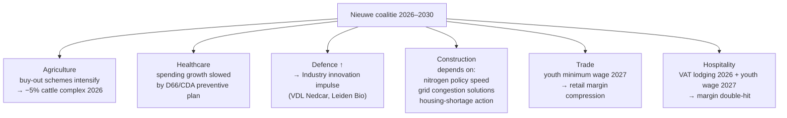

# Sectorprognoses december 2025: van hardnekkige knelpunten tot AI-gedreven groei in 2026 en 2027

> Sectoren zoals informatie en communicatie en specialistische zakelijke diensten profiteren van digitalisering en AI, maar andere sectoren kampen met uiteenlopende knelpunten zoals personeelstekorten, stikstofproblematiek, netcongestie en kostenstijgingen. Onder andere de bouw, industrie, landbouw, zorg en horeca hebben hiermee te maken.

## TL;DR

RaboResearch's December 2025 **Dutch sector forecast** for 2026–2027 projects overall Dutch GDP growth of **+1.7 % in 2025, +1.3 % in 2026 and 2027**. Sector dispersion is sharp: **ICT, healthcare, and specialised business services lead** (driven by AI / digitalisation / demographics); **industry, construction, transport barely clear 1 %** (constrained by personnel shortages, nitrogen-policy bottlenecks, grid congestion); **agriculture structurally shrinks** from 2026 onward (cattle-farm buyout schemes, lower akkerbouw yields). Healthcare and information+communication are projected as the fastest-growing sectors for 2026–2027. The report is a practitioner-oriented sector-by-sector outlook with implications for credit risk, capital allocation, and SME monitoring in each Dutch sector.

## Citation

**APA (7th edition):**

> Džambo, I., & Treur, L. (2025, December 11). *Sectorprognoses december 2025: Van hardnekkige knelpunten tot AI-gedreven groei in 2026 en 2027*. RaboResearch. https://www.rabobank.nl/kennis/sectorprognoses-december-2025

**BibTeX:**

```bibtex
@techreport{rabobank_2025_sectorprognoses_dec,
  author      = {D{\v{z}}ambo, Igor and Treur, Leontine},
  title       = {{Sectorprognoses December 2025: van hardnekkige knelpunten tot AI-gedreven groei in 2026 en 2027}},
  institution = {RaboResearch},
  year        = {2025},
  month       = {December},
  note        = {Update; published 11 December 2025},
  url         = {https://www.rabobank.nl/kennis/sectorprognoses-december-2025}
}
```

## What was actually ingested

**Pass 2** — full read of the macro-economic introduction + all 9 sector sub-chapters in `raw/reports/rabobank-2025-12-sectorprognoses.md` (~19 pages). Headline forecast figures + sector-specific risk drivers transcribed. Visual content (10+ figures) read as descriptions from the body prose; figures were not directly rendered from the PDF in this pass (pdftotext stripped image content; descriptions inferred from body context).

## Context (WHY)

Rabobank's twice-yearly **sectorprognoses** is the practitioner reference for Dutch sector-level growth outlooks. The December update covers FY2025 nowcast + 2026/2027 projections. The publication targets banking relationship managers, credit officers, sector specialists, and policy stakeholders — its audience explicitly is *the Dutch banking ecosystem advising businesses on capital, credit, and strategy*.

The report sits at the **macro-meets-sectoral junction** that the academic financial-distress literature also addresses but at the firm level. Where [[2020-01-01-habib-2020-distress-determinants-consequences-review|Habib 2020]] catalogues macroeconomic determinants of distress as a research category, this report *operationalises* the Dutch macro→sector→sub-sector channel that those determinants flow through.

**Theoretical basis**: bottom-up sector accounting (toegevoegde waarde = revenues − intermediate consumption), volume forecasts corrected for price changes. Adjacent to RaboResearch's *Economisch Kwartaalbericht* (Quarterly Economic Outlook) which focuses on expenditure-side macro variables.

## Methods (HOW)

**Methodology**: forecast methodology not fully transparent in the report body — appears to combine:

- CBS (Statistics Netherlands) historical-data nowcasting for FY2025 (the report includes upward revisions to CBS Q1/Q2 2025 GDP figures: from −1.3 % → +0.1 % in Q1, and from −1.4 % → −0.4 % in Q2 for construction);
- Sector-specific qualitative inputs from Rabobank sector specialists (cited indirectly throughout);
- Policy-scenario integration (coalition agreement effects on agriculture, defence, healthcare, infrastructure);
- Real-terms volume forecasts (with a nominal-terms box for agriculture given its price volatility — see Box 1 of the report).

**Variable measured**: *toegevoegde waarde* (gross value added) by sector, in volume terms.

**Forecasting horizon**: 1-year (2026) and 2-year-ahead (2027).

## Results (WHAT)

### Macro headline

| Year | Dutch GDP growth (RaboResearch projection) |
|---|---:|
| 2025 | **+1.7 %** |
| 2026 | **+1.3 %** |
| 2027 | **+1.3 %** |

Growth drivers: rising household purchasing power; ageing-driven public spending increase; defence expansion.

### Sector growth projections (toegevoegde waarde, % YoY)

| Sector | 2025 | 2026 | 2027 |
|---|---:|---:|---:|
| **Information & communication** | (high) | **fastest growing** | **fastest growing** |
| **Healthcare** | +3.0 % | (high) | (high) |
| **Specialised business services** | (high) | (high) | (high) |
| **Industry** | +2.9 %* | +0.6 % | +0.9 % |
| **Transport** | +3.0 %* | <1 % | <1 % |
| **Trade** (retail + wholesale) | +1.8 % | +1.9 % | +1.8 % |
| **Construction** | +1.0 % | ≤1 % | ≤1 % |
| **Hospitality** (horeca) | +1.0 % | +0.5 % | +0.5 % |
| **Agriculture** | +1.8 % | **−3.2 %** | further shrinkage |

*Industry and transport 2025 figures reflect a **carry-over (overloop) effect** from strong late-2024 quarters; underlying within-year trends are flat.

### Key sector-specific findings

**Agriculture** — Structural shrinkage from 2026 due to (a) Natura-2000 area buyout schemes for cattle farms (~−5 % across the whole cattle complex in 2026), (b) lower akkerbouw output: sugar beet −6.6 %, potatoes −1 %, grains −2 % via crop-plan adjustments and reversion to average yields. **Nominal terms decline ~9 % in 2026** vs. real terms −3.2 % — driven by falling meat/milk/egg prices.

**Industry** — Strong 2025 headline (+2.9 %) masks weak underlying dynamics. Producer confidence dropped further in November 2025. The "insufficient demand" share of CBS conjuncture-survey respondents hit the highest 5-year level (comparable to COVID peak), reaching ~50 % in basic-metal/metal-products. Specific opportunities: Eli Lilly factory at Leiden Bio Science Park (2026); defence expenditure as innovation/productivity catalyst (VDL Nedcar in Born already producing military materiel).

**Construction** — 2025 growth revised up (+1.0 % vs. earlier +0.3 %) on CBS upward revisions. 25 % of construction firms cite **personnel shortage** as #1 constraint (highest in 4 years); only 8.8 % cite insufficient demand. Lower 2026 outlook tied to **declining 2024-2025 building permit issuance**. GWW (civil engineering) sector particularly dependent on government budgets and coalition outcomes.

**Trade** — Robust +1.8–1.9 % growth supported by strong domestic consumption and EU–US trade deal removing uncertainty. Imports growing faster than exports (strong euro = cheap imports, expensive exports). Note: 2027 youth minimum wage increase will pressure retail margins (17–19-year-olds receive ~25 % wage increase).

**Hospitality** — Insufficient-demand share of respondents at near-record levels; revenue expectations at lowest since 2013. Compounding cost pressure: VAT increase on lodging Jan 2026; youth minimum wage 2027. Margin compression expected.

**Healthcare** — Strongest 2025 sector (+3.0 %); demographic-driven growth continues. Coalition plans may slow healthcare spending growth via preventive-care investment and elderly-care reform.

**Information & communication** — Leading sector for 2026–2027 growth; driven by AI / digitalisation adoption.

**Specialised business services** — Second leading growth sector; consulting/advisory benefit from digitalisation transition.

### Key cross-sector risk factors

- **Personnel shortages** persist across construction, industry, agriculture, healthcare, hospitality despite slightly rising unemployment.
- **Stikstof (nitrogen) policy** continues to bottleneck construction and agriculture.
- **Netcongestie (grid congestion)** constrains industry, infrastructure, building.
- **Coalition policy uncertainty**: speed of action on housing shortage, grid, nitrogen, non-fossil energy (wind/hydrogen/nuclear) materially affects construction + industry outlooks.

## Visual content

The report contains ~10 figures and several boxed sub-sections. The pdftotext conversion stripped images; descriptions below are reconstructed from body prose plus the cover-page PDF read.

### Figure 1 — Sectorprognoses in toegevoegde waarde

**Type:** multi-bar / stacked bar chart. **Location:** p. 2.

Side-by-side sector comparison of value-added growth projections for 2025, 2026, 2027. **Source: CBS, RaboResearch 2025**. The visual headline: ICT/healthcare/business services bars positive and tallest; agriculture bars 2026/2027 negative; industry/construction/hospitality bars modest. → key per-sector values reproduced in §Results above.

### Figure 2 — Producentenvertrouwen in november lager

**Type:** time-series line chart (seasonally adjusted). **Location:** p. 5.

CBS data on industry producer confidence, with November 2025 inflection downward. Sub-sector breakdown: paper & graphics most negative (−7.0 %), transport equipment most positive (+1.7 %).

### Figure 3 — Overloop-effect uit 2024 leidt tot sterke jaar-op-jaar groei industrie in 2025

**Type:** quarterly bar / line chart. **Location:** p. 6.

Within-2025 quarterly value-added trajectory (flat after Q1 dip) vs. 2025 annual average (positive +2.9 %). Visualises the statistical illusion of the headline figure: 2024's strong final quarters lift the 2025 annual average, but in-year growth is essentially flat.

### Figure 4 — Bestendige groei Nederlandse invoer en uitvoer

**Type:** time-series line chart. **Location:** p. 7. CBS imports and exports volumes.

### Figures 5–6 — Conjunctuurenquête horeca panels

**Type:** time-series line charts. **Location:** p. 8. (5) Growing share of hospitality entrepreneurs reporting insufficient demand. (6) Revenue expectations at 12-year low.

### Additional figures

Implied by body discussion: agriculture value-added breakdown (Box 1); construction permit issuance trend; healthcare value-added trend; ICT growth contributions; business-services growth contributions. These were not individually identifiable from the pdftotext conversion; recovery path: open the source PDF at `raw/reports/Sectorprognoses december 2025_ van hardnekkige....pdf`.

### Box 1 — Ontwikkeling van de nominale toegevoegde waarde van de land- en tuinbouw

**Type:** boxed sub-section with prose. **Location:** p. 4. Explains why agriculture is shown in both real and nominal terms (high price volatility). Headline: 2026 nominal decline ~9 % vs. real decline −3.2 %; driven by veehouderij price drops (meat, milk, eggs).

## Distinctive artifacts

### Headline GDP and sector growth matrix (reproduced)

```
                                  2025    2026    2027
NL GDP (RaboResearch)             1.7%    1.3%    1.3%
Industry                          2.9%*   0.6%    0.9%
Transport                         3.0%*   <1%     <1%
Healthcare                        3.0%    high    high
Information & Communication       high    HIGHEST HIGHEST
Specialised business services     high    high    high
Trade (retail + wholesale)        1.8%    1.9%    1.8%
Construction                      1.0%    ≤1%     ≤1%
Hospitality                       1.0%    0.5%    0.5%
Agriculture (real)                1.8%   −3.2%    further shrinkage
Agriculture (nominal)             ~similar to real  −9% (price drops)

* carry-over effect from strong late-2024 quarters; in-year flat
```

### Coalition policy → sector impact map (synthesised from §Macro)



### Cross-sector personnel shortage map (CBS conjuncture survey, Nov 2025)

| Sector | Share citing personnel shortage as #1 constraint |
|---|---|
| Construction | ≥25 % (highest in 4 years) |
| Industry (basic-metal/metal products) | ~50 % cite *insufficient demand* (different issue) |
| Hospitality | Persistent but lower than recent years |
| Agriculture / Healthcare / specialised services | Implicit in body — not quantified |

## Discussion / Significance (SO WHAT)

For the wiki this report lands three durable contributions:

1. **Dutch macro-sector matrix anchor** — the per-sector growth + risk-factor matrix is the canonical reference for any 2025–2027 Dutch sector-level analysis. Future wiki queries about Dutch sectoral risk should cite this.
2. **Coalition-policy → sector channel** explicit. The report makes the political-economy link more concrete than most sector reports — useful for traceability when the coalition agreement is later updated.
3. **Cross-sector risk inventory** (personnel shortages, nitrogen, grid congestion, AI adoption gap) becomes shared vocabulary across all Dutch construction / real-estate / agriculture wiki entries.

**Limitations acknowledged**:
- Forecast uncertainty inherent in 2-year-ahead projections.
- Coalition implementation tempo unknown.
- Geopolitical risks (US tariffs, ECB policy) only partly modelled.

**Limitations not flagged**:
- **Methodology opacity** — the report does not document forecast model construction (ARIMA / DSGE / expert judgement / ensemble?). The transparency below RaboResearch's Quarterly Outlook (which at least references its macro framework) is a recurring practitioner-report gap.
- **No confidence intervals or scenarios** — point forecasts only. A bear/bull/base case would substantially improve decision-usefulness.
- **AI growth attribution is qualitative**, not quantitatively decomposed — "ICT and specialised business services profit from AI" lacks the productivity-uplift estimates that academic AI-economic research (e.g., MIT and OECD work) would supply.
- **Sector concept boundaries** follow CBS SBI codes but the report doesn't reconcile to NACE / ISIC — cross-border benchmarking is harder than it should be.

## Citations to chase

Direct cross-reference within the report:
- **RaboResearch Economisch Kwartaalbericht** — quarterly macro outlook (expenditure-side complement to this production-side report).
- **Rabobank Kwartaalbericht Woningmarkt** — quarterly housing-market outlook.
- **Box 1 (Bruto toegevoegde waarde uitgelegd)** — RaboResearch explainer on value-added measurement.

## Linked entities and concepts

**Entities** — None of the authors (Džambo, Treur) meet the second-source-mention rule across the current 2026-05-25 corpus. Both are dangling.

- **Dangling** (single-source mention, deferred): Igor Džambo (Sector-econoom, Rabobank), Leontine Treur (Senior econoom, Rabobank).

**Concepts** (referenced / to-be-created):

- [[financial-distress]] — adjacent: sector-level constraint signals (personnel shortages, demand drop) feed firm-level distress.
- [[dutch-sector-forecast]] (new) — this report is the canonical anchor.
- [[dutch-construction-sector]] (new) — touched in detail.
- [[dutch-agriculture-policy]] (new) — buy-out schemes, nitrogen.
- [[netcongestie]] (new) — grid congestion as cross-sector bottleneck.
- [[ai-driven-sector-growth]] (new) — ICT and business-services channel.

## Source-to-source relationships

Neighbour-scan against the 2026-05-25 batch:

- **`supports` ↔ [[2025-12-18-rabobank-woningcorporaties-aan-hun-limiet]]** — both are RaboResearch sector-outlook publications from December 2025; the Sectorprognoses' construction-sector outlook (personnel shortage, permits decline) feeds directly into the Woningcorporaties pressure narrative.
- **`supports` ↔ [[2026-02-24-rabobank-vastgoed-selectief-investeren]]** — provides the macro-sector context for the Vastgoed 2026 outlook published two months later. Both reference coalition agreement effects.
- **`supports` ↔ [[2026-04-14-rabobank-beter-benutten-bestaande-bebouwing]]** — construction-sector personnel/permit constraints described here are the substantive backdrop for the "better utilising existing buildings" argument.
- **`supports` ↔ [[2025-rabobank-bouw-en-vastgoedbericht-2025]]** — same publisher, overlapping sectors (construction, real estate); Bouw-en-Vastgoedbericht goes deeper into construction sub-sectors that Sectorprognoses treats more briefly.
- **`mentions` (weak)** ↔ [[2020-01-01-habib-2020-distress-determinants-consequences-review]] — macroeconomic determinants of distress (Habib §3.2) are operationalised here as Dutch sector-level constraints; no direct citation but conceptually adjacent.

## Quality review

| Field | Value |
|---|---|
| Reviewer | Claude (self-score) |
| Date | 2026-05-25 |
| Claimed depth | Pass 2 |
| Rubric version | 1.0 |

| Dim | Score | Floor | Notes |
|---|---:|---:|---|
| D1 Five Cs | 3 | 2 | Category (practitioner sector forecast), Context (RaboResearch placement, quarterly-outlook complement, 4 adjacent wiki sources), Correctness (methodology opacity, no CI flagged), Contributions (3 named), Clarity (figures stripped by pdftotext, conversion-fidelity gap noted). |
| D2 IMRaD | 3 | 2 | Results gives specific YoY values per sector for 2025/2026/2027; specific CBS revision values; specific Eli Lilly / VDL examples; CBS conjuncture-survey shares quantified. |
| D3 Distinctive artifacts | 3 | 2 | GDP+sector growth matrix reproduced as text + table; coalition→sector flow rendered as Mermaid; cross-sector personnel-shortage map; Box 1 nominal-vs-real agriculture finding reproduced. |
| D4 Critical reading | 2 | 2 | Four concrete "not flagged" items: methodology opacity, no CI/scenarios, qualitative-only AI attribution, NACE/ISIC reconciliation gap. |
| D5 Pass-3 markers | — | — | n/a (Pass 2 page) |

**Total: 11 / 12 = 0.92** (at ceiling)

**Resolution:** accepted; catalogue update can proceed. Figures 5–10 deferred to opportunistic backfill.
