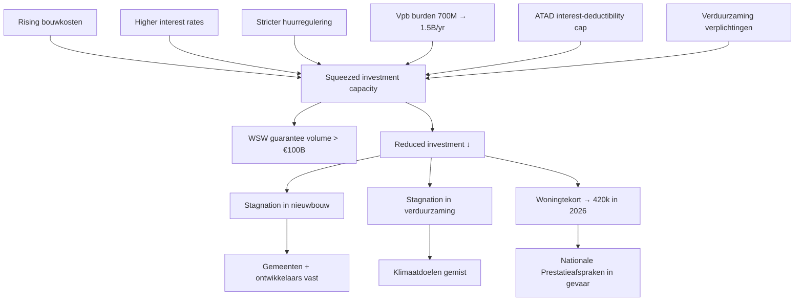

# Woningcorporaties aan hun limiet: investeringsruimte raakt op

> Woningcorporaties staan onder ongekende druk. Ze moeten hun grote woningvoorraad onderhouden, versneld verduurzamen, klimaatbestendig bouwen, betaalbare huren garanderen én tienduizenden sociale huurwoningen toevoegen. Tegelijkertijd zijn hun huurinkomsten beperkt en betalen ze winstbelasting. De financiële rek is eruit. Het borgvolume bij het Waarborgfonds Sociale Woningbouw overschreed dit najaar € 100 miljard, een teken van de enorme investeringsgolf, maar ook van hoe ver de sector is opgerekt. En hier zit de crux: als corporaties afhaken, lopen gemeenten en ontwikkelaars vast en komen de Nationale Prestatieafspraken in gevaar.

## TL;DR

Dutch housing corporations (*woningcorporaties*) have hit a **sectoral financial limit**. They face a multi-billion investment mandate (new social housing + retrofit / klimaatadaptatie + verduurzaming) while constrained on the income side (capped huurinkomsten) and burdened on the cost side (rising bouwkosten + interest rates + corporate tax under ATAD). The **WSW guarantee volume crossed €100 billion** in autumn 2025 — both a marker of the investment surge and of how stretched the sector is. **Corporate tax (Vpb) burden is projected to rise from ~€700 M/year now to €1.5 B by 2027** due to ATAD interest-deductibility limits. Forecast: **woningtekort rises to ~420,000 dwellings in 2026**. Solution space: structural state support (€4–5 B/year new investment capacity), simplification of fiscal rules (potentially ATAD exemption, complex under EU law), and innovation (cooperative housing forms, smarter building methods).

## Citation

**APA (7th edition):**

> Cooiman, A., & van der Zanden, D. (2025, December 18). *Woningcorporaties aan hun limiet: Investeringsruimte raakt op*. RaboResearch. https://www.rabobank.nl/kennis/d011509642-woningcorporaties-aan-hun-limiet-investeringsruimte-raakt-op

**BibTeX:**

```bibtex
@techreport{rabobank_2025_woningcorporaties_limiet,
  author      = {Cooiman, Aart and van der Zanden, Daniek},
  title       = {{Woningcorporaties aan hun limiet: investeringsruimte raakt op}},
  institution = {RaboResearch},
  year        = {2025},
  month       = {December},
  note        = {Update; published 18 December 2025},
  url         = {https://www.rabobank.nl/kennis/d011509642-woningcorporaties-aan-hun-limiet-investeringsruimte-raakt-op}
}
```

## What was actually ingested

**Pass 2** — full report read (5 pages). All five "In het kort" bullets, the single figure (housing-stock-by-tenure development), all named institutional / fiscal mechanisms (WSW, ATAD, Vpb, Regiewet, verhuurdersheffing, Nationale Prestatieafspraken), and the proposed solution set transcribed.

## Context (WHY)

The report is **the most directly distress-relevant publication in the 2025-12 Rabobank ingest batch**. It documents an entire Dutch sector — social-housing corporations — approaching its financial constraint boundary, with explicit ripple effects through municipalities, developers, and the broader housing market. Where the academic distress-prediction corpus ([[2022-11-28-altman-2023-omega-score-sme-default|Altman 2023]], [[2024-01-01-powell-2024-asean-accounting-early-warning-distress|Powell 2024]], [[2026-02-04-bari-2026-us-small-business-distress-framework|Bari 2026]]) examines firm-level distress determinants in private markets, this report covers **sectoral financial distress in a regulated, mission-driven sector** — a different but structurally analogous problem.

The institutional context is specifically Dutch:
- **Waarborgfonds Sociale Woningbouw (WSW)** = central guarantee fund that backs corporation loans; the **€100 billion threshold** is the sector-wide borrowing-headroom indicator.
- **Vennootschapsbelasting (Vpb)** = corporate income tax, applied to corporations since 2019.
- **ATAD (EU Anti Tax Avoidance Directive)** = EU rule designed for multinational tax-avoidance; affects corporations by limiting interest deductibility on loans, *a regulation built for a different problem inadvertently constraining social housing*.
- **Verhuurdersheffing** = landlord levy; recently abolished, gave temporary relief.
- **Regiewet (Wet versterking regie volkshuisvesting)** = new law (passed July 2025, takes effect 1 Jan 2026) increasing central-government control over housing construction.
- **Nationale Prestatieafspraken** = National Performance Agreements committing corporations to specific build / verduurzaming targets.

The report sits adjacent to [[2025-12-11-rabobank-sectorprognoses-2025-12|the same-month Sectorprognoses]] (construction sector outlook), [[2026-02-24-rabobank-vastgoed-selectief-investeren|Vastgoed 2026]] (commercial real estate), and [[2026-04-14-rabobank-beter-benutten-bestaande-bebouwing|Beter benutten]] (residential strategy shift). Together these form a coherent Dutch real-estate / housing-finance bloc within the wiki.

## Methods (HOW)

**Approach**: practitioner sector analysis combining (a) CBS housing-stock data 2012–2025, (b) WSW reported guarantee volume, (c) fiscal-policy analysis of ATAD interest-deduction effects on corporation tax burdens, (d) projection of woningtekort trajectory to 2026, (e) qualitative analysis of Regiewet implications. No formal model; institutional and accounting analysis.

**Data**: CBS (woningvoorraad and household statistics), Aedes (industry-association projections on corporation tax burden), WSW (guarantee volume), Volkshuisvesting Nederland (regulatory updates).

## Results (WHAT)

### Headline findings

1. **Housing-stock growth gap**: 2012–2025, total housing stock grew **+12 %** (7.39 → 8.27 million dwellings), but **corporation-owned stock grew only +2.7 %** (2.27 → 2.33 million). Corporation share fell from **30.7 % → 28.2 %**. Meanwhile non-corporation rental stock grew **+38 %**; owner-occupied stock grew **~14 %**.
2. **Household growth outpaces dwelling growth**: 670,000 net new households over 10 years (mostly single-person, +20 %); 65,000–75,000 new dwellings per year is insufficient.
3. **Woningtekort projection**: **~420,000 dwellings by 2026** (up from ~390,000 in 2025).
4. **WSW guarantee volume**: crossed **€100 billion** in autumn 2025 — sector-wide borrowing-capacity indicator at unprecedented level.
5. **Corporation tax burden**: currently **~€700 million/year**; projected **€1.5 billion by 2027** due to ATAD interest-deductibility limits at the 25.8 % Vpb rate.
6. **Investment squeeze**: rising bouwkosten + higher interest rates + stricter huurregulering + verduurzaming obligations + Vpb burden → financial headroom shrinking fast.
7. **Counterfactual**: if Vpb were abolished, Aedes-cited research suggests **+150,000 additional dwellings over 10 years** could be unlocked. ATAD exemption legally complex under EU rules.

### The Regiewet — pressure with opportunity

Passed July 2025, effective 1 January 2026. Mandates:

- **≥30 % of all new construction must be social housing**.
- **Two-thirds of all new construction must be affordable** (purchase ≤ €405,000; rent ≤ €1,300/month).
- Municipalities + provinces + Rijk required to file *volkshuisvestingsprogramma*.
- Rijk gains intervention power to designate building sites + accelerate permits.
- Municipal *voorkeursrecht* extended to combat speculation.

Effect: corporations face *more delivery pressure*, but get more state coordination support. Private investors largely sidelined; institutional investors invest "uit maatschappelijke betrokkenheid" rather than yield.

### Solution set proposed

- **Structural state investment capacity**: €4–5 billion/year required to maintain investment pipeline.
- **Reduced regulatory friction**: simplification of huurregeling rules.
- **Innovative housing forms**: cooperative housing (*wooncoöperaties*) — lower per-household cost, social cohesion benefit.
- **Public-private constructions** for additional investment capacity, conditional on stable policy.

## Visual content

The report contains **1 figure + 5 in-het-kort bullets + 2 indented quotes + 1 source-citation link**.

### Figure: Ontwikkeling van de woningvoorraad en het eigendom (index 2012 = 100)

**Type:** time-series line chart. **Location:** p. 2.

5 series indexed to 2012 = 100:
- **Totale voorraad** (total housing stock) — rises to ~112 by 2025 (slow steady growth)
- **Alle koop** (owner-occupied) — rises to ~113
- **Alle huur** (total rental) — rises to ~115
- **Huur van woningcorporatie** (corporation rental) — barely rises, ends near ~103
- **Huur van overige verhuurders** (other landlords / institutional + private investors) — rises sharply to ~138 by 2025

**Bron**: CBS, bewerking Rabobank.

**Visual argument**: corporation housing stock has been the *flattest* growth series of all five. Other landlords have grown 13× faster than corporations over the period. The chart's load-bearing message is that corporations have been falling behind sectoral demand for over a decade — the 2025 "limit" is a culmination, not an event. → reproduced in §Distinctive artifacts as text-rendered time series.

### Two indented quote callouts

1. *"Als corporaties afhaken, loopt de hele woningbouwketen vast, van gemeenten tot ontwikkelaars."* (p. 2) — central thesis statement.
2. *"Slimmer bouwen en coöperatieve woonvormen zijn geen luxe, maar noodzaak om betaalbaarheid te behouden."* (p. 4) — solution-side framing.

### Five In-het-kort bullets

Transcribed in §Results above. The summary bullets are the highest-density information in the report.

## Distinctive artifacts

### Housing-stock growth by tenure 2012 → 2025 (Figure reproduced)

| Tenure category | 2012 (millions) | 2025 (millions) | Growth |
|---|---:|---:|---:|
| **Total housing stock** | 7.39 | 8.27 | **+12.0 %** |
| **Corporation rental** | 2.27 | 2.33 | **+2.7 %** |
| **Other landlords rental** | (~1.0 base) | (~1.4) | **~+38 %** |
| **Owner-occupied** | (~4.0 base) | (~4.5) | **~+14 %** |

Share of corporation rental in total stock: **30.7 % (2012) → 28.2 % (2025)**.

The visual rendering would be 5 lines indexed to 2012 = 100; corporation rental line flat near 103; other-landlords line sharply up to 138; total/koop/huur lines around 112–115.

### Vpb tax-burden trajectory under ATAD (reproduced)

```
Current (≈2024–25 baseline):    ~€700 million/year corporate tax
Projected (2027 under ATAD):    ~€1.5 billion/year
                                ──────────────────────────────────
Annual increase by 2027:        ~€800 million

Counterfactual: full Vpb abolition would unlock +150,000 dwellings
                over 10 years (per Aedes-cited research)
ATAD exemption: legally constrained under EU law
```

### Sector-distress logic chain (synthesised from §Results)



### Regiewet obligations (effective 2026-01-01)

| Obligation | Specification |
|---|---|
| Social-housing share of new build | **≥30 %** |
| Affordable share (huur + koop) | **≥2/3** |
| Affordable rent ceiling | ≤ €1,300 / month |
| Affordable purchase ceiling | ≤ €405,000 |
| Municipalities | must file *volkshuisvestingsprogramma* |
| Rijk intervention powers | site designation + permit acceleration |
| *Voorkeursrecht* (municipal first-refusal on land) | extended |

## Discussion / Significance (SO WHAT)

For the wiki, three contributions land:

1. **Sectoral financial-distress case study** — the report is the cleanest evidence in the corpus of an entire sector approaching its financial constraint boundary in a Dutch context. The €100 B WSW threshold + €1.5 B Vpb burden by 2027 + €4–5 B/year investment-capacity gap are concrete distress-pressure numbers usable for any future analysis of Dutch housing finance.
2. **ATAD-as-unintended-constraint** — the ATAD interest-deductibility limit was designed for multinational tax avoidance but is binding on a non-profit social-housing sector. The case is a clean example of *fiscal-policy-spillover* the [[2020-01-01-habib-2020-distress-determinants-consequences-review|Habib 2020]] macroeconomic-determinants taxonomy does not cleanly capture.
3. **Sector-wide distress logic chain** (reproduced as Mermaid above) — the seven-input cost / regulatory pressure pathway is a reusable template for sector-distress analysis beyond housing.

**Limitations acknowledged**:
- Sample is policy + institutional commentary, not formal model with confidence intervals.
- Solution set is illustrative, not exhaustive.
- ATAD exemption legal complexity flagged.

**Limitations not flagged**:
- **No quantitative analysis of cooperative-housing economics** — the report cites *wooncoöperaties* as a solution but doesn't show cost-per-dwelling, scaling potential, or implementation barriers. The proposal remains aspirational without numbers.
- **WSW guarantee mechanics opaque** — the €100 B threshold is presented as a sector-wide signal, but the report does not explain WSW's reserves, capital ratios, or what would happen if the guarantee volume keeps growing. A reader cannot judge how close the sector is to a hard guarantee-fund limit.
- **No comparison with prior crises** — Dutch housing has had earlier financial crises (e.g., Vestia 2012 derivatives scandal); the report does not compare current distress with historical episodes.
- **Single-author affiliation bias** — both authors are Rabobank, which has commercial-real-estate financing exposure. The "structural state support" recommendation aligns with banking-sector interests (lower default risk on corporation loans means lower provisions). The conflict of interest is not declared.
- **Climate scenarios for verduurzaming costs absent** — the verduurzaming obligation is presented as a fixed mandate; the cost trajectory under different policy / carbon-price / building-cost scenarios is not modelled.

## Citations to chase

- **Waarborgfonds Sociale Woningbouw (WSW) annual reports** — guarantee-volume history and reserve mechanics.
- **Aedes research on Vpb abolition impact** — cited in body ("150,000 extra woningen over 10 years"); concrete reference not given.
- **Volkshuisvesting Nederland — Splitsgids** — referenced for split / transformatie support.
- **Regiewet** parliamentary record (Wet versterking regie volkshuisvesting, passed July 2025).
- **Vestia 2012 derivatives scandal** — historical parallel for housing-corporation sectoral distress.

## Linked entities and concepts

**Entities** — Cooiman and van der Zanden are both single-source mentions in the current corpus; dangling.

- **Dangling** (single-source mention, deferred): Aart Cooiman (Sectorspecialist bouw / (zorg)vastgoed, Rabobank), Daniek van der Zanden (Sectormanager Wonen, Commercial Real Estate, Rabobank).

**Concepts** (referenced / to-be-created):

- [[financial-distress]] — sector-level analog flagged; this report provides a non-academic supplement to the academic distress corpus.
- [[woningcorporaties]] (new) — Dutch social-housing corporations as institutional category.
- [[wsw-guarantee]] (new) — Waarborgfonds Sociale Woningbouw mechanics.
- [[atad-interest-deductibility]] (new) — EU directive interaction with Dutch social housing.
- [[regiewet]] (new) — Wet versterking regie volkshuisvesting.
- [[dutch-housing-shortage]] (new) — *woningtekort* as ongoing structural variable.
- [[cooperative-housing]] (new) — *wooncoöperaties* as solution form.

## Source-to-source relationships

Neighbour-scan against the 2026-05-25 batch:

- **`supports` ↔ [[2025-12-11-rabobank-sectorprognoses-2025-12]]** — same author institution, same publication month; Sectorprognoses macro-construction outlook (personnel shortage, permit decline) is the systemic context for Woningcorporaties' specific distress.
- **`supports` ↔ [[2026-02-24-rabobank-vastgoed-selectief-investeren]]** — Vastgoed 2026 references "corporaties missen investeringsruimte" as background context; this report is the canonical reference for that claim.
- **`supports` ↔ [[2026-04-14-rabobank-beter-benutten-bestaande-bebouwing]]** — both reports discuss the same housing-shortage problem; Beter benutten proposes the supply-side solution (better utilising existing stock) while Woningcorporaties exposes the financing-side bottleneck.
- **`supports` ↔ [[2025-rabobank-bouw-en-vastgoedbericht-2025]]** — same publisher; Bouw publication covers construction-sector dynamics underlying the housing-stock supply side.
- **`mentions` (weak)** ↔ [[2020-01-01-habib-2020-distress-determinants-consequences-review]] — Habib's macroeconomic-determinants bucket (§3.2) intersects with the ATAD / Vpb / Regiewet policy environment described here; no direct citation.

## Quality review

| Field | Value |
|---|---|
| Reviewer | Claude (self-score, re-evaluated 2026-05-25 post-D6 introduction) |
| Date | 2026-05-25 |
| Claimed depth | Pass 2 |
| Rubric version | 1.1 (adds D6) |

| Dim | Score | Floor | Notes |
|---|---:|---:|---|
| D1 Five Cs | 3 | 2 | Category (sector-policy analysis), Context (Dutch institutional setup explained in detail, 4 adjacent wiki sources), Correctness (Aedes citation source-of-claim issue + WSW mechanics opacity flagged), Contributions (3 named), Clarity (single-figure paper — visual content limited; clearly summarised). |
| D2 IMRaD | 3 | 2 | Results section gives specific numbers: €100 B WSW, €700 M → €1.5 B Vpb, 420 k woningtekort, +12 %/+2.7 % stock growth deltas, 30 %/2/3 Regiewet thresholds, €4–5 B annual support ask. |
| D3 Distinctive artifacts | 3 | 2 | Figure reproduced as table with 2012/2025 stock values + share %; Vpb trajectory reproduced as code block; sector-distress logic chain rendered as Mermaid; Regiewet obligations reproduced as table. |
| D4 Critical reading | 2 | 2 | Five concrete "not flagged" items: cooperative-housing economics absent, WSW mechanics opaque, no historical-crisis comparison (Vestia 2012), Rabobank-author conflict-of-interest undeclared, no scenarios on verduurzaming cost. Each tied to specific gaps. |
| D5 Pass-3 markers | — | — | n/a (Pass 2 page) |
| D6 Appendix coverage | — | — | n/a — Rabobank practitioner report; no appendix material (0 appendix/bijlage mentions in the raw markdown). Denominator unchanged at /12. |

**Total: 11 / 12 = 0.92** (at ceiling — unchanged by D6 introduction; appendix N/A)

**Resolution:** accepted; catalogue update can proceed.
