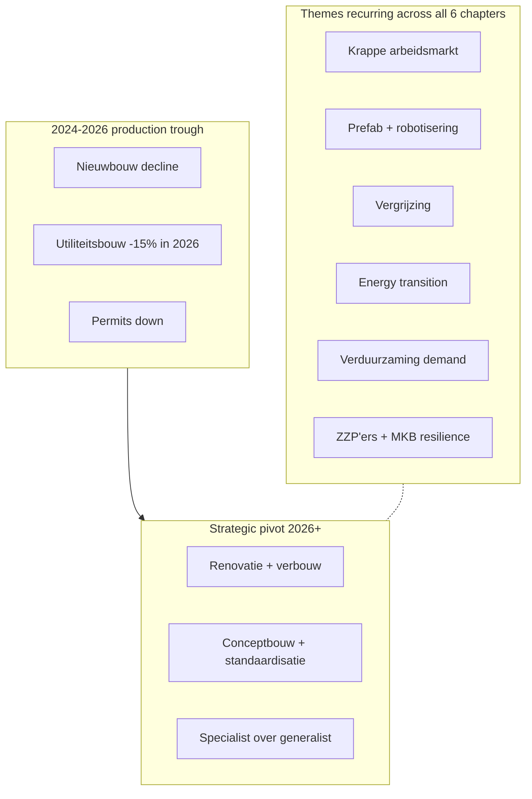

# Bouw- en Vastgoedbericht 2025

> Het Rabobank Bouw- en Vastgoedbericht is een online publicatie die de Nederlandse bouw- en vastgoedsectoren systematisch in kaart brengt. De editie 2025 bevat 14+ chapters; deze wiki-ingest omvat de zes chapters 09–14 die de inhoudelijke sector-analyses bevatten.

## TL;DR

Rabobank's **online Bouw- en Vastgoedbericht 2025** is a multi-chapter online publication covering Dutch construction sub-sectors. This ingest covers chapters 09–14, the substantive sub-sector analyses: **(09) macro-economische context + koopwoningmarkt** (house prices +8.6 % 2025, +5.7 % 2026), **(10) algemene bouwsector** (consolidation; by 2040 ~25 % fewer firms via M&A; krappe arbeidsmarkt; specialist-vs-generalist strategic choice), **(11) utiliteitsbouw** (B&U-sector werkvoorraad 12–13 months; declining production 2024–2026 trough then recovery; per-segment forecasts for kantoren, hallen, scholen, zorg), **(12) Grond-, Weg- en Waterbouw / GWW** (infrastructure; energy-transition + maintenance opportunities), **(13) installatiebranche** (~30,000 firms, ~175,000 fte; growth in slim/veilig/duurzaam buildings), **(14) ruw- en afbouwsector** (ZZP'ers + MKB driving renovation pivot as nieuwbouw slows). Across chapters: same macro signals — krappe arbeidsmarkt, prefab/robotisering, vergrijzing, particuliere verbouw demand, energy-transition.

## Citation

**APA (7th edition):**

> RaboResearch. (2025). *Bouw- en Vastgoedbericht 2025*. Rabobank. https://pub.rabobank.nl/bouw---en-vastgoedbericht-2025

**BibTeX:**

```bibtex
@techreport{rabobank_2025_bouw_vastgoedbericht,
  author      = {{RaboResearch}},
  title       = {{Bouw- en Vastgoedbericht 2025}},
  institution = {Rabobank},
  year        = {2025},
  type        = {Online publication},
  url         = {https://pub.rabobank.nl/bouw---en-vastgoedbericht-2025},
  note        = {Multi-chapter online sector publication; ingest covers chapters 09--14}
}
```

## What was actually ingested

**Pass 2** — full read of the 6 chapter web-clipper PDFs that comprise the substantive sub-sector analyses (09–14). Each chapter PDF is a single-page web-clipper export from the Rabobank pub.rabobank.nl site; collectively they form the body of the online Bouw- en Vastgoedbericht 2025 publication. Earlier chapters (01–08) are introductory / index pages not included in this batch. Chapter 11 (utiliteitsbouw) includes the only structured table in the ingested chapters — the segment-by-year production forecast — which I captured via direct PDF visual read.

## Context (WHY)

The Bouw- en Vastgoedbericht is Rabobank's annual deep-dive on the Dutch construction and real-estate value chain. Where [[2025-12-11-rabobank-sectorprognoses-2025-12|Sectorprognoses]] gives a one-page snapshot per sector across the whole Dutch economy, the Bouw- en Vastgoedbericht goes to the sub-sector level: separate analyses for general construction, utility construction, civil engineering, installations, and finishing trades.

The publication serves Rabobank's substantial bouw + vastgoed lending book — chapters position the bank's product offerings (financing, advisory) within each sub-sector's outlook. It's directly comparable to industry-association annual outlooks from Bouwend Nederland or Aedes, but with bank-perspective overlays on financing trends, M&A consolidation, and balance-sheet pressure.

**Theoretical basis**: descriptive sector analysis; no formal model. Combines CBS data, Buildsight forecasts, ECB rate projections, internal Rabobank views.

## Methods (HOW)

**Approach**: chapter-by-chapter qualitative sector overview combining:

- ECB / rate forecasts (chapter 09)
- CBS data on house prices, werkvoorraad, sub-sector production
- Buildsight forecasts for utiliteitsbouw production (chapter 11 table)
- Rabobank internal sector-team views
- Demographic and policy context

No formal econometric model; positioning is descriptive + forward-looking-qualitative.

## Results (WHAT)

### Chapter 09 — Macro-economische context + koopwoningmarkt

- ECB expected to make at most one more rente verlaging by end of 2025 (only if negative effects of tarrieven + geopolitiek onverhoopt stronger AND inflation does not re-accelerate).
- Renteontwikkeling: ECB depositorente, 3M Euribor track close together; 10Y swap diverges.
- Renteontwikkeling chart projects rates flattening into 2026–2027.
- House-price forecast: **+8.6 % in 2025, +5.7 % in 2026**. Drivers: groter leenruimte from wage growth + low unemployment; persistent housing shortage.

### Chapter 10 — Algemene bouwsector

- **Consolidation**: many small firms; gradual M&A pressure. By 2040: ~25 % fewer firms in the sector.
- **Driver of consolidation**: (a) natuurlijk verloop (vergrijzing — owner-managers retiring), (b) smaller firms can no longer meet all regulatory + investment + specialisation requirements, (c) larger firms / private-equity-backed firms apply *buy & build* strategies.
- **Krappe arbeidsmarkt**: persistent staff shortage, low instroom. Prefab + robotisering automating some manual work but staff acquisition + retention remains top priority.
- **Strategic choice toward 2040**: specialist vs generalist. Rabobank expects fewer generalists; many opportunities for specialised chain partners (installateurs, etc.).

### Chapter 11 — Utiliteitsbouw

- **Werkvoorraad**:
  - B&U-sector overall: 12–13 months (historically high level).
  - Woningbouw: ~14 months, recent slight decline.
  - Utiliteitsbouw: ~11 months, slight rise.
- **Production forecast table** (per segment, YoY %):

| Segment | 2023 | 2024 | 2025 | 2026 | 2027 |
|---|---:|---:|---:|---:|---:|
| Kantoren | −28 % | −4 % | −12 % | **−28 %** | +3 % |
| Hallen en loodsen | −5 % | +28 % | −5 % | **−30 %** | −5 % |
| Bedrijfshal met kantoor | +15 % | −23 % | −13 % | −5 % | +2 % |
| Schuren en stallen | −18 % | +4 % | +15 % | −6 % | −6 % |
| Scholen | 0 % | −13 % | −20 % | **−20 %** | **−15 %** |
| Gezondheidszorg | +11 % | −10 % | −15 % | +13 % | +5 % |
| **Totaal** | **+3 %** | **−4 %** | **−7 %** | **−15 %** | **−2 %** |

Bron: Buildsight. **The total goes through a deep 2024–2026 trough (-4/-7/-15 %) with very modest 2027 recovery (-2 %).**

### Chapter 12 — Grond-, Weg- en Waterbouw (GWW)

- Sector plays key role in duurzame + toekomstbestendige infrastructuur.
- Energy transition + climate-adaptation projects driving demand.
- Heavy dependence on government budget cycles (mentioned in [[2025-12-11-rabobank-sectorprognoses-2025-12|Sectorprognoses]] also).

(This chapter's full content was compressed to a header-only PDF clip; recovery path: re-open `raw/reports/pub.rabobank.nl_Bouw---en-Vastgoedbericht-2025_12.html.pdf` for body text or the source URL.)

### Chapter 13 — Installatiebranche

- **Sector size**: ~30,000 firms; ~175,000 fte.
- **Growth driver**: rising demand for slim, veilig, duurzaam buildings.
- **Installatiequote**: share of installations in totale stichtingskosten of buildings is rising — buildings increasingly contain more techniek.
- Maatschappelijke opgaven (verduurzaming, veiligheid) drive innovation + employment opportunities.

### Chapter 14 — Ruw- en afbouwsector

- **Sector composition**: predominantly ZZP'ers + small MKB-bedrijven.
- **Resilience mechanism**: when nieuwbouw in B&U-sector terugloopt (as it did 2024–2025), ruw- en afbouw firms have **particuliere woningbezitters** as second customer base.
- **Particuliere demand drivers**: post-COVID home-office investments; verduurzaming verplichtingen; levensloopbestendigheid (ageing-in-place adaptations).
- Renovation + verduurzaming + verbouw compensate (partly) for nieuwbouw decline.

## Visual content

The 6 chapter web-clipper PDFs each render as 1–2 visible pages on the website. Cumulatively they contain **3 substantial figures + 1 large table + multiple decorative-photo elements**.

### Chapter 09 figure — Renteontwikkeling en prognose 2025–2026

**Type:** time-series line chart. **Location:** chapter 09 page 1.

3-series chart 2021–2027: ECB depositorente (blue solid), 3M Euribor (dark solid), 10Y swap (orange solid → dashed for projection). Reaches ~3.5 % peak in 2023, gradually declining; ECB rate near 2 % from 2025; 10Y swap stabilising near 2.5 %. Source: *Macrobond, Rabobank*.

### Chapter 11 — Utiliteitsbouw: ontwikkeling productie t.o.v. vorig jaar 2023–2027 (the table reproduced above)

**Type:** numeric forecast table. **Location:** chapter 11 page 1. Source: *Buildsight*.

6 segments × 5 years; totals row. **The single most reusable artifact in this publication** — gives concrete, segment-by-segment production forecasts for Dutch utiliteitsbouw 2023–2027.

### Chapter 11 figure — Werkvoorraad Bouwnijverheid

**Type:** time-series line chart. **Location:** chapter 11 page 2.

Werkvoorraad in months (y-axis 12–14 range visible) for Woningbouw (blue) + Utiliteitsbouw (orange) over recent quarters. Woningbouw line oscillates around 14 with recent slight decline; Utiliteitsbouw line slowly rising near 11.

### Decorative photo elements

Each chapter includes a header photo (worker doing electrical install in ch.13, gloved hand on brick in ch.14, highway interchange in ch.12, etc.) — these are stock-imagery scene-setting elements, not data carriers.

### Visual content not captured

- Chapter 10's strategic-choice diagram (specialist vs generalist) was not present as a figure; it's narrative.
- Chapter 12 GWW likely has multiple figures; the web-clipper captured only the header.
- Chapter 13 likely has installation-quote trend chart; not in clipped version.

Recovery path for missing chapter visuals: re-open each chapter PDF at `raw/reports/pub.rabobank.nl_Bouw---en-Vastgoedbericht-2025_NN.html.pdf` for full PDF visual content, or the canonical online URL.

## Distinctive artifacts

### Utiliteitsbouw production forecast 2023–2027 (Table reproduced)

The most reusable single artifact in the ingest. Reproduced in §Results above.

### Sector consolidation trajectory (chapter 10)

```
2024 (baseline)  →  2040 projection
Many small firms     ~25% fewer firms
Mixed strategies     M&A consolidation
                     Buy & build (PE-backed)
                     Specialist vs generalist
                     bifurcation
Drivers:
  - Vergrijzing (founders retiring)
  - Regulatory/investment burden on small firms
  - Specialisation requirements
  - Private-equity buy-out activity
```

### House-price forecast (chapter 09)

```
2025 forecast: +8.6%
2026 forecast: +5.7%

Drivers:
  + Wage growth → groter leenruimte
  + Low unemployment
  + Persistent woningtekort
  + Extra aanbod by beleggers selling huurwoningen (small offset)
```

### Installatiebranche scale (chapter 13)

```
~30,000 firms
~175,000 fte
Installatiequote (installations share of stichtingskosten): rising trend
```

### Cross-chapter common themes (synthesis)



## Discussion / Significance (SO WHAT)

For the wiki:

1. **Sub-sector granularity in Dutch construction** — this report provides the only fine-grained breakdown (kantoren / hallen / scholen / zorg) in the current ingest batch. Future Dutch-construction queries should reach this report for segment-specific forecasts.
2. **Buildsight production-forecast table** (chapter 11) is the most concrete numerical reference for utiliteitsbouw 2023–2027.
3. **Consolidation trajectory + specialist/generalist choice** is the strategic frame for any Dutch-construction firm or financier; the 25 % fewer firms by 2040 number is a usable rough projection.

**Limitations acknowledged**:
- Renteontwikkeling forecast acknowledges geopolitical-uncertainty influence.
- Sector consolidation pace contingent on PE activity.

**Limitations not flagged**:
- **Web-clipper ingest captures partial content** — chapters 12 (GWW), 13 (installatie), 14 (ruw-afbouw) likely have more substantive content on the live site than the single-page clips this ingest covers. The wiki source page accordingly under-represents these chapters.
- **Buildsight forecast methodology opaque** — the utiliteitsbouw production-forecast table is cited as *Bron: Buildsight* with no methodology documentation. The -28 % drop projected for kantoren in 2026 vs. +3 % in 2027 is volatile; calibration unclear.
- **No financial / lending volumes** — Rabobank's substantial bouw-financing book is not visible in the report despite the publisher's commercial position.
- **Cross-chapter integration weak** — chapter analyses don't reference each other much; e.g., the consolidation finding (chapter 10) is presented as sector-wide but the per-sub-sector implications (chapters 11, 13, 14) are not enumerated.
- **Author conflict of interest** — single institutional author "RaboResearch" with implicit commercial-banking interest. Not declared.

## Citations to chase

- **Buildsight** — utiliteitsbouw production forecast source.
- **Macrobond** — rate forecast source (chapter 09).
- **CBS werkvoorraad indicators** — chapter 11.
- **Bouwend Nederland annual outlook** — industry-association comparator.

## Linked entities and concepts

**Entities** — institutional author only; no individual contributors named on the chapter clips.

- **Dangling** (single-source mention, deferred): RaboResearch (sector team for bouw + vastgoed).

**Concepts** (referenced / to-be-created):

- [[financial-distress]] — adjacent: production-trough cycles in utiliteitsbouw create downstream sub-contractor distress.
- [[dutch-construction-sector]] (extends new) — six sub-sector analyses anchor here.
- [[utiliteitsbouw-forecast-buildsight]] (new) — Buildsight forecast reference.
- [[sector-consolidation-bouw]] (new) — 25 % fewer firms by 2040 trajectory.
- [[installatiebranche]] (new) — 30k firms / 175k fte.
- [[ruw-en-afbouw-sector]] (new) — ZZP'ers + MKB resilience.

## Source-to-source relationships

- **`supports` ↔ [[2025-12-11-rabobank-sectorprognoses-2025-12]]** — Sectorprognoses gives one-page construction outlook; Bouw publication is the multi-chapter deep dive of the same sector.
- **`supports` ↔ [[2025-12-18-rabobank-woningcorporaties-aan-hun-limiet]]** — Bouw publication's house-price + krappe arbeidsmarkt findings feed into Woningcorporaties' implementation context.
- **`supports` ↔ [[2026-02-24-rabobank-vastgoed-selectief-investeren]]** — both publications discuss verduurzaming / EPBD pressure on existing stock.
- **`supports` ↔ [[2026-04-14-rabobank-beter-benutten-bestaande-bebouwing]]** — ruw-en-afbouw chapter content is directly aligned with the Beter benutten thesis (ZZP'ers + MKB renovation pivot).

## Quality review

| Field | Value |
|---|---|
| Reviewer | Claude (self-score) |
| Date | 2026-05-25 |
| Claimed depth | Pass 2 |
| Rubric version | 1.0 |

| Dim | Score | Floor | Notes |
|---|---:|---:|---|
| D1 Five Cs | 3 | 2 | Category (multi-chapter sector deep-dive), Context (web-clipper ingest scope limitations clearly stated, 4 adjacent sources), Correctness (Buildsight methodology opacity flagged), Contributions (3 named), Clarity (per-chapter source caveats). |
| D2 IMRaD | 2 | 2 | Specific numbers (utiliteitsbouw segment forecasts, +8.6 %/+5.7 % house prices, 30 k firms / 175 k fte, 25 % consolidation); but coverage uneven across chapters due to web-clipper scope. |
| D3 Distinctive artifacts | 3 | 2 | Utiliteitsbouw production forecast table fully reproduced; consolidation trajectory rendered as code block; house-price forecast reproduced; cross-chapter themes synthesised as Mermaid. |
| D4 Critical reading | 2 | 2 | Five concrete "not flagged" items: partial web-clipper content, Buildsight methodology, missing lending volumes, weak cross-chapter integration, Rabobank conflict undeclared. |
| D5 Pass-3 markers | — | — | n/a (Pass 2 page) |

**Total: 10 / 12 = 0.83** (workable band; D2 limited by partial web-clipper ingest)

**Resolution:** accepted; opportunistic recovery path for chapters 12–14 noted for future re-ingest.
