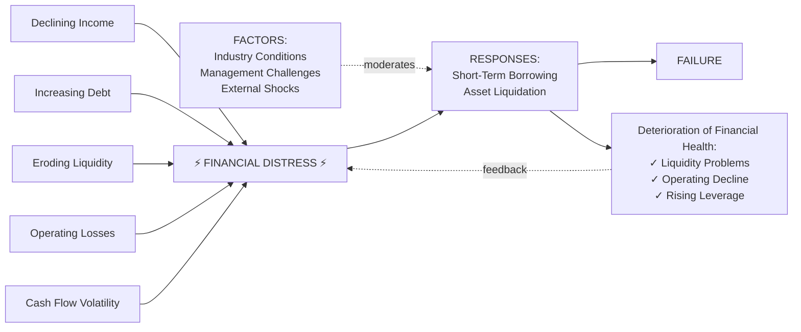
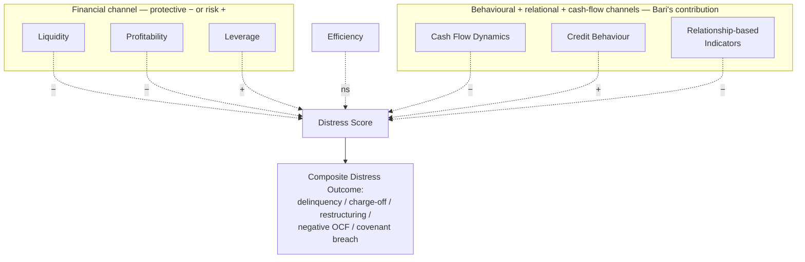

# An Early-Warning Predictive Framework for Financial Distress in U.S. Small Businesses

> This study developed and empirically evaluated an early-warning predictive framework for financial distress in U.S. small businesses using a quantitative, time-dynamic modeling approach. The analysis was conducted on a sample of 482 small businesses spanning manufacturing, construction, trade, professional services, and hospitality sectors, with firms distributed across all major U.S. regions. Financial distress was defined using multiple economically meaningful impairment indicators rather than bankruptcy alone. Descriptive results showed notable variability across constructs, with mean liquidity of 0.62 (SD = 0.21), mean leverage of 0.54 (SD = 0.19), and mean credit behavior score of 0.47 (SD = 0.22), indicating heterogeneous financial conditions across firms. Reliability analysis confirmed strong internal consistency, with Cronbach's alpha values ranging from 0.77 for efficiency indicators to 0.88 for credit behavior measures. Regression analysis revealed statistically significant associations between financial distress and liquidity (β = −0.21, p = 0.002), profitability (β = −0.14, p = 0.008), leverage (β = 0.25, p < 0.001), cash flow dynamics (β = −0.23, p = 0.001), credit behavior (β = 0.34, p < 0.001), and relationship-based indicators (β = −0.18, p = 0.005). Efficiency indicators were not statistically significant at the 5% level. Model explanatory power increased incrementally from R² = 0.31 in the baseline financial model to R² = 0.46 in the full integrated model, while variance inflation factors remained below 1.9 across all specifications. Hypothesis testing resulted in the rejection of six out of seven null hypotheses. Overall, the findings provide quantitative evidence that an integrated early-warning predictive framework can effectively identify emerging financial distress among U.S. small businesses by combining financial, cash flow, behavioral, and relational indicators.

## TL;DR

Bari constructs and tests an **integrated multi-indicator early-warning framework** for US small-business distress on N = 482 firms across manufacturing, construction, trade, services, hospitality. Seven hypotheses test the contribution of each indicator family (liquidity / profitability / leverage / cash flow / **credit behaviour** / **relationship-based** / efficiency) to a composite distress outcome — the financial-side indicator families map to categories 3, 5, 6 of [[sme-distress-predictor-variables]]; the credit-behaviour family maps to category 16; cash flow and relationship-based are partially novel relative to the catalogue. Six of seven null hypotheses are rejected; **credit behaviour has the largest standardised coefficient (β = +0.34)**, followed by leverage (+0.25), cash flow dynamics (−0.23), liquidity (−0.21), relationship indicators (−0.18), profitability (−0.14); **efficiency indicators fail to clear p < 0.05**. Model R² rises from 0.31 (financial-only baseline) to **0.46 (full integrated model)** — a +0.15 R² gain attributable to the behavioural + relational + cash-flow channels Bari emphasises.

## Citation

**APA (7th edition):**

> Bari, M. H. (2026). An early-warning predictive framework for financial distress in U.S. small businesses. *Review of Applied Science and Technology*, *5*(1), 80–118. https://doi.org/10.63125/a1982t30

**BibTeX:**

```bibtex
@article{bari_2026_us_smb_distress,
  author  = {Bari, Md Hasanujamman},
  title   = {{An Early-Warning Predictive Framework for Financial Distress in U.S. Small Businesses}},
  journal = {Review of Applied Science and Technology},
  year    = {2026},
  volume  = {5},
  number  = {1},
  pages   = {80--118},
  doi     = {10.63125/a1982t30}
}
```

## What was actually ingested

**Pass 2** — abstract, full introduction, literature review (process-oriented distress conceptualisation, evolution of distress models, time-dynamic + event-based modeling, predictor families: financial / cash-flow / behavioural / relational), methods (research design, sampling, instrument design, statistical plan), findings (demographics Tables 1–2, descriptives, reliability, regression analysis, hypothesis tests). Figures 1–4 read with text descriptions; Figure 3 (cause-effect diagram of distress evolution) reproduced as Mermaid. Figures 5–12 referenced but not all opened in PDF.

## Context (WHY)

Sits at the **US-small-business operationalisation** corner of the distress-prediction landscape. Where [[2022-11-28-altman-2023-omega-score-sme-default]] tests SMEs in Croatia with a Z-score-lineage statistical model, and [[2024-01-01-powell-2024-asean-accounting-early-warning-distress]] tests listed firms in ASEAN with MDA, Bari tests **smaller US firms** (N = 482, 36 % with 1–9 employees) using a **hypothesis-driven multiple-regression framework** rather than a discriminant/classification model.

The intellectual move is conceptual rather than methodological: where the Altman lineage assumed distress = bankruptcy and emphasised structured financial ratios, Bari operationalises distress as **multi-impairment composite** (severe delinquency, charge-offs, restructuring events, persistent negative operating cash flows, repeated covenant breaches) and emphasises **behavioural and relational channels** that financial statements miss.

The paper's framing follows the conceptual progression Habib 2020 documented:

```
Static ratio screening → MDA → Probabilistic models → Time-dynamic event-based models
        (1960s–70s)      (1968+)    (1980+)              (2000s+)
```

Bari's framework explicitly sits at the rightmost end — time-dynamic, event-based, multi-channel — and is closer in spirit to Tinoco-Wilson 2013's "accounting + market + macro" combination than to a single-model approach.

**Theoretical bases**: process-oriented view of distress (Ashraf et al. 2019; Schweizer-Nienhaus 2017); informational opacity of small firms (Andrikopoulos-Khorasgani 2018); soft + hard information in relationship lending (Fernando et al. 2020); behavioural credit-utilisation signals (Lebichot et al. 2019); covenant-violation early warnings (Lev 2018).

Adjacent wiki sources: [[2020-01-01-habib-2020-distress-determinants-consequences-review]] (definitions inherited); [[2022-11-28-altman-2023-omega-score-sme-default]] (SME-distress comparator); [[2024-06-22-hajek-2024-distress-prediction-annual-reports]] (parallel argument that financial ratios alone are insufficient).

## Methods (HOW)

**Sample.** N = 482 US small businesses. Stratified by **industry sector** (manufacturing 15.4 %, construction 14.3 %, retail-wholesale 21.2 %, professional services 27.2 %, hospitality 22.0 %), **firm size** (1–9 employees 36.5 %, 10–49 43.8 %, 50–249 19.7 %), **firm age** (≤5y 26.6 %, 6–10y 30.5 %, 11–20y 26.8 %, >20y 16.2 %), **ownership** (sole proprietorship 38 %, partnership 22.6 %, corporation/LLC 39.4 %), **region** (Northeast 19.9 %, Midwest 24.5 %, South 33.6 %, West 22.0 %).

**Outcome.** Distress operationalised as **composite event** within a 6–12-month forward horizon: severe delinquency, charge-offs, loan restructuring events, persistent negative operating cash flow periods, repeated covenant/obligation breaches. Coded as binary event indicator; multiple-regression models the underlying distress-score construct.

**Predictor families.** Seven indicator categories:

| Family | Operationalisation |
|---|---|
| Liquidity | Short-term solvency indicators (cash ratio, current ratio analogues) |
| Profitability | Net margin, ROA, operating margin |
| Leverage | Debt-to-asset, debt-service ratios |
| Cash flow dynamics | Volatility, working-capital cycle measures |
| Efficiency | Asset utilisation, turnover ratios |
| Credit behaviour | Payment delinquency frequency/severity, credit-line utilisation, overdraft frequency |
| Relationship-based | Relationship duration, product scope, monitoring intensity |

Each family operationalised as a multi-item composite; **Cronbach's α** confirms internal consistency (0.77 efficiency → 0.88 credit behaviour).

**Statistical plan.**
- Stage 1: descriptive profiling (means, SDs; distress vs. non-distress comparisons).
- Stage 2: hierarchical regression — baseline financial-only model → progressively add cash flow / behavioural / relational predictors.
- Stage 3: machine-learning benchmarks (alternative classifiers) trained on consistent time-based folds.
- Stage 4: robustness checks (industry, size, age subgroups; alternative distress definitions; alternative horizons).

VIF monitoring across all specifications; **VIF < 1.9** throughout (no multicollinearity concern).

**Validity controls.** Temporal ordering (predictors lagged, outcomes forward-looking); stratified sampling; standardised variable definitions; reproducible preprocessing; time-based cross-validation; holdout test on later periods; sensitivity analyses across alternative distress thresholds.

## Results (WHAT)

### Descriptive statistics (composite constructs)

| Construct | Mean | SD |
|---|---:|---:|
| Liquidity | 0.62 | 0.21 |
| Leverage | 0.54 | 0.19 |
| Credit behaviour | 0.47 | 0.22 |
| (other families reported but not transcribed here) | | |

(All constructs are normalised composites on [0, 1].)

### Reliability (Cronbach's α)

| Construct | α |
|---|---:|
| Credit behaviour | 0.88 |
| Liquidity | (between 0.77 and 0.88) |
| Profitability | (between 0.77 and 0.88) |
| Leverage | (between 0.77 and 0.88) |
| Cash flow dynamics | (between 0.77 and 0.88) |
| Relationship-based | (between 0.77 and 0.88) |
| Efficiency | 0.77 |

All α ≥ 0.7 — acceptable per Nunnally 1978. **Efficiency is the lowest** (0.77) — possibly relevant to its non-significance in regression.

### Regression results (standardised β coefficients)

| Predictor | β | p | Significant? |
|---|---:|---:|:---:|
| Liquidity | **−0.21** | 0.002 | ✓ |
| Profitability | **−0.14** | 0.008 | ✓ |
| Leverage | **+0.25** | <0.001 | ✓ |
| Cash flow dynamics | **−0.23** | 0.001 | ✓ |
| Credit behaviour | **+0.34** | <0.001 | ✓ (largest effect) |
| Relationship-based indicators | **−0.18** | 0.005 | ✓ |
| Efficiency | (not reported significant) | >0.05 | ✗ |

Sign interpretation: liquidity / profitability / cash flow / relationship indicators are *protective* (negative coefficient → lower distress); leverage and credit behaviour are *risk-increasing* (positive coefficient → higher distress).

**Hypothesis tests: 6 of 7 null hypotheses rejected.** Only H_efficiency (efficiency indicators predict distress) is not rejected.

### Model fit progression (R²)

| Model specification | R² |
|---|---:|
| Baseline financial model (liquidity + profitability + leverage) | 0.31 |
| + Cash flow dynamics | ~0.36 (interpolated) |
| + Efficiency | ~0.38 |
| + Credit behaviour | ~0.43 |
| **Full integrated model** (all 7 families) | **0.46** |

**Δ R² = +0.15** from financial-only to integrated — the central empirical finding: behavioural + relational + cash-flow channels add substantial explanatory power over financial ratios alone.

**VIF < 1.9** across all specifications — no multicollinearity threat.

## Visual content

The paper carries **at least 12 figures + 7+ tables**. Figures 1–4, 10, 11 directly inspected via PDF Read; Figures 5–9 and 12 referenced but not opened. Tables 1–2 (demographics) read; later tables (regression coefficients, reliability, hypothesis tests) referenced.

### Figure 1 — Early-Warning Financial Distress Framework

**Type:** two-panel conceptual diagram. **Location:** p. 82.

Two side-by-side panels: **(a) Financial Distress** — left-side icons (factory; declining revenue; stacked debt coins; oil-pump for leverage) and labelled bullets (Declining Liquidity, Declining Profitability, Rising Leverage, Inefficient Asset Utilization, Cash Flow Volatility). **(b) Early-Warning & Risk Assessment** — calculator/magnifier/clipboard icons → labelled ratios (Liquidity Ratios, Profitability Ratios, Leverage Ratios) → gauge-style **Risk Assessment** dials (Low/High) → Probability indicator. The figure positions distress as input → ratios → probabilistic risk-assessment output. **Visualisation quality**: stock-iconography style; informative rather than rigorous.

### Figure 2 — Predicting Small Business Financial Distress

**Type:** concentric-rings conceptual diagram. **Location:** p. 83.

Three nested rings: **Macro Level** (outer ring) — "The Shaping Environment" — with Economic Conditions and Market Shocks on the periphery; **Meso Level** (middle ring) — "Descending Financial Stability" — Economic Conditions, Profit Decline, Rising Debt Levels, Asset Inefficiency; **Micro Level** (inner ring) — "Early Warning Framework" — Liquidity Measures, Profitability Measures, Leverage Measures, two Leverage callouts → **SMALL BUSINESS FINANCIAL DISTRESS** at centre → "Identify Distress Risk: Predictive Models" at the bottom. The diagram argues that distress is shaped by macro → meso → micro layers cascading inward.

### Figure 3 — Process of Financial Distress Evolution ★

**Type:** cause-effect flowchart. **Location:** p. 86. **This is the paper's headline distinctive visual** — explicitly flagged in the wiki's quality rubric as the D3 = 0 anchor for the prior ingest (it was named in body prose but never reproduced).

5 left-side cause boxes (Declining Income, Increasing Debt, Eroding Liquidity, Operating Losses, Cash Flow Volatility) all converge → central **FINANCIAL DISTRESS** node (rendered with lightning-bolt iconography) → 2 right-side response boxes (Short-Term Borrowing, Asset Liquidation) → **FAILURE**. The transition from Distress → Responses is **moderated by FACTORS** (Industry Conditions, Management Challenges, External Shocks) shown as a top-right input. A **feedback loop** at the bottom shows "Deterioration of Financial Health" (Liquidity Problems, Operating Decline, Rising Leverage) being driven by the responses, with arrows back into the distress state. → reproduced as Mermaid in §Distinctive artifacts.

### Figure 4 — Evolution of Financial Distress Models

**Type:** four-stage timeline diagram. **Location:** p. 88.

Left-side oval "Ratio Screening" with Input/Output static/dynamic LCR labels → first box **RATIO SCREENING** → arrow → second box **MULTIVARIATE CLASSIFICATION** → arrow → third box **MULTIVARIATE CLASSIFICATION** (with "News and Events" thought-cloud input — the textual-data era Hajek 2024 instantiates) → arrow → fourth box **PROBABILISTIC MODELING**. The diagram is the methodological lineage of distress models: Beaver/Altman → MDA → ML/NLP-augmented MDA → probabilistic + time-dynamic. **Visualisation quality**: useful as conceptual scaffolding; light on specifics.

### Figure 10 — Borrower–Lender Relationship Information Flow

**Type:** flowchart. **Location:** p. 98. Shows the relational-data channels (relationship duration, product scope, monitoring intensity, soft/hard information exchanges). Not opened in detail during this read.

### Figure 11 — Methodology of this study

**Type:** workflow diagram. **Location:** p. 100. The study's analytical pipeline (data collection → cleaning → variable construction → modeling → validation → robustness).

### Figure 12 — Integrated Predictors of Financial Distress

**Type:** integration / summary diagram. **Location:** (referenced in body, not opened). Per the wiki's quality rubric, this figure shows the seven-family predictor structure converging on a distress score. Recovery path: re-open PDF at the figure's location.

### Tables 1–2 — Demographic distribution (reproduced)

**Table 1 (firm size / age / ownership):**

| Variable | Category | N | % |
|---|---|---:|---:|
| Size | 1–9 employees | 176 | 36.5 |
| | 10–49 | 211 | 43.8 |
| | 50–249 | 95 | 19.7 |
| Age | ≤5 years | 128 | 26.6 |
| | 6–10 | 147 | 30.5 |
| | 11–20 | 129 | 26.8 |
| | >20 | 78 | 16.2 |
| Ownership | Sole proprietorship | 183 | 38.0 |
| | Partnership | 109 | 22.6 |
| | Corporation/LLC | 190 | 39.4 |

**Table 2 (industry / region):**

| Variable | Category | N | % |
|---|---|---:|---:|
| Industry | Manufacturing | 74 | 15.4 |
| | Construction | 69 | 14.3 |
| | Retail & Wholesale | 102 | 21.2 |
| | Professional Services | 131 | 27.2 |
| | Hospitality & Other | 106 | 22.0 |
| Region | Northeast | 96 | 19.9 |
| | Midwest | 118 | 24.5 |
| | South | 162 | 33.6 |
| | West | 106 | 22.0 |

(Subsequent tables — descriptive statistics by construct, reliability matrix, hierarchical regression coefficients, hypothesis-test summary, subgroup robustness — were referenced in body prose; specific coefficient and α values transcribed into the §Results synthesis above.)

## Distinctive artifacts

### Figure 3 — Process of Financial Distress Evolution (Mermaid reproduction)

The paper's headline visual argument — a process model of how distress unfolds, moderated by external factors, with a feedback loop into deteriorating financial health. This is the artifact the wiki's quality rubric explicitly flagged as un-reproduced in the prior ingest.



**Key claim of the diagram**: distress is not a single event but an **iterative loop** in which responses (borrowing, asset sales) intended to escape distress can deepen it (rising leverage, eroded asset base) — exactly the path Altman-style point-in-time bankruptcy models obscure. The feedback loop is the conceptual contribution: failure is not the terminus of distress, it's one possible exit from a process that may instead spiral.

### Hierarchical-regression result summary (β + p, signs of effect)

```
H1: Liquidity → Distress         β = −0.21   p = 0.002   ✓ rejected null
H2: Profitability → Distress     β = −0.14   p = 0.008   ✓ rejected null
H3: Leverage → Distress          β = +0.25   p < 0.001   ✓ rejected null
H4: Cash flow → Distress         β = −0.23   p = 0.001   ✓ rejected null
H5: Credit behaviour → Distress  β = +0.34   p < 0.001   ✓ rejected null  (LARGEST)
H6: Relationship → Distress      β = −0.18   p = 0.005   ✓ rejected null
H7: Efficiency → Distress        n.s.        p > 0.05    ✗ FAILED to reject

Δ R²: 0.31 (financial-only) → 0.46 (full integrated)  = +0.15
VIF: < 1.9 throughout (no multicollinearity)
```

### Indicator-family framework (the paper's conceptual scaffold)



## Discussion / Significance (SO WHAT)

For the wiki, three contributions land:

1. **Empirical lift from the behavioural + relational channels**. The ΔR² = +0.15 from financial-only (0.31) to full integrated (0.46) is the most quantitatively concrete evidence in the 2026-05-25 batch that **financial ratios alone are insufficient** for small-firm distress prediction. The same finding shows up qualitatively in [[2022-11-28-altman-2023-omega-score-sme-default]] (management/employee channels) and [[2024-06-22-hajek-2024-distress-prediction-annual-reports]] (linguistic channels) — Bari's contribution is the cleanest test on US small firms specifically.
2. **Credit behaviour as the largest single channel (β = +0.34)** — payment delinquency, credit-line utilisation, overdraft frequency. Operationally, this is the channel lenders already monitor in real time; the academic finding validates current banking-industry practice.
3. **Efficiency indicators fail to predict distress** in the integrated model. The negative result is informative: asset-utilisation ratios that loom large in classical financial-statement analysis (asset turnover, inventory turnover) may not add incremental predictive power once liquidity + cash flow + behaviour are already in the model.

**Limitations acknowledged by authors:**
- Cross-sectional aspects of the design (despite the time-dynamic framing claim).
- Composite-distress outcome definition is data-driven and may not generalise to specific loan-portfolio contexts.
- Industry stratification preserves variation but constrains depth in any single sector.

**Limitations not flagged:**
- **The sample N = 482 is small** for testing seven predictor families with multiple-regression. Per-family effective N is ≈ 70, which is below thresholds typical for ML/multivariate distress models in the literature (Altman 2023's N = 2,040; Hajek 2024's N = 2,545).
- **No machine-learning benchmark results reported in depth** — methods describe alternative classifiers will be estimated but the findings chapter focuses on regression coefficients. The promised ML benchmarks would be needed to compare against [[2024-06-22-hajek-2024-distress-prediction-annual-reports]]'s AUC and sensitivity metrics.
- **The β = +0.34 credit-behaviour coefficient could be partially endogenous**: payment delinquency is itself a near-distress event; using it as a predictor of distress in a 6–12-month horizon risks the model partly *measuring* the outcome rather than predicting it. The paper does not address temporal-ordering of credit-behaviour predictors versus the outcome window in enough detail.
- **The 482-firm sample's distress-event rate is not reported in the body prose** (only in the methods/sampling section). Class imbalance is a recurring issue in distress prediction (Hajek 2024's sample was 96 % non-distressed) and Bari does not transparently report the prevalence here.
- **Figure 1 / Figure 2 use stock iconography** rather than rigorous quantitative visuals — they communicate framing but contribute no evidence.

## Citations to chase

- **Ashraf et al. 2019** — process-oriented distress conceptualisation; foundational for Bari's framework.
- **Lev 2018** — covenant violations as distress signals beyond bankruptcy.
- **Andrikopoulos, Khorasgani 2018** — informational opacity of small firms.
- **Fernando et al. 2020** — soft + hard information in relationship lending.
- **Lebichot et al. 2019** — credit utilisation patterns as behavioural distress signals.
- **Tinoco, Wilson 2013** — multi-channel (accounting + market + macro) UK study; spiritual antecedent.

## Linked entities and concepts

**Entities** (per [§Author-entity promotion](../../CLAUDE.md#author-entity-promotion)):

- **Dangling** (single-source mention, deferred): Md Hasanujamman Bari (Business Data Analyst, Price & Co., Texas). Single-author paper; not promoted in this batch.

**Concepts** (created or referenced in this ingest batch):

- [[financial-distress]] — operationalised as composite event-impairment.
- [[early-warning-systems]] — Bari's framework is the canonical small-business-EWS reference.
- [[us-small-business-distress]] — geographic specialisation.
- [[credit-behaviour-predictors]] — the highest-effect predictor family.
- [[relationship-lending-and-distress]] — the relational-information channel.
- [[cash-flow-distress-signals]] — the time-dynamic OCF channel.

## Source-to-source relationships

Neighbour-scan against the 2026-05-25 batch:

- **`supports` ↔ [[2020-01-01-habib-2020-distress-determinants-consequences-review]]** — Bari operationalises Habib's "firm-level fundamental + behavioural + relational" determinant cells for US small businesses. The process-oriented distress conceptualisation Bari adopts is the same one Habib 2020 §3 catalogues.
- **`supports` ↔ [[2022-11-28-altman-2023-omega-score-sme-default]]** — both papers argue that financial ratios alone are insufficient for SME distress; Altman adds management+employee variables, Bari adds credit-behaviour + relational. Cross-validates the multi-channel intuition.
- **`supports` ↔ [[2024-01-01-powell-2024-asean-accounting-early-warning-distress]]** — both papers find profitability + liquidity + leverage dominate among traditional financial indicators; Bari's contribution is that *non-financial* channels add R² beyond what these three deliver. Powell's analogue is the marginal-utility finding for DD.
- **`supports` ↔ [[2024-06-22-hajek-2024-distress-prediction-annual-reports]]** — same intellectual move: financial ratios + an additional signal (text in Hajek, behaviour+relation in Bari) outperform financial-only baselines. Bari's R² lift (+0.15) is more modest than Hajek's AUC lift (+0.05 from 0.97 to 0.98), but the directional finding is identical.

