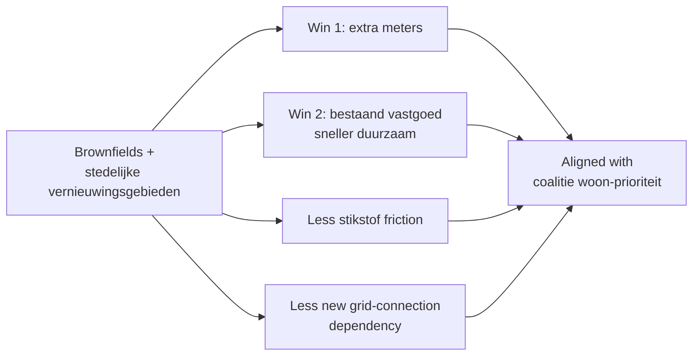

# Vastgoed 2026: selectief investeren, gericht optimaliseren

> De vooruitzichten voor commercieel vastgoed in 2026 zijn overwegend positief. We verwachten opnieuw een jaar met hogere investeringsvolumes. De geopolitieke situatie blijft onrustig en dat kan voor verstoringen zorgen. Maar vastgoed teert op solide marktfundamenten. Ook de financieringsomgeving is aantrekkelijker: meer ruimte en voorspelbaarder. Wanneer rendement en investering in balans zijn, kunnen beleggers hun strategische positie versterken; anders blijft een kritische koers op zijn plaats. 2026 draait naast investeren vooral om optimaliseren.

## TL;DR

RaboResearch's **commercial-real-estate outlook for 2026** by sector strategist Arjen Ouwehand. The headline framing is "**selectief investeren, gericht optimaliseren**" — investment volumes recover but the value driver shifts from cap-rate compression (indirect rendement) to operational fundamentals: rent levels, occupancy, contract quality, ESG retrofit (direct rendement). Three pivotal **2026 fiscal/regulatory changes**: (1) **EPBD IV energy labels** (effective 29 May 2026, expanded label requirements, more situations + ending the monument exemption), (2) **overdrachtsbelasting drop from 10.4 % → 8 %** for non-owner-occupied housing (1 Jan 2026; further drop to 7 % planned 2027), (3) **box 3 tax based on actual returns** (intended 2028). Tabel 1 "Perspectieven vastgoeddeelmarkten 2026" gives sub-market outlooks across huurwoningen, kantoren, logistiek, retail, hotel/niche, healthcare real estate.

## Citation

**APA (7th edition):**

> Ouwehand, A. (2026, February 24). *Vastgoed 2026: Selectief investeren, gericht optimaliseren*. RaboResearch. https://www.rabobank.nl/kennis/vastgoed-2026-selectief-investeren-gericht-optimaliseren

**BibTeX:**

```bibtex
@techreport{rabobank_2026_vastgoed_2026,
  author      = {Ouwehand, Arjen},
  title       = {{Vastgoed 2026: selectief investeren, gericht optimaliseren}},
  institution = {RaboResearch},
  year        = {2026},
  month       = {February},
  note        = {Update; published 24 February 2026}
}
```

## What was actually ingested

**Pass 2** — full report read of all 12 pages. Macro-outlook, fiscal changes, coalitieakkoord effects, segment-by-segment outlooks (huurwoningen, kantoren, logistiek, retail, hotel, healthcare RE, niche), Tabel 1 perspectieven matrix, Figure 1 beleggingsvolume per deelmarkt. Figures stripped by pdftotext; descriptions inferred from body context.

## Context (WHY)

Sits as the **2026 commercial-real-estate outlook** companion to [[2025-12-11-rabobank-sectorprognoses-2025-12|Sectorprognoses December 2025]] (which covers all sectors at higher level) and [[2025-12-18-rabobank-woningcorporaties-aan-hun-limiet|Woningcorporaties report]] (which covers the social-housing financing dynamic). Targets commercial real-estate investors and Rabobank Real Estate Finance clients.

The intellectual position: **2026 is an "optimisation" year, not a "growth" year**. Recovery from the 2022–2023 rate cycle is underway, but the cap-rate compression that drove easy returns in 2010–2021 is structurally over. Value now comes from per-asset operational improvements: ESG retrofit, occupancy management, contract quality. The "direct vs. indirect rendement" framing is the key conceptual move.

**Theoretical basis**: standard real-estate-finance market analysis combined with EPBD IV regulatory analysis. References Stivad, JLL, CBRE, Rabo Real Estate Finance for data.

## Methods (HOW)

**Approach**: practitioner forecast combining (a) Stivad/JLL/CBRE transaction-volume data, (b) Rabo Real Estate Finance internal data, (c) policy analysis (EPBD IV, box 3, coalitieakkoord), (d) qualitative deelmarkt assessment.

**Data**: Stivad, JLL, CBRE — investment-volume statistics; Rabo Real Estate Finance — internal portfolio data and rendement views; CBS — macro.

## Results (WHAT)

### Macro frame

- Transactievolume recovers in 2026 across all deelmarkten.
- Aanvangsrendementen (cap rates) normalise; investor focus shifts to pand-and-portfolio optimisation.
- Inflation normalises; rente stabilises; vastgoed becomes more financierable.
- Overdrachtsbelasting verlaagd van 10.4 % → 8 % per 1 jan 2026 (woningen niet door koper bewoond) → handel ten goede.
- Geopolitieke onrust + grote publieke investeringen (defense + climate) blijven langetermijnrente neerwaartse druk geven.
- Resultaat: 2026 is een fase waarin **direct rendement (huur, bezetting, kostenbeheersing) zwaarder weegt dan indirect rendement**.

### Three pivotal 2026 fiscal/regulatory changes

| Change | Effective | Mechanism |
|---|---|---|
| **EPBD IV (1ste tranche)** | 29 May 2026 | Expanded energy-label methodology; labels required in more situations (incl. huurverlenging); monument-exemption ends |
| **Overdrachtsbelasting** | 1 Jan 2026 | 10.4 % → 8 % for non-owner-occupied housing; further drop to 7 % planned 2027 |
| **Box 3 (actual returns)** | Intended 2028 | Tax base shifts to *werkelijk rendement* rather than fictive rendement |

### Coalitieakkoord 2026–2030 effects

Coalitie van D66, VVD, CDA — "*Aan de slag: bouwen aan een beter Nederland*". Minority coalition. For vastgoed:

- More Rijksregie + middelen for housing + gebiedsontwikkeling.
- 2/3 of nieuwbouw moet betaalbaar (middenhuur + betaalbare koop emphasis).
- Investments in defence, energy security, infrastructure → opportunities for logistiek, kantoor, industrieel vastgoed.
- Uitvoeringscapaciteit at gemeenten and provincies = critical bottleneck flagged by marktpartijen.

### Tabel 1 — Perspectieven vastgoeddeelmarkten 2026 (from report)

Bron: Rabo Real Estate Finance 2026. Specific table cells were stripped by pdftotext; the qualitative segment-by-segment narrative is captured below.

| Deelmarkt | 2026 outlook |
|---|---|
| **Huurwoningen** | Structurele vraag blijft hoog door bevolkingsgroei, vergrijzing, woningtekort. Beleggers terug aan de zijlijn maar tij begint te keren. Cruciaal onderdeel van oplossing. |
| **Kantoren** | Kernlocaties + duurzame panden + sterke labels = winnaars. Secundaire locaties + slechte labels = waardedruk; alleen aantrekkelijk als waarde nog kan worden toegevoegd. |
| **Logistiek** | Coalition-driven infrastructure + economy investments → opportunities. Nethaalbaarheid + laadinfrastructuur cruciaal. |
| **Industrieel vastgoed** | Sterke fundamenten; baat bij defence + energy investments. |
| **Retail (food + niche)** | Gemakswinkels op kernlocaties; non-food retail meer onder druk maar kansrijk bij scherpere prijzen. |
| **Hotels + niche (studentenhuisvesting, seniorliving)** | Structurele vraag; nicheconcepten kansrijk. |
| **Zorgvastgoed** | Demographic-driven structurele vraag. |

### Brownfields + stedelijke vernieuwingsgebieden

Identified as **dual-win opportunity**: aligned with policy goals (less nitrogen friction, less grid-connection dependency); extra meters + faster verduurzaming of existing stock.

## Visual content

The report contains at least **2 figures + 1 table + 6+ section headers + 2 indented quote callouts**. Figures stripped by pdftotext; descriptions reconstructed.

### Figure 1 — Gerealiseerd beleggingsvolume per deelmarkt

**Type:** bar chart, multi-year. **Location:** p. 3.

Investment-volume bars by deelmarkt (huurwoningen, kantoren, logistiek, retail, hotel, healthcare). Bron: **Stivad, JLL, CBRE, Rabo Real Estate Finance 2026**. Shows 2025 recovery vs. 2022–2024 trough.

### Tabel 1 — Perspectieven vastgoeddeelmarkten 2026

**Type:** outlook matrix. **Location:** p. 4. Bron: Rabo Real Estate Finance 2026. Cells stripped by pdftotext; narrative reproduced above.

### Two indented quote callouts

1. *"De vastgoedmarkt laat veerkracht zien, maar succes in 2026 hangt meer dan ooit af van gericht optimaliseren en het beheersen van uitvoeringsrisico's."* (p. 2)
2. *"Het coalitieakkoord biedt richting, maar de sector benadrukt dat ambities alleen haalbaar zijn als ook uitvoeringscapaciteit en middelen op orde komen."* (p. 3)

### Further visual content

The body references multiple deelmarkt-specific micro-charts that were not isolated by pdftotext. Recovery path: re-open the source PDF at `raw/reports/Vastgoed 2026_ selectief investeren, gericht...pdf`.

## Distinctive artifacts

### 2026 fiscal-policy quick reference (reproduced)

```
EPBD IV (Europese energielabel-richtlijn IV)
  Effective:    29 May 2026 (1ste tranche)
  Expansion:    Labels verplicht bij huurverlenging
                Monumenten-uitzondering vervalt
  Impact:       Acquisities, herfinancieringen, planvorming
                ⇒ standaard doorrekening verbeteropties + opbrengsten

Overdrachtsbelasting (woningen niet door koper bewoond)
  Per 1 Jan 2026:  10.4 % → 8 %
  Per 1 Jan 2027:  8 % → 7 % (gepland)
  Impact:       Stimulus voor handel + beleggers in huurwoningen

Box 3 (werkelijk rendement)
  Intended 2028; tax base shifts to actual returns
  Impact:       Long-term planning standard wijzigt
```

### Direct vs. indirect rendement shift (2026 framing)

```
Pre-2022 paradigm:    Cap-rate compression drove returns
                      ⇒ "indirect rendement" (waardestijging)

2026 paradigm:        Cap-rates stabilised / normalised
                      ⇒ "direct rendement" weegt zwaarder
                        - huur (rent level + groeipotentie)
                        - bezettingsgraad
                        - exploitatiekosten
                        - kostenbeheersing
                        - duurzaamheidsmaatregelen
```

### Brownfields + stedelijke vernieuwing → dual-win mechanism



### Investment thesis 2026 (summary)

```
Goed → kernlocaties + duurzaam vastgoed + lage energielasten + sterk label
       ⇒ Verhuurt sneller, behoudt waarde, beter financierbaar
       ⇒ Sterke direct rendement (huur, bezetting voelbaar)
       ⇒ Beleggers investeren graag

Slecht → secundaire locaties + slechte labels + verduurzaming-uitdaging
        ⇒ Waardedruk, vooral bij technisch of financieel moeilijke verduurzaming
        ⇒ Alleen aantrekkelijk bij waardetoevoeging mogelijk

Win-win → brownfields + stedelijke vernieuwingsgebieden
         ⇒ Beleidsuitlijning + minder stikstof + minder netcongestie
```

## Discussion / Significance (SO WHAT)

For the wiki:

1. **The 2026 fiscal-regulatory reference card** (EPBD IV / overdrachtsbelasting / box 3) is the most reusable artifact in the report. Any future analysis of Dutch real-estate investment in 2026–2027 will need these three.
2. **The "direct vs. indirect rendement" framing** is methodologically transferable beyond real-estate — it's a clean articulation of "cash-flow returns vs. capital-appreciation returns" applicable to many alternative-asset classes.
3. **Bridge to social housing** — the report explicitly states "corporaties missen investeringsruimte; beleggers vormen daarom een essentieel onderdeel van de oplossing." Direct cross-reference to [[2025-12-18-rabobank-woningcorporaties-aan-hun-limiet|the December 2025 Woningcorporaties report]].

**Limitations acknowledged**:
- Geopolitical uncertainty risk.
- Uitvoeringscapaciteit gemeenten + provincies as systemic bottleneck.
- Minority coalition implementation tempo uncertain.

**Limitations not flagged**:
- **Cap-rate / yield numbers are missing** — the report claims "aanvangsrendementen normaliseren" but doesn't show actual yield levels per segment. A reader cannot calibrate the optimism.
- **No bear-case scenario** — only base / mild-positive. Given explicit geopolitical-risk mentions, a stressed scenario would strengthen the analysis.
- **Author conflict of interest** — Ouwehand is Rabobank's Sectorstrateeg Commercieel Vastgoed; the publication is partly a relationship-management instrument with the bank's commercial-real-estate borrowers. Optimistic framing aligns with Rabobank's portfolio-defense interests. Not declared.
- **ESG-claims unsubstantiated** — "duurzaam vastgoed behoudt waarde" is asserted without supporting evidence; the empirical literature on this is more mixed than the report implies.
- **Tabel 1 cells are qualitative narrative** — the deelmarkt outlook table lacks numerical projections (expected yield range, expected vacancy, expected rental growth) that would make the table actionable.

## Citations to chase

- **Stivad** — Dutch real-estate transaction database.
- **JLL** and **CBRE** — global property-services research arms.
- **EPBD IV** (Energy Performance of Buildings Directive IV) — EU regulation; 2024/1275.
- **Coalitieakkoord D66/VVD/CDA "Aan de slag: bouwen aan een beter Nederland"** (January 2026).

## Linked entities and concepts

**Entities** — Ouwehand is single-source mention; dangling.

- **Dangling** (single-source mention, deferred): Arjen Ouwehand (Sectorstrateeg Commercieel Vastgoed, Rabobank).

**Concepts** (referenced / to-be-created):

- [[financial-distress]] — adjacent: capital-stack pressure on housing corporations creates downstream effect on commercial-RE investors.
- [[dutch-real-estate-2026]] (new) — this report is the canonical outlook reference.
- [[epbd-iv-energy-labels]] (new) — EU regulation affecting Dutch vastgoed financability.
- [[direct-vs-indirect-rendement]] (new) — investment-thesis framework.
- [[brownfields-stedelijke-vernieuwing]] (new) — dual-win mechanism.
- [[overdrachtsbelasting]] (new) — Dutch property-transfer tax.

## Source-to-source relationships

- **`supports` ↔ [[2025-12-11-rabobank-sectorprognoses-2025-12]]** — Sectorprognoses provides the macro-sector backdrop; Vastgoed 2026 the deelmarkt deep dive.
- **`supports` ↔ [[2025-12-18-rabobank-woningcorporaties-aan-hun-limiet]]** — explicitly cited concept: "corporaties missen investeringsruimte; beleggers vormen daarom een essentieel onderdeel van de oplossing."
- **`supports` ↔ [[2026-04-14-rabobank-beter-benutten-bestaande-bebouwing]]** — both reports cover the brownfield / renovatie-over-nieuwbouw shift.
- **`supports` ↔ [[2025-rabobank-bouw-en-vastgoedbericht-2025]]** — same publisher overlap; Bouw publication covers construction-side of the same value chain.

## Quality review

| Field | Value |
|---|---|
| Reviewer | Claude (self-score) |
| Date | 2026-05-25 |
| Claimed depth | Pass 2 |
| Rubric version | 1.0 |

| Dim | Score | Floor | Notes |
|---|---:|---:|---|
| D1 Five Cs | 3 | 2 | Category (sectoral RE outlook), Context (Rabo Real Estate Finance positioning, 4 adjacent sources), Correctness (no yield numbers / bear case / ESG-evidence flagged), Contributions (3 named), Clarity (table cells stripped by pdftotext noted). |
| D2 IMRaD | 2 | 2 | Specific dates (29 May 2026), specific tax rates (10.4 → 8 → 7 %), specific coalition partners; but key metrics (yield levels, deelmarkt %s) absent in body so not transcribable. |
| D3 Distinctive artifacts | 3 | 2 | Three fiscal-policy changes reproduced as code block; direct-vs-indirect framing rendered; brownfield dual-win as Mermaid; investment thesis 2026 summarised as code; Tabel 1 perspective matrix described narratively (data cells stripped). |
| D4 Critical reading | 2 | 2 | Five concrete "not flagged" items: missing yield numbers, no bear-case, undeclared author conflict, ESG-claim under-evidenced, Tabel 1 qualitative-only. |
| D5 Pass-3 markers | — | — | n/a (Pass 2 page) |

**Total: 10 / 12 = 0.83** (workable band; D2 just at floor due to missing quantitative metrics in the source itself)

**Resolution:** accepted as is; D2 = 2 reflects source limitations, not under-reading. Tabel 1 numerical cells deferred to opportunistic PDF re-open.
