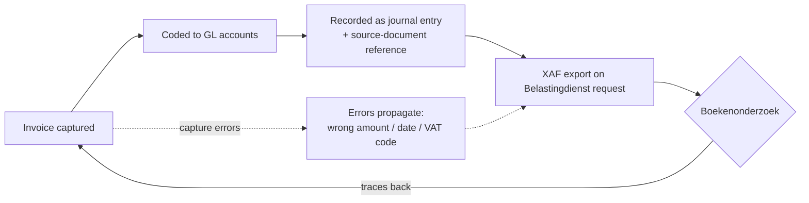

# Netherlands Auditfile Financieel (XAF 4.0) Requirements Guide

> Guide to Netherlands Auditfile Financieel (XAF) requirements. Covers XAF 4.0 transition, XAF vs SAF-T differences, audit file data, and compliance scope.

## TL;DR

A vendor explainer (Invoice Data Extraction / DEH Technologies LLC) on the **Dutch Auditfile Financieel (XAF)** — the standardised XML audit file the **Belastingdienst** can demand during a *boekenonderzoek* (tax inspection). The load-bearing facts: **XAF 4.0 became mandatory on 1 January 2026**, retiring XAF 3.2 (in force since 2014) with **no backwards compatibility**. The format was simplified from **~250 → ~90 data elements** and aligned to the **RGS** (Referentie GrootboekSchema) standard chart of accounts. The article's central corrective: **the Netherlands is *not* a SAF-T country** — XAF is its own OECD-independent standard, and misclassifying it as SAF-T produces unprocessable exports. XAF is positioned for future EU **ViDA** harmonisation and sits alongside **Peppol** e-invoicing in the Dutch digital-finance roadmap. The obligation is **reactive** (produce on request, not file proactively), applies to **all NL businesses regardless of size**, and carries a **seven-year retention** requirement.

## Citation

**APA (7th edition):**

> Harding, D. (2026, March 1). *Netherlands Auditfile Financieel (XAF 4.0) requirements guide*. Invoice Data Extraction. https://invoicedataextraction.com/blog/netherlands-auditfile-financieel-xaf-requirements

**BibTeX:**

```bibtex
@misc{harding_2026_xaf_4_requirements,
  author       = {Harding, David},
  title        = {{Netherlands Auditfile Financieel (XAF 4.0) Requirements Guide}},
  howpublished = {Invoice Data Extraction (DEH Technologies LLC)},
  year         = {2026},
  month        = {March},
  note         = {Published 1 March 2026; updated 24 March 2026},
  url          = {https://invoicedataextraction.com/blog/netherlands-auditfile-financieel-xaf-requirements}
}
```

## What was actually ingested

Full article read (text-only; no visuals). Acquired via the [zotero-acquire](../../.claude/skills/zotero-acquire/SKILL.md) skill as a `webpage` item, full text extracted by Zotero (`fulltext_source: zotero-extracted`). Website chrome (nav, footer, product CTA, related-articles list) was discarded; only the substantive article body was processed.

## Context (WHY)

This is the wiki's **first source on Dutch tax / financial-administration compliance** — a new cluster adjacent to the existing Dutch thread (the RaboResearch real-estate reports) but distinct in subject. The article is **content marketing**: Invoice Data Extraction sells an AI invoice-extraction product, and the piece funnels toward the claim that clean invoice capture is the foundation of an XAF-compliant administration. That commercial framing is real and is flagged in [§Discussion](#discussion--significance-so-what); it does not invalidate the regulatory facts, which are checkable against the Belastingdienst and SBR sources the article points to.

The XAF operates under the Dutch **SBR (Standard Business Reporting)** programme — the government's standardised business-to-government reporting framework. The Auditfile Financieel is the audit-file component within SBR.

**External-trigger reading (`contextual/external-triggers`):** the mandatory XAF 4.0 cutover is exactly the kind of **regulatory external trigger** that forces organisations to adapt their digital financial-administration stack — vendors had to ship XAF 4.0 export, finance teams had to remap their chart of accounts to RGS, and ERP owners had to verify entity-level export. The source documents the trigger and its compliance-capability implications rather than analysing the organisational-renewal response, so this is the only Warner & Wäger cell the article cleanly touches.

## Methods (HOW)

Practitioner / vendor explainer. No primary research, dataset, or methodology — the article synthesises the Belastingdienst's XAF 4.0 specification, the SBR programme documentation, the RGS taxonomy (referentiegrootboekschema.nl), and the OECD SAF-T standard into a finance-team-facing guide. One quantitative external anchor is cited: the **Belastingdienst 2024 annual report** (EUR 375 billion in tax + premium revenue in 2024, +EUR 23 billion vs 2023) used to argue the authority has the capacity to enforce.

## Results (WHAT)

### What the XAF is

- A **structured XML file** holding a business's complete financial administration in a standardised, machine-readable format — the Netherlands' own digital-audit-file standard.
- **Reactive, not a filing.** The Belastingdienst requests it during a *boekenonderzoek*; there is no submission schedule or annual deadline. The export must be producible **on demand** for any period within the retention window.
- Governed under the **SBR** programme.

### XAF vs SAF-T (the article's central correction)

- **SAF-T** = OECD-originated international standard; adopted (with national variation) by **Portugal, Norway, Poland, Austria, Luxembourg**.
- **XAF** = the Dutch standard, **predating** SAF-T adoption by several of those countries; same *purpose* as SAF-T, but **technically distinct** (different XML schema, data elements, structure).
- **Risk of confusion is concrete:** guides that list the NL as a SAF-T country lead teams to configure the wrong export format → failed submissions, audit delays.
- **Other national formats named:** Germany **GoBD**, Sweden **SIE**, France **FEC** — each requires its own extraction logic; multi-jurisdiction operations must map per country.
- **Forward look:** XAF 4.0 was designed with eventual **ViDA** (VAT in the Digital Age) alignment in mind, but as of 2026 XAF and SAF-T remain separate with no merged spec.

### What changed with XAF 4.0 (mandatory 2026-01-01)

| Dimension | XAF 3.2 (2014–2025) | XAF 4.0 (from 2026-01-01) |
|---|---|---|
| Data elements | ~250 | ~90 (≈⅔ reduction) |
| Chart of accounts | Any internal structure | Aligned to **RGS** (national standard) |
| EU harmonisation | — | Structured for future **ViDA** fields |
| Backwards compatibility | — | **None** — 3.2 files rejected from 2026-01-01 |

- **RGS alignment** means general-ledger accounts must map to the RGS taxonomy (documented, with English overview, at referentiegrootboekschema.nl). Software with RGS support automates the transition; without it, manual mapping is required.
- **Enforcement teeth:** a business that cannot produce a compliant file lets the Belastingdienst reverse the burden of proof, estimate tax liability, or impose penalties.
- **Vendor support:** Exact Online, Twinfield, AFAS, Unit4, SAP, Microsoft Dynamics 365 have released or are releasing XAF 4.0 export — but a compatible version alone does not guarantee compliance (RGS mapping + a validated test export are also required).

### Five required data categories

1. **Header data** — company name, KvK number, tax ID (RSIN/BSN), fiscal year, transaction date range, file-generation date.
2. **General ledger structure** — full chart of accounts (number, description, type), RGS-aligned under 4.0.
3. **Opening balances** — per-account balance at period start.
4. **Journal entries** — the largest portion: every transaction with journal ID, posting date, description, debit/credit, and a **source-document reference** (invoice/credit note/bank statement/receipt). Accuracy of the XAF is therefore determined by the accuracy of the underlying source documents.
5. **Sub-ledger data** — accounts receivable + payable at customer/supplier level.

### Scope of obligation

- Applies to **every NL-registered business that keeps financial records** — eenmanszaak, VOF, BV, multinational subsidiaries alike; even **KOR** small-business VAT-exemption firms.
- Distinct from (and broader than) statutory audit — statutory audit examines financial statements; XAF gives the authority transaction-level access.
- International groups must ensure each **Dutch entity** can export its own ledger (not consolidated group figures); global ERPs do not always include XAF export by default.
- **Seven-year retention** under Dutch fiscal law, covering both the file and the source documents it references.

## Visual content

> No visuals in source. (Text-only vendor article; the Zotero extraction contained no figures, tables-as-images, or charts.)

## Distinctive artifacts

### XAF vs SAF-T — national audit-file standards (reproduced)

| Country | Audit-file standard | Family |
|---|---|---|
| Netherlands | **XAF** (Auditfile Financieel) | National (OECD-independent) |
| Portugal, Norway, Poland, Austria, Luxembourg | SAF-T | OECD |
| Germany | GoBD | National |
| Sweden | SIE | National |
| France | FEC (Fichier des Écritures Comptables) | National |

### XAF 4.0 readiness checklist (reproduced)

```
1. Verify accounting software supports XAF 4.0 export
   (do NOT assume XAF 3.2 compatibility suffices; confirm with vendor)
2. Confirm chart of accounts aligns with the RGS framework
   (review + reclassify against current RGS taxonomy)
3. Audit invoice-processing workflow
   (errors in amounts / dates / supplier IDs / VAT codes propagate into the XAF)
4. Address multi-entity requirements independently
   (each Dutch entity must export from its own administration)
5. Test the XAF 4.0 export BEFORE an inspection
   (validate journal entries, source-doc references, account classifications)
```

### Invoice → audit-file propagation (the article's core argument)



A capture-time error (transposed digit, inconsistent vendor name, wrong VAT category) flows through the GL into the XAF and surfaces as a discrepancy under inspection. The article notes that **cumulative VAT errors exceeding EUR 1,000 require a Dutch supplementary VAT return (*suppletie aangifte*)** to correct before inspectors find them, and that sector-specific treatments (e.g. construction reverse charge / *btw verlegd*) are especially prone to misclassification.

## Discussion / Significance (SO WHAT)

For the wiki:

1. **Seeds the [[xaf-auditfile-financieel]] concept** — the canonical reference for the Dutch digital-audit-file standard, the natural anchor for future NL-compliance ingests (Peppol e-invoicing, NLCIUS/SI-UBL, ViDA, the FEC/SAF-T comparators).
2. **The XAF-vs-SAF-T correction is the most reusable fact** — a discrete, checkable claim that prevents a common cross-border configuration error.
3. **The 2026-01-01 cutover is a dated compliance milestone** worth tracking; XAF 3.2 is now superseded by 4.0 (a *standard*-level supersession, not a wiki-page supersession).

**Critical reading (vendor bias):**

- **Commercial framing.** The piece is content marketing for an invoice-extraction product; its "invoice accuracy → XAF compliance" throughline is true but selectively emphasised to position the vendor's tool. Per [§Lifecycle](../../CLAUDE.md#lifecycle), vendor-sponsored sources are capped at confidence ≤0.75 — the concept it seeds is set at the 0.70 single-source baseline.
- **No primary sourcing shown.** Specific schema details (the exact ~90 elements, the RGS mapping rules) are asserted, not linked element-by-element; a reader implementing XAF 4.0 must verify against the SBR technical documentation and the Belastingdienst spec directly.
- **"~250 → ~90" is approximate** ("approximately") on both ends — treat as order-of-magnitude, not exact.
- **Vendor list may date quickly** — "released or are releasing" hedges the XAF 4.0 support status of Exact/Twinfield/AFAS/Unit4/SAP/Dynamics; confirm current status per vendor.

## Citations to chase

- **Belastingdienst** — XAF 4.0 specification + 2024 annual report (EUR 375 bn revenue figure).
- **SBR (Standard Business Reporting)** programme — technical documentation, XML schema.
- **RGS (Referentie GrootboekSchema)** — referentiegrootboekschema.nl (English overview available).
- **OECD SAF-T** standard; national comparators **GoBD** (DE), **SIE** (SE), **FEC** (FR).
- **ViDA** (VAT in the Digital Age) — EU digital-reporting initiative.
- **Peppol / NLCIUS / SI-UBL / Digipoort** — Dutch e-invoicing stack (referenced as the XAF's companion).

## Linked entities and concepts

**Entities** — David Harding is a single-source author mention; dangling.

- **Dangling** (single-source mention, deferred): David Harding (author, Invoice Data Extraction). Candidate organisations also deferred to a second source: Belastingdienst, SBR, RGS.

**Concepts:**

- [[xaf-auditfile-financieel]] (new, seeded by this source) — the Dutch digital-audit-file standard.

## Source-to-source relationships

**Neighbour-source scan run** (Ingest step 5). The new source shares the `contextual/external-triggers` W&W cell with three RaboResearch sources ([[2026-02-24-rabobank-vastgoed-selectief-investeren]], [[2025-12-11-rabobank-sectorprognoses-2025-12]], [[2025-12-18-rabobank-woningcorporaties-aan-hun-limiet]]), but those are real-estate / macro regulatory triggers — a different domain from tax audit-file compliance. **No defensible typed edge** (per CLAUDE.md: *not every co-occurrence is a relationship*). This source opens a new thematic cluster; edges will form when a second Dutch-compliance source (e-invoicing / Peppol / ViDA) lands.

A loose thematic adjacency exists to the meta-tooling concept [[document-ai-ingestion-options]] (both concern extracting structured data from financial documents), but that is a wiki-pipeline concept, not a content relationship — noted, not edged.
