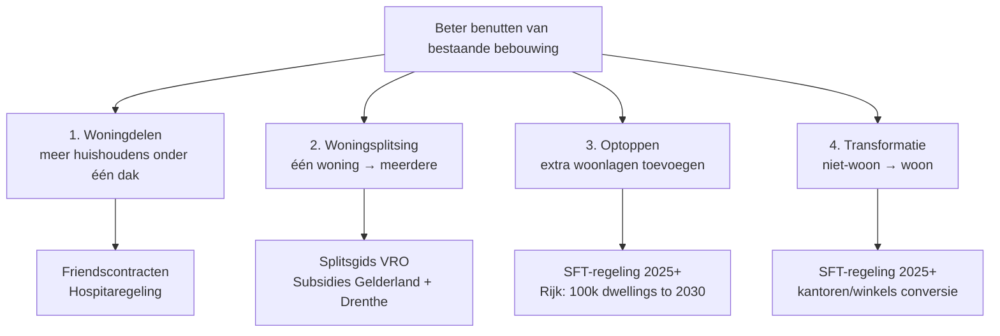

# Wat zijn de ondernemerskansen van het beter benutten van bestaande bebouwing?

> Terwijl nieuwbouwprojecten onder druk staan, groeit de aandacht voor oplossingen die sneller uitvoerbaar en minder afhankelijk zijn van grote gebiedsontwikkelingen. In deze update laten we zien hoe 'beter benutten' uitgroeit tot een volwaardig onderdeel van de landelijke woningbouwstrategie. En welke rol Rabobank ziet voor de bouwsector in deze verschuiving.

## TL;DR

Rabobank sector strategists argue that **"beter benutten" (better utilising existing buildings) is becoming a central pillar of national housing strategy** — promoted from supporting tactic to first-class component of the national woningbouwstrategie in the 2026 regeerakkoord. Four operational categories: **(1) woningdelen** (more households per dwelling — friendscontracten, hospitaregeling), **(2) woningsplitsing** (one dwelling into multiple), **(3) optoppen** (adding storeys onto existing buildings — Rijk projects 100k dwellings via this route by 2030), **(4) transformatie** (converting non-residential like kantoren / winkels). Each shifts demand from large-scale nieuwbouw to specialised renovation / verbouw, opening opportunities for construction firms that offer **standaardisatie, conceptbouw, procesontzorging**. The report frames this as "not less work, but different work" for construction entrepreneurs.

## Citation

**APA (7th edition):**

> Smit, H.-H., & Dirkse, G. (2026, April 14). *Wat zijn de ondernemerskansen van het beter benutten van bestaande bebouwing?* RaboResearch. https://www.rabobank.nl/kennis/d011521158-wat-zijn-de-ondernemerskansen-van-het-beter-benutten-van-bestaande-bebouwing

**BibTeX:**

```bibtex
@techreport{rabobank_2026_beter_benutten,
  author      = {Smit, Hans-Hugo and Dirkse, Geert},
  title       = {{Wat zijn de ondernemerskansen van het beter benutten van bestaande bebouwing?}},
  institution = {RaboResearch},
  year        = {2026},
  month       = {April},
  note        = {Update; published 14 April 2026}
}
```

## What was actually ingested

**Pass 2** — full report read of all 6 pages. All four utilisation categories enumerated with specific instruments (Friendscontracten, hospitaregeling, Splitsgids, SFT-stimuleringsregeling, regeerakkoord positioning). Three In-het-kort bullets transcribed.

## Context (WHY)

The report sits at the **construction-strategy meets policy junction** within the wiki's Dutch real-estate cluster. Where [[2025-12-18-rabobank-woningcorporaties-aan-hun-limiet|Woningcorporaties report]] exposes the financing bottleneck on the corporation side, and [[2026-02-24-rabobank-vastgoed-selectief-investeren|Vastgoed 2026]] covers commercial-investor strategy, **this report covers the supply-side response from construction firms**: the strategic shift from nieuwbouw to better-utilising-existing-stock activities.

The intellectual move is that **"better benutten" gets promoted from tactical fallback to strategic pillar** in the 2026 regeerakkoord. The implication for construction entrepreneurs: not less work, but different work — different competencies, different financing requirements, different scale economies.

**Theoretical basis**: implicit RBV (resource-based view) — construction firms with competencies in standardisation / conceptbouw / procesontzorging are positioned to win in this regime. No formal economic model.

## Methods (HOW)

**Approach**: practitioner strategic analysis. Combines:

- Policy positioning (regeerakkoord, SFT scheme, Splitsgids reference)
- Categorical decomposition of "beter benutten" into four operational forms
- Strategic implication for construction-firm competencies (Rabobank-relevant: financing products + relationship-banking)
- Demographic context (vergrijzing, eenpersoonshuishoudens)

No formal data analysis; qualitative narrative.

## Results (WHAT)

### The four categories of "beter benutten"

| Category | Mechanism | Key instruments / numbers |
|---|---|---|
| **1. Woningdelen** | Multiple households share one dwelling | Friendscontracten; deelverhuur via hospitaregeling; Raad van State proposal for hospitacontracten up to 5 years |
| **2. Woningsplitsing** | One dwelling → multiple independent dwellings | Provinces Gelderland + Drenthe offer haalbaarheidsonderzoek / realisatie subsidies; VRO ministerie Splitsgids |
| **3. Optoppen** | Adding storeys onto existing buildings | Rijk projects **100,000 dwellings via optoppen by 2030**; SFT (Stimuleringsregeling Flex- en Transformatiewoningen) available since 2025 |
| **4. Transformatie** | Non-residential → residential (kantoren, winkels) | Long-standing practice; SFT also applies |

### Strategic shift narrative

- Nieuwbouw is constrained by stikstof, netcongestie, langere vergunning- + bezwaarprocedures.
- "Beter benutten" advantages: (a) locations already exist, (b) some procedures bypass-able or faster, (c) less physical space needed than nieuwbouw, (d) stikstof + netcongestie less binding because work is in already-built environment, (e) "koppelkansen" with verduurzaming / demografie (vergrijzing + eenpersoonshuishouden trends).
- Constructor perspective: not less work, but **different work** — pivot from grootschalige nieuwbouw to slimme renovatie, uitbreiding, transformatie.

### Implications for bouwondernemers

Opportunities concentrate on firms offering:
- **Standaardisatie** — repeatable approaches across many small projects.
- **Conceptbouw** — pre-engineered building concepts.
- **Procesontzorging** — taking complexity off the customer's hands (especially for woningsplitsing where particulieren are the demand side).

The shift particularly benefits ZZP'ers and MKB construction firms (per parallel content in [[2025-rabobank-bouw-en-vastgoedbericht-2025|the Bouw publication]] §Ruw- en afbouwsector).

## Visual content

The report carries **no figures** (no charts, no tables, no diagrams beyond the In-het-kort bullets). Per [§Visual content extraction](../../CLAUDE.md#visual-content-extraction): text-only report; no §Visual content catalogue is required, but documenting absence:

> No figures, charts, or tables in source. Three In-het-kort bullets at the top function as visual summary; the body is exclusively narrative prose.

The pdftotext conversion produced no image references either. Pages 1–6 are text-heavy with only header / divider line elements.

## Distinctive artifacts

### The four "beter benutten" categories (taxonomy)



### Advantages-of-beter-benutten vs. nieuwbouw (reproduced)

```
Beter benutten advantages:
  + Locations already exist (no land-acquisition friction)
  + Some procedures bypass-able or faster
  + Less physical space needed
  + Stikstof + netcongestie less binding (already-built environment)
  + "Koppelkansen" with verduurzaming + demografie

Nieuwbouw constraints:
  − Stikstof restrictions
  − Netcongestie
  − Lange vergunning- + bezwaarprocedures
  − Krappe locaties + bouwkosten
```

### Bouwondernemer competency shift (Rabobank framing)

```
Old paradigm:                     New paradigm:
─────────────────                 ────────────────
Grootschalige nieuwbouw           Slimme renovatie / uitbreiding / transformatie
Sequential phases                 Standardisation across many small projects
Specialised crews                 Conceptbouw — pre-engineered concepts
Direct customer interface         Procesontzorging — managing complexity for klanten

⇒ Niet minder werk, maar ander werk
⇒ Andere competenties, substantiële kansen in sub-sectoren
```

## Discussion / Significance (SO WHAT)

For the wiki:

1. **Taxonomy of "beter benutten" is wiki-reusable** — the four-category decomposition (woningdelen / woningsplitsing / optoppen / transformatie) is the canonical Dutch reference for this strategic shift.
2. **Construction-firm strategic-pivot framing** is the methodological contribution — "niet minder werk, ander werk" reframes a threat (nieuwbouw pressure) as an opportunity (renovation specialisation).
3. **Policy-instrument inventory** — SFT scheme + Splitsgids + Friendscontracten + hospitaregeling become the reference list for Dutch housing-policy queries.

**Limitations acknowledged**:
- "Optoppen heeft veel potentie maar in praktijk vallen aantallen tegen en er zijn nog flinke barrières."
- Realisation of 100k optop-dwellings by 2030 is a Rijk-projection, not a confirmed delivery path.

**Limitations not flagged**:
- **No financial-volume numbers** — what is the market size for each of the four categories? How does it compare to nieuwbouw spending? Without numbers, the strategic claim cannot be validated.
- **No competitive-landscape analysis** — which construction firms are already positioned to win in this regime? Are there incumbents?
- **No cross-border benchmarking** — Germany, UK, France all have parallel renovation-over-nieuwbouw shifts. No reference to international evidence.
- **Author conflict of interest** — both authors are Rabobank; the report ends with explicit reference to "Rabobank denkt graag mee" — i.e., this is partly a sales-enablement instrument for Rabobank's bouw-financing products. Not declared.
- **Implementation timeline opaque** — 2030 target for optoppen-100k assumes consistent policy support across multiple coalitions. The report does not assess political durability.

## Citations to chase

- **SFT (Stimuleringsregeling Flex- en Transformatiewoningen)** — Rijk scheme since 2025.
- **VRO Splitsgids** — Volkshuisvesting Nederland published guide.
- **Regeerakkoord 2026** — explicit positioning of "beter benutten".
- **Friendscontracten** — gemeenten implementing variants.

## Linked entities and concepts

**Entities** — both authors are single-source mentions; dangling.

- **Dangling** (single-source mention, deferred): Hans-Hugo Smit (Sectorstrateeg Bouw & Vastgoed, Rabobank), Geert Dirkse (Business Analist Bouw, Rabobank).

**Concepts** (referenced / to-be-created):

- [[financial-distress]] — adjacent: construction firms facing nieuwbouw-decline pressure; "beter benutten" pivot is a response strategy.
- [[beter-benutten-bestaande-bebouwing]] (new) — taxonomy anchor.
- [[woningdelen]] (new) — friendscontracten + hospitaregeling.
- [[woningsplitsing]] (new) — Splitsgids reference.
- [[optoppen]] (new) — 100k by 2030 target.
- [[transformatie-naar-wonen]] (new) — kantoren / winkels conversion.
- [[sft-stimuleringsregeling]] (new) — Rijk scheme.

## Source-to-source relationships

- **`supports` ↔ [[2025-12-18-rabobank-woningcorporaties-aan-hun-limiet]]** — same problem (housing shortage) from supply-side perspective; corporations financing pressure ↔ construction-firm strategy pivot.
- **`supports` ↔ [[2025-12-11-rabobank-sectorprognoses-2025-12]]** — construction sector outlook context (personnel shortage, declining permits) is the backdrop driving the "beter benutten" pivot.
- **`supports` ↔ [[2026-02-24-rabobank-vastgoed-selectief-investeren]]** — both discuss brownfield / renovation-over-nieuwbouw shift; Vastgoed 2026 from investor perspective, this from construction-firm perspective.
- **`supports` ↔ [[2025-rabobank-bouw-en-vastgoedbericht-2025]]** — Bouw publication §Ruw- en afbouwsector covers the same ZZP'ers + MKB renovation-pivot dynamic.

## Quality review

| Field | Value |
|---|---|
| Reviewer | Claude (self-score) |
| Date | 2026-05-25 |
| Claimed depth | Pass 2 |
| Rubric version | 1.0 |

| Dim | Score | Floor | Notes |
|---|---:|---:|---|
| D1 Five Cs | 3 | 2 | Category (sector-strategy practitioner analysis), Context (Rabobank construction-financing positioning, 4 adjacent sources), Correctness (no market-size numbers / cross-border benchmark flagged), Contributions (3 named), Clarity (text-only, no figures — clearly stated). |
| D2 IMRaD | 2 | 2 | Specific numbers (100k dwellings, 5-year hospitacontracten, provinces named); but qualitative throughout — no €-volumes, no market shares. |
| D3 Distinctive artifacts | 3 | 2 | Four-category taxonomy rendered as Mermaid; advantages/constraints reproduced as code block; competency-shift framing reproduced as before/after. |
| D4 Critical reading | 2 | 2 | Five concrete "not flagged" items: no market-size numbers, no competitive-landscape, no international benchmarking, undeclared author conflict, political durability unaddressed. |
| D5 Pass-3 markers | — | — | n/a (Pass 2 page) |

**Total: 10 / 12 = 0.83** (workable band; D2 limited by source's qualitative-only character)

**Resolution:** accepted; catalogue update can proceed.
