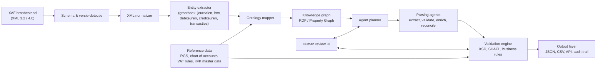

# Ontology-driven agentic XAF parser — architecture and implementation approach

> A Perplexity-generated (LLM) answer, in Dutch, sketching a technical architecture and implementation plan for an **ontology-driven, agentic parser** for the Dutch **XAF (Auditfile Financieel)** — the standard described in [[xaf-auditfile-financieel]]. Provenance caveat: this is a machine-generated answer with three external citations, not an authoritative engineering reference.

## TL;DR

Design proposal for parsing XAF (XML Auditfile Financieel) via a **semantic / agentic** pipeline rather than a brittle direct XML→report parser. The core idea: insert an **ontology + knowledge-graph layer** between raw XAF-XML and downstream financial concepts, and orchestrate **specialised agents** (extract / validate / enrich / reconcile / report) over it. Layers: *syntax* (XAF versions, XML nodes, namespaces) → *semantic* (accounting concepts, posting rules, document relations) → *regulatory* (RGS, SBR, NT20, fiscal/reporting concepts) → *operational* (parse status, exceptions, confidence, provenance). Validation is three-tier: **XSD** (structure) + **SHACL** (semantics) + business rules (accounting logic). Recommended stack: `lxml`/.NET XML reader, OWL/RDF + SHACL, a graph store (Neo4j / GraphDB / Apache Jena), a rules engine, and tool-driven agent orchestration with lineage/observability. Build order: XAF-ingest → ontology-core → validation, then add RGS/SBR reference mapping, then the "smart" agentic layer (self-healing mappings, anomaly detection, confidence-based human review).

## Citation

**APA (7th edition):**

> Perplexity AI. (2026, June 28). *Ontology-driven agentic XAF parser — architecture and implementation approach* [AI-generated answer]. Perplexity. https://www.perplexity.ai/search/6b52a3ad-42c6-44c3-ba5a-11e1217f524c

**BibTeX:**

```bibtex
@misc{perplexity_2026_xaf_ontology_parser,
  author       = {{Perplexity AI}},
  title        = {{Ontology-driven agentic XAF parser — architecture and implementation approach}},
  howpublished = {Perplexity AI (LLM-generated answer)},
  year         = {2026},
  note         = {Retrieved 28 June 2026; no publish date},
  url          = {https://www.perplexity.ai/search/6b52a3ad-42c6-44c3-ba5a-11e1217f524c}
}
```

## What was actually ingested

Full answer read (Dutch). Acquired as a manually-saved Perplexity answer in `raw/articles/`. The companion HTML snapshot (`answer-perplexity.html` + `_files/`) is the original page capture; the markdown is the clean text that was processed. The answer carries three inline external citations (Invantive XAF 3.2 data-model docs; referentiegrootboekschema.nl RGS-3.8→SBR-NT20 mapping, cited twice).

## Context (WHY)

This source is a **downstream application** of the XAF standard documented in [[xaf-auditfile-financieel]]: where [[2026-03-01-harding-2026-netherlands-xaf-4-requirements|Harding (2026)]] describes *what* XAF is and what an export must contain, this answer proposes *how to parse and semantically enrich* such exports. It is the second source in the wiki's Dutch tax / financial-administration compliance cluster, and the first touching the **engineering / tooling** angle (ontology, knowledge graph, SHACL validation, agentic orchestration).

The motivating data point the answer cites: the XAF 3.2 driver exposes **48 tables and 1110 columns** (Invantive), illustrating how broad the data model is — the argument for a semantic layer rather than per-field hand-mapping.

## Methods (HOW)

None — this is an LLM-generated synthesis, not primary engineering work or a benchmarked system. It assembles a plausible reference architecture from general knowledge plus its cited sources (Invantive XAF data model; RGS→SBR/NT20 mapping). Treat all specifics (table/column counts, layer names, stack choices) as **starting hypotheses to verify**, not validated facts. See [§Discussion](#discussion--significance-so-what) for the reliability caveat.

## Results (WHAT)

### Proposed architecture (pipeline)

`XAF source (XML 3.2/4.0)` → schema & version detection → XML normalizer → **entity extractor** (grootboek, journalen, btw, debiteuren, crediteuren, transacties) → **ontology mapper** → **knowledge graph** (RDF / property graph) → **agent planner** → **parsing agents** (extract / validate / enrich / reconcile) → **validation engine** (XSD, SHACL, business rules) → output layer (JSON, CSV, API, audit trail). Two side inputs: **reference data** (RGS, chart of accounts, VAT rules, KvK master data) feeds the ontology mapper and the validation engine; a **human-review UI** loops with the agent planner and validation engine.

### The four ontology layers

| Layer | Contents |
|---|---|
| **Syntax** | XAF versions, XML nodes, namespaces, field types |
| **Semantic** | accounting concepts, posting rules, document relations |
| **Regulatory** | RGS, SBR, NT20, fiscal & reporting concepts |
| **Operational** | parsing status, exceptions, confidence, provenance |

### Core ontology entities & relations

- **Entities:** `Company`, `Administration`, `LedgerAccount`, `Journal`, `JournalEntry`, `TransactionLine`, `Counterparty`, `Invoice`, `VATCode`, `RGSCode`, `ReportingConcept`, `Period`, `Document`, `SourceFile`, `ValidationIssue`, `MappingRule`.
- **Relations:** `hasJournal`, `containsEntry`, `postsToAccount`, `mapsToRGS`, `mapsToReportingConcept`, `referencesDocument`, `derivedFromSourceField`.

### Implementation approach (6 steps)

1. XML ingestion layer that recognises XAF 3.2/4.0, validates namespaces, emits a canonical internal format.
2. Mapping engine: XML nodes → ontology instances, with explicit per-field provenance.
3. Knowledge-graph store for entities, relations, reference mappings (enables reasoning over missing/inconsistent data).
4. Validation rules: XSD (structure) + SHACL (semantics) + business rules (accounting logic).
5. Agent layer with per-task roles: extractor, reconciler, enricher, anomaly detector, reporter.
6. Export to JSON/CSV/API; always retain an audit trail from source field → derived semantic interpretation.

### Core business rules (examples given)

- A `LedgerAccount` may have multiple `RGSCode` mappings but only one active mapping per context/version.
- A `JournalEntry` must contain at least one `TransactionLine`.
- A `TransactionLine` may post only to a `LedgerAccount` valid within the posting period.
- A `MappingRule` stores source field, target concept, version, confidence, validity.
- A `ValidationIssue` carries severity, rule-id, source reference, remediation advice.

### Recommended stack

Parser: Python `lxml` or .NET XML reader · Ontology: OWL/RDF + SHACL constraints · Graph store: Neo4j / GraphDB / Apache Jena · Rules engine: Python rules / Drools / SHACL · Agent orchestration: tool-driven workflow with explicit state machine · Observability: structured logging, lineage, replayable runs, exception queues.

## Visual content

The answer contains **one visual**: a Mermaid architecture diagram (the pipeline). Reproduced below.

### Figure 1 — XAF parser reference architecture

**Type:** flowchart (Mermaid, LR) · **Location:** top of the answer.

A left-to-right pipeline from the XAF source XML through version detection, normalisation, entity extraction, ontology mapping, a knowledge-graph store, an agent planner, parsing agents, and a three-tier validation engine, ending at a multi-format output layer. Two feeder nodes branch in: a *reference data* node (RGS, chart of accounts, VAT rules, KvK master data) feeding both the ontology mapper and the validation engine, and a *human-review UI* node looping bidirectionally with the agent planner and the validation engine. → reproduced in [§ Distinctive artifacts](#distinctive-artifacts).

## Distinctive artifacts

### Reference architecture (reproduced as Mermaid)



(The four ontology layers, core entity/relation vocabulary, six-step implementation approach, and core business rules are reproduced in [§Results](#results-what) and are not duplicated here.)

## Discussion / Significance (SO WHAT)

For the wiki:

1. **First engineering-angle source on XAF.** It complements the regulatory [[xaf-auditfile-financieel]] concept with a "how would you build a parser for this" design view — useful if the wiki's owner pursues an XAF/RGS tooling project (e.g. SAP add-on, the answer's closing context).
2. **Reusable design vocabulary.** The four-layer ontology split (syntax / semantic / regulatory / operational) and the XSD+SHACL+business-rules validation triple are transferable to other structured-financial-document parsing problems, not just XAF.
3. **Bridges to the wiki's own tooling thread.** Loosely adjacent to [[document-ai-ingestion-options]] — both concern turning documents into structured data — though that concept is about the wiki's PDF→markdown pipeline, a different problem from XAF-XML semantic parsing.

**Reliability caveat (load-bearing).** This is an **LLM-generated answer**, the lowest-authority source tier — comparable to (or weaker than) vendor content. Specific claims need independent verification:

- The "48 tables / 1110 columns" figure is attributed to Invantive's XAF *3.2* driver — verify against the cited Invantive docs and note it describes 3.2, while XAF 4.0 (the current mandatory version) simplified the model to ~90 elements per [[xaf-auditfile-financieel]]. The answer does not reconcile this tension.
- RGS↔SBR/NT20 mapping specifics are asserted via one source (referentiegrootboekschema.nl); confirm the current RGS version and NT taxonomy before relying on them.
- Stack recommendations (Neo4j vs GraphDB vs Jena, etc.) are generic best-practice, not benchmarked for this workload.
- No working system, evaluation, or performance data — this is a sketch, not a validated architecture.

## Citations to chase

- **Invantive** — XAF 3.2 data model (documentation.invantive.com) — the 48-tables/1110-columns claim.
- **referentiegrootboekschema.nl** — RGS 3.8 → SBR NT20 concept mapping (cited twice).
- **Belastingdienst** — XAF 4.0 specification (the answer references its "simplified, future-proof" framing; cross-check against [[xaf-auditfile-financieel]]).
- Standards to verify: **OWL/RDF**, **SHACL**, **XSD**, **SBR / NT20** taxonomy.

## Linked entities and concepts

**Entities** — none promotable. "Perplexity AI" is the generating system, not an author-entity; not dangling, not promoted.

**Concepts:**

- [[xaf-auditfile-financieel]] — this source `uses` the XAF standard (proposes a parser for XAF 3.2/4.0 and its RGS linkage).
- [[document-ai-ingestion-options]] — loose thematic adjacency (structured-data extraction), noted not edged.

## Source-to-source relationships

**Neighbour-source scan run** (Ingest step 5). Strong topical neighbour: [[2026-03-01-harding-2026-netherlands-xaf-4-requirements]] — both concern XAF, but they make different *kinds* of claim (Harding = the regulatory standard; this = a parser design). The typed edge is modelled as `uses → [[xaf-auditfile-financieel]]` (the shared concept the design consumes) rather than a same-claim `supports` edge to Harding, since the two sources reinforce different propositions. They are linked navigationally through the shared concept page.
